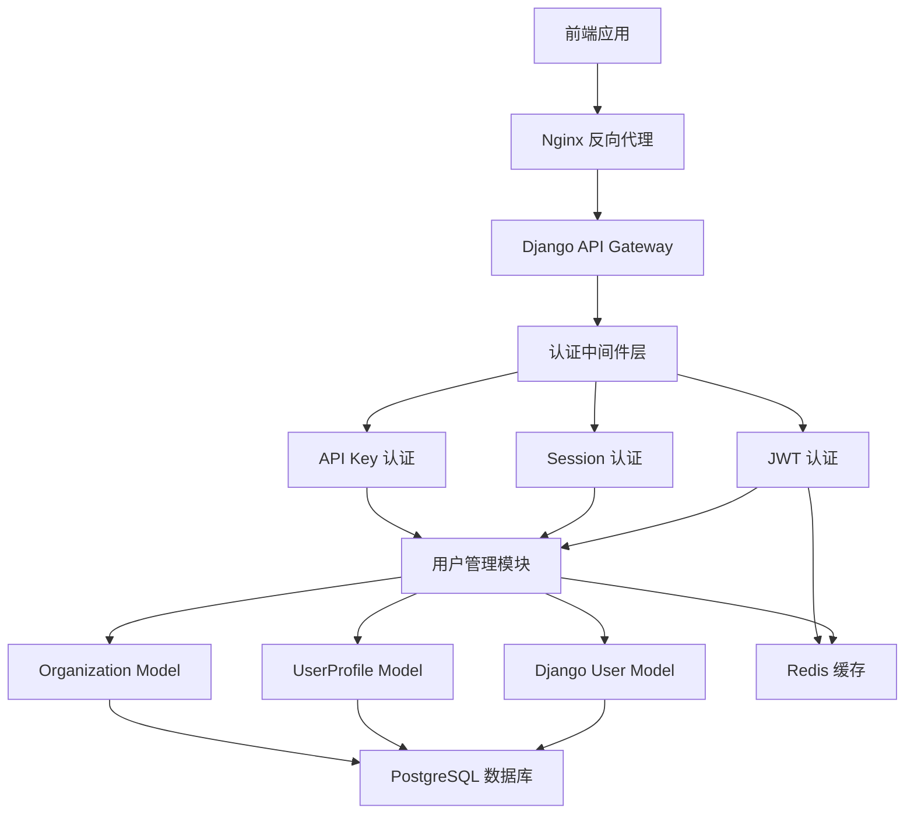
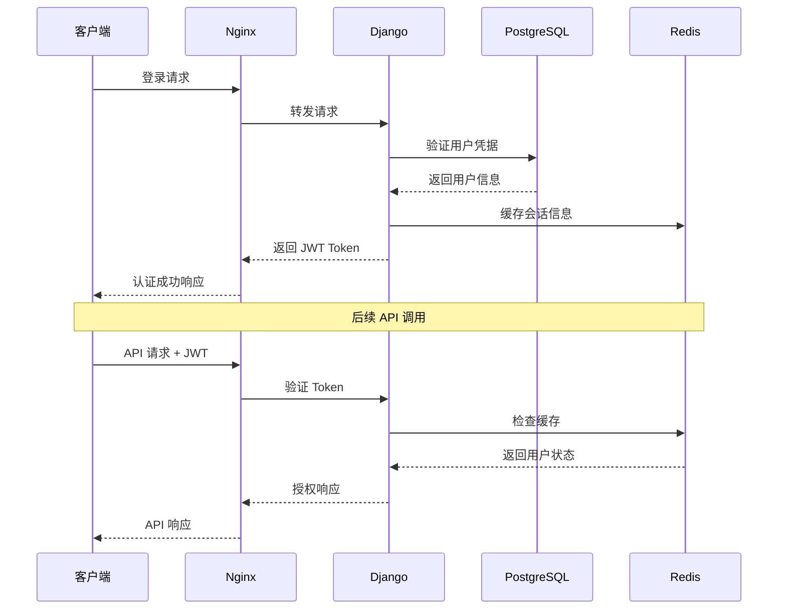

# AI 中台 - 认证系统架构概览

[](https://www.djangoproject.com/) [](https://jwt.io/)

**文档版本**: v1.0  
**更新时间**: 2025-05-30  
**适用环境**: Ubuntu 24.04 LTS + Django 4.2

## 📋 架构概览

AI 中台的认证系统采用分层架构设计，基于 Django 内置认证系统扩展，支持多种认证方式和精细化权限控制。

## 🏗️ 系统架构图



## 🔧 核心组件

### 1. 用户认证层

| 组件 | 技术实现 | 功能描述 | 状态 |
|------|----------|----------|------|
| Django User | AbstractUser 扩展 | 基础用户认证 | ✅ 已实现 |
| UserProfile | OneToOne 关联 | 用户扩展信息 | ✅ 已实现 |
| Organization | 自定义模型 | 组织机构管理 | ✅ 已实现 |

### 2. 认证机制

| 认证方式 | 适用场景 | 实现状态 | 配置优先级 |
|----------|----------|----------|------------|
| JWT Token | API 调用 | 📋 待配置 | 高 |
| Session Auth | Web 界面 | ✅ Django 内置 | 中 |
| API Key | 服务间调用 | 📋 待实现 | 低 |

### 3. 数据模型关系

```python
# 现有模型结构
User (AbstractUser)
├── email: EmailField (unique)
├── phone: CharField
├── avatar: ImageField
├── bio: TextField
└── profile: OneToOne -> UserProfile

UserProfile
├── user: OneToOne -> User
├── organization: ForeignKey -> Organization
├── department: CharField
├── position: CharField
└── preferences: JSONField

Organization
├── name: CharField (unique)
├── description: TextField
├── is_active: BooleanField
└── users: ForeignKey <- UserProfile
```

## 🔐 安全架构

### 认证流程



### 安全措施

| 安全层级 | 实现方式 | 防护目标 |
|----------|----------|----------|
| 传输安全 | HTTPS + TLS 1.3 | 数据传输加密 |
| 认证安全 | JWT + 刷新令牌 | 身份验证 |
| 会话安全 | Redis 存储 + 过期机制 | 会话管理 |
| 密码安全 | Django PBKDF2 | 密码哈希 |
| 访问控制 | IP 白名单 + 速率限制 | 恶意访问防护 |

## 📊 性能考虑

### 缓存策略

```python
# Redis 缓存配置示例
CACHES = {
    'default': {
        'BACKEND': 'django_redis.cache.RedisCache',
        'LOCATION': 'redis://127.0.0.1:6379/1',
        'OPTIONS': {
            'CLIENT_CLASS': 'django_redis.client.DefaultClient',
        }
    }
}

# 用户会话缓存
SESSION_ENGINE = 'django.contrib.sessions.backends.cache'
SESSION_CACHE_ALIAS = 'default'
SESSION_COOKIE_AGE = 86400  # 24小时
```

### 数据库优化

| 优化项 | 实现方式 | 预期效果 |
|--------|----------|----------|
| 索引优化 | 用户名、邮箱字段索引 | 查询性能提升 50% |
| 连接池 | PostgreSQL 连接池 | 并发处理能力提升 |
| 查询优化 | select_related/prefetch_related | 减少数据库查询次数 |

## 🔄 扩展性设计

### 多租户支持

- **组织隔离**: 基于 Organization 模型的数据隔离
- **权限继承**: 组织级权限向用户级权限继承
- **资源共享**: 跨组织资源访问控制

### 认证扩展

- **第三方登录**: OAuth2、SAML 集成预留接口
- **多因素认证**: TOTP、短信验证扩展
- **设备管理**: 设备注册和信任机制

## 📋 部署检查清单

### 部署前检查

- [ ] PostgreSQL 数据库已配置
- [ ] Redis 缓存服务运行正常
- [ ] Django 项目环境已激活
- [ ] 必要的 Python 包已安装

### 配置验证

```bash
# 检查数据库连接
python manage.py dbshell

# 检查 Redis 连接
python manage.py shell -c "from django.core.cache import cache; print(cache.get('test', 'Redis OK'))"

# 验证用户模型
python manage.py shell -c "from apps.authentication.models import User; print(User.objects.count())"
```

### 安全配置

```python
# settings.py 安全配置检查
SECURE_SSL_REDIRECT = True
SECURE_HSTS_SECONDS = 31536000
SECURE_HSTS_INCLUDE_SUBDOMAINS = True
SECURE_CONTENT_TYPE_NOSNIFF = True
SECURE_BROWSER_XSS_FILTER = True
X_FRAME_OPTIONS = 'DENY'
```

## 🔗 相关文档

- [Django 用户认证部署](./02_django_user_auth.md)
- [JWT 令牌认证配置](./03_jwt_authentication.md)
- [权限系统架构](./04_django_permissions.md)
- [API 安全配置](./06_api_security.md)

## ⚠️ 注意事项

1. **密钥管理**: 确保 SECRET_KEY 和 JWT 密钥的安全性
2. **权限最小化**: 遵循最小权限原则分配用户权限
3. **监控告警**: 设置异常登录和权限操作监控
4. **备份策略**: 定期备份用户和权限数据
5. **合规要求**: 满足数据保护和隐私法规要求

---

**下一步**: 继续配置 [Django 用户认证系统](./02_django_user_auth.md)
