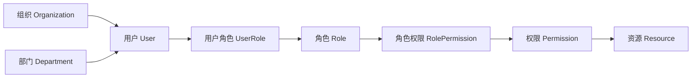

# AI 中台 - 角色权限管理 (RBAC)

[](https://en.wikipedia.org/wiki/Role-based_access_control) [](https://www.djangoproject.com/)

**部署时间**: 30-45分钟  
**难度级别**: ⭐⭐⭐⭐  
**前置要求**: Django 权限系统已配置

## 📋 RBAC 概览

基于角色的访问控制 (Role-Based Access Control, RBAC) 是一种广泛使用的访问控制模型，通过角色来管理用户权限，简化权限分配和管理。

## 🏗️ RBAC 模型设计

### 核心概念



### 数据模型扩展

更新 `apps/authentication/models.py`，添加完整的 RBAC 模型：

```python
from django.db import models
from django.contrib.auth.models import AbstractUser, Permission
from django.contrib.contenttypes.models import ContentType
import json

class Department(models.Model):
    """部门模型"""
    name = models.CharField(max_length=100, verbose_name='部门名称')
    code = models.CharField(max_length=20, unique=True, verbose_name='部门代码')
    organization = models.ForeignKey(
        'Organization', 
        on_delete=models.CASCADE, 
        verbose_name='所属组织'
    )
    parent = models.ForeignKey(
        'self', 
        on_delete=models.CASCADE, 
        null=True, 
        blank=True,
        verbose_name='上级部门'
    )
    level = models.PositiveIntegerField(default=1, verbose_name='部门层级')
    is_active = models.BooleanField(default=True, verbose_name='是否启用')
    created_at = models.DateTimeField(auto_now_add=True, verbose_name='创建时间')
    
    class Meta:
        verbose_name = '部门'
        verbose_name_plural = '部门'
        unique_together = ('organization', 'code')
        db_table = 'auth_departments'
    
    def __str__(self):
        return f"{self.organization.name} - {self.name}"
    
    def get_children(self):
        """获取子部门"""
        return Department.objects.filter(parent=self, is_active=True)
    
    def get_all_children(self):
        """递归获取所有子部门"""
        children = []
        for child in self.get_children():
            children.append(child)
            children.extend(child.get_all_children())
        return children

class Position(models.Model):
    """职位模型"""
    name = models.CharField(max_length=100, verbose_name='职位名称')
    code = models.CharField(max_length=20, unique=True, verbose_name='职位代码')
    department = models.ForeignKey(
        Department, 
        on_delete=models.CASCADE, 
        verbose_name='所属部门'
    )
    level = models.PositiveIntegerField(default=1, verbose_name='职位级别')
    description = models.TextField(blank=True, verbose_name='职位描述')
    is_active = models.BooleanField(default=True, verbose_name='是否启用')
    created_at = models.DateTimeField(auto_now_add=True, verbose_name='创建时间')
    
    class Meta:
        verbose_name = '职位'
        verbose_name_plural = '职位'
        db_table = 'auth_positions'
    
    def __str__(self):
        return f"{self.department.name} - {self.name}"

class Role(models.Model):
    """角色模型"""
    ROLE_TYPES = [
        ('system', '系统角色'),
        ('organization', '组织角色'),
        ('department', '部门角色'),
        ('custom', '自定义角色'),
    ]
    
    name = models.CharField(max_length=100, unique=True, verbose_name='角色名称')
    display_name = models.CharField(max_length=100, verbose_name='显示名称')
    description = models.TextField(blank=True, verbose_name='角色描述')
    role_type = models.CharField(
        max_length=20, 
        choices=ROLE_TYPES, 
        default='custom',
        verbose_name='角色类型'
    )
    permissions = models.ManyToManyField(
        Permission, 
        blank=True, 
        verbose_name='权限'
    )
    
    # 角色层级和继承
    level = models.PositiveIntegerField(default=1, verbose_name='角色级别')
    parent = models.ForeignKey(
        'self', 
        on_delete=models.CASCADE, 
        null=True, 
        blank=True,
        verbose_name='父角色'
    )
    
    # 角色范围限制
    organization = models.ForeignKey(
        'Organization', 
        on_delete=models.CASCADE, 
        null=True, 
        blank=True,
        verbose_name='限制组织'
    )
    department = models.ForeignKey(
        Department, 
        on_delete=models.CASCADE, 
        null=True, 
        blank=True,
        verbose_name='限制部门'
    )
    
    is_active = models.BooleanField(default=True, verbose_name='是否启用')
    created_at = models.DateTimeField(auto_now_add=True, verbose_name='创建时间')
    updated_at = models.DateTimeField(auto_now=True, verbose_name='更新时间')
    
    class Meta:
        verbose_name = '角色'
        verbose_name_plural = '角色'
        db_table = 'auth_roles'
    
    def __str__(self):
        return self.display_name
    
    def get_all_permissions(self):
        """获取角色及其父角色的所有权限"""
        permissions = set(self.permissions.all())
        
        # 递归获取父角色权限
        if self.parent:
            permissions.update(self.parent.get_all_permissions())
        
        return list(permissions)
    
    def can_assign_to_user(self, user):
        """检查角色是否可以分配给用户"""
        # 系统角色只能由超级用户分配
        if self.role_type == 'system' and not user.is_superuser:
            return False
        
        # 检查组织限制
        if self.organization:
            try:
                if user.profile.organization != self.organization:
                    return False
            except:
                return False
        
        # 检查部门限制
        if self.department:
            try:
                if user.profile.department_obj != self.department:
                    return False
            except:
                return False
        
        return True

class UserRole(models.Model):
    """用户角色关联"""
    user = models.ForeignKey(
        'User', 
        on_delete=models.CASCADE, 
        verbose_name='用户'
    )
    role = models.ForeignKey(
        Role, 
        on_delete=models.CASCADE, 
        verbose_name='角色'
    )
    assigned_by = models.ForeignKey(
        'User', 
        on_delete=models.SET_NULL, 
        null=True, 
        related_name='assigned_roles',
        verbose_name='分配者'
    )
    assigned_at = models.DateTimeField(auto_now_add=True, verbose_name='分配时间')
    expires_at = models.DateTimeField(null=True, blank=True, verbose_name='过期时间')
    is_active = models.BooleanField(default=True, verbose_name='是否启用')
    
    # 角色范围限制（可以进一步限制角色的使用范围）
    scope_organization = models.ForeignKey(
        'Organization', 
        on_delete=models.CASCADE, 
        null=True, 
        blank=True,
        verbose_name='作用组织'
    )
    scope_department = models.ForeignKey(
        Department, 
        on_delete=models.CASCADE, 
        null=True, 
        blank=True,
        verbose_name='作用部门'
    )
    
    class Meta:
        verbose_name = '用户角色'
        verbose_name_plural = '用户角色'
        unique_together = ('user', 'role', 'scope_organization', 'scope_department')
        db_table = 'auth_user_roles'
    
    def __str__(self):
        return f"{self.user.username} - {self.role.display_name}"
    
    def is_expired(self):
        """检查角色是否已过期"""
        if self.expires_at:
            from django.utils import timezone
            return timezone.now() > self.expires_at
        return False

# 扩展 UserProfile 模型
class UserProfile(models.Model):
    """用户配置文件"""
    user = models.OneToOneField(
        'User', 
        on_delete=models.CASCADE, 
        related_name='profile'
    )
    organization = models.ForeignKey(
        'Organization', 
        on_delete=models.SET_NULL, 
        null=True, 
        blank=True,
        verbose_name='所属组织'
    )
    department_obj = models.ForeignKey(
        Department, 
        on_delete=models.SET_NULL, 
        null=True, 
        blank=True,
        verbose_name='所属部门'
    )
    position = models.ForeignKey(
        Position, 
        on_delete=models.SET_NULL, 
        null=True, 
        blank=True,
        verbose_name='职位'
    )
    
    # 保留原有字段用于兼容性
    department = models.CharField(max_length=100, blank=True, verbose_name='部门')
    preferences = models.JSONField(default=dict, verbose_name='用户偏好')
    
    class Meta:
        verbose_name = '用户配置'
        verbose_name_plural = '用户配置'
        db_table = 'auth_userprofile'
    
    def get_effective_roles(self):
        """获取用户当前有效的角色"""
        from django.utils import timezone
        return Role.objects.filter(
            userrole__user=self.user,
            userrole__is_active=True,
            userrole__expires_at__isnull=True
        ).filter(
            models.Q(userrole__expires_at__gt=timezone.now()) |
            models.Q(userrole__expires_at__isnull=True)
        )
    
    def has_role_in_scope(self, role_name, organization=None, department=None):
        """检查用户在特定范围内是否拥有角色"""
        filters = {
            'role__name': role_name,
            'is_active': True
        }
        
        if organization:
            filters['scope_organization'] = organization
        if department:
            filters['scope_department'] = department
        
        return self.user.userrole_set.filter(**filters).exists()
```

## 🔧 RBAC 管理器

创建 `apps/authentication/rbac_manager.py`：

```python
from django.db import transaction
from django.contrib.auth.models import Permission
from django.contrib.contenttypes.models import ContentType
from django.utils import timezone
from .models import Role, UserRole, Department, Position
import logging

logger = logging.getLogger(__name__)

class RBACManager:
    """RBAC 管理器"""
    
    @staticmethod
    def create_role(name, display_name, description='', role_type='custom', 
                   permissions=None, parent=None, organization=None, department=None):
        """创建角色"""
        try:
            with transaction.atomic():
                role = Role.objects.create(
                    name=name,
                    display_name=display_name,
                    description=description,
                    role_type=role_type,
                    parent=parent,
                    organization=organization,
                    department=department
                )
                
                if permissions:
                    role.permissions.set(permissions)
                
                logger.info(f"Created role: {role.display_name}")
                return role
                
        except Exception as e:
            logger.error(f"Error creating role {name}: {str(e)}")
            raise
    
    @staticmethod
    def assign_role_to_user(user, role, assigned_by=None, expires_at=None, 
                           scope_organization=None, scope_department=None):
        """为用户分配角色"""
        try:
            # 检查角色是否可以分配给用户
            if not role.can_assign_to_user(user):
                raise ValueError(f"角色 {role.display_name} 不能分配给用户 {user.username}")
            
            # 检查是否已存在相同的角色分配
            existing = UserRole.objects.filter(
                user=user,
                role=role,
                scope_organization=scope_organization,
                scope_department=scope_department,
                is_active=True
            ).first()
            
            if existing:
                if existing.is_expired():
                    # 如果已过期，重新激活
                    existing.expires_at = expires_at
                    existing.assigned_by = assigned_by
                    existing.assigned_at = timezone.now()
                    existing.save()
                    return existing
                else:
                    raise ValueError(f"用户已拥有角色 {role.display_name}")
            
            # 创建新的角色分配
            user_role = UserRole.objects.create(
                user=user,
                role=role,
                assigned_by=assigned_by,
                expires_at=expires_at,
                scope_organization=scope_organization,
                scope_department=scope_department
            )
            
            logger.info(f"Assigned role {role.display_name} to user {user.username}")
            return user_role
            
        except Exception as e:
            logger.error(f"Error assigning role to user: {str(e)}")
            raise
    
    @staticmethod
    def remove_role_from_user(user, role, scope_organization=None, scope_department=None):
        """移除用户角色"""
        try:
            user_roles = UserRole.objects.filter(
                user=user,
                role=role,
                scope_organization=scope_organization,
                scope_department=scope_department,
                is_active=True
            )
            
            count = user_roles.update(is_active=False)
            logger.info(f"Removed {count} role assignments for user {user.username}")
            return count
            
        except Exception as e:
            logger.error(f"Error removing role from user: {str(e)}")
            raise
    
    @staticmethod
    def get_user_permissions(user, organization=None, department=None):
        """获取用户在特定范围内的所有权限"""
        permissions = set()
        
        # 获取用户的有效角色
        roles_query = user.userrole_set.filter(is_active=True)
        
        if organization:
            roles_query = roles_query.filter(
                models.Q(scope_organization=organization) |
                models.Q(scope_organization__isnull=True)
            )
        
        if department:
            roles_query = roles_query.filter(
                models.Q(scope_department=department) |
                models.Q(scope_department__isnull=True)
            )
        
        for user_role in roles_query:
            if not user_role.is_expired():
                role_permissions = user_role.role.get_all_permissions()
                permissions.update(role_permissions)
        
        # 添加用户直接权限
        direct_permissions = user.user_permissions.all()
        permissions.update(direct_permissions)
        
        return list(permissions)
    
    @staticmethod
    def check_permission(user, permission_codename, organization=None, department=None):
        """检查用户是否拥有特定权限"""
        # 超级用户拥有所有权限
        if user.is_superuser:
            return True
        
        # 获取用户权限
        user_permissions = RBACManager.get_user_permissions(
            user, organization, department
        )
        
        # 检查权限
        for perm in user_permissions:
            if hasattr(perm, 'codename') and perm.codename == permission_codename:
                return True
            elif isinstance(perm, str) and perm.endswith(f".{permission_codename}"):
                return True
        
        return False
    
    @staticmethod
    def create_department_hierarchy():
        """创建预定义部门层级"""
        try:
            # 这里可以根据实际需要创建部门结构
            default_departments = [
                {
                    'name': '技术部',
                    'code': 'TECH',
                    'children': [
                        {'name': '研发组', 'code': 'DEV'},
                        {'name': '运维组', 'code': 'OPS'},
                        {'name': '测试组', 'code': 'QA'},
                    ]
                },
                {
                    'name': '产品部',
                    'code': 'PRODUCT',
                    'children': [
                        {'name': '产品组', 'code': 'PM'},
                        {'name': '设计组', 'code': 'UI'},
                    ]
                }
            ]
            
            from .models import Organization
            default_org = Organization.objects.first()
            
            if not default_org:
                logger.warning("No organization found, creating default organization")
                default_org = Organization.objects.create(
                    name='默认组织',
                    description='系统默认组织'
                )
            
            for dept_data in default_departments:
                parent_dept, created = Department.objects.get_or_create(
                    code=dept_data['code'],
                    organization=default_org,
                    defaults={
                        'name': dept_data['name'],
                        'level': 1
                    }
                )
                
                if created:
                    logger.info(f"Created department: {parent_dept.name}")
                
                # 创建子部门
                for child_data in dept_data.get('children', []):
                    child_dept, created = Department.objects.get_or_create(
                        code=child_data['code'],
                        organization=default_org,
                        defaults={
                            'name': child_data['name'],
                            'parent': parent_dept,
                            'level': 2
                        }
                    )
                    
                    if created:
                        logger.info(f"Created sub-department: {child_dept.name}")
                        
        except Exception as e:
            logger.error(f"Error creating department hierarchy: {str(e)}")
            raise
```

## 🎯 RBAC 装饰器和中间件

创建 `apps/authentication/rbac_decorators.py`：

```python
from functools import wraps
from django.http import JsonResponse
from django.contrib.auth.decorators import login_required
from django.core.exceptions import PermissionDenied
from .rbac_manager import RBACManager

def rbac_permission_required(permission_codename, organization_field=None, department_field=None):
    """RBAC 权限装饰器"""
    def decorator(view_func):
        @wraps(view_func)
        @login_required
        def wrapped_view(request, *args, **kwargs):
            # 获取组织和部门上下文
            organization = None
            department = None
            
            if organization_field:
                if hasattr(request, organization_field):
                    organization = getattr(request, organization_field)
                elif organization_field in kwargs:
                    organization = kwargs[organization_field]
            
            if department_field:
                if hasattr(request, department_field):
                    department = getattr(request, department_field)
                elif department_field in kwargs:
                    department = kwargs[department_field]
            
            # 检查权限
            has_permission = RBACManager.check_permission(
                request.user, permission_codename, organization, department
            )
            
            if not has_permission:
                if request.path.startswith('/api/'):
                    return JsonResponse({
                        'error': '权限不足',
                        'detail': f'需要权限: {permission_codename}',
                        'required_permission': permission_codename
                    }, status=403)
                else:
                    raise PermissionDenied(f"需要权限: {permission_codename}")
            
            return view_func(request, *args, **kwargs)
        return wrapped_view
    return decorator

def organization_member_required(view_func):
    """组织成员权限装饰器"""
    @wraps(view_func)
    @login_required
    def wrapped_view(request, *args, **kwargs):
        # 从 URL 参数获取组织 ID
        org_id = kwargs.get('organization_id') or request.GET.get('organization_id')
        
        if org_id:
            try:
                from .models import Organization
                organization = Organization.objects.get(id=org_id)
                
                # 检查用户是否属于该组织
                if (request.user.profile.organization != organization and 
                    not request.user.is_superuser):
                    
                    if request.path.startswith('/api/'):
                        return JsonResponse({
                            'error': '权限不足',
                            'detail': '您不属于该组织'
                        }, status=403)
                    else:
                        raise PermissionDenied("您不属于该组织")
                
                # 将组织添加到请求中
                request.current_organization = organization
                
            except Organization.DoesNotExist:
                return JsonResponse({
                    'error': '组织不存在'
                }, status=404)
        
        return view_func(request, *args, **kwargs)
    return wrapped_view

class RBACPermissionMixin:
    """RBAC 权限混入类"""
    required_permission = None
    organization_field = None
    department_field = None
    
    def dispatch(self, request, *args, **kwargs):
        if not request.user.is_authenticated:
            return JsonResponse({
                'error': '未认证',
                'detail': '需要登录访问'
            }, status=401)
        
        if self.required_permission:
            # 获取上下文
            organization = self.get_organization_context(request, *args, **kwargs)
            department = self.get_department_context(request, *args, **kwargs)
            
            # 检查权限
            has_permission = RBACManager.check_permission(
                request.user, self.required_permission, organization, department
            )
            
            if not has_permission:
                return JsonResponse({
                    'error': '权限不足',
                    'detail': f'需要权限: {self.required_permission}'
                }, status=403)
        
        return super().dispatch(request, *args, **kwargs)
    
    def get_organization_context(self, request, *args, **kwargs):
        """获取组织上下文"""
        if self.organization_field:
            return kwargs.get(self.organization_field)
        return None
    
    def get_department_context(self, request, *args, **kwargs):
        """获取部门上下文"""
        if self.department_field:
            return kwargs.get(self.department_field)
        return None
```

## 🔧 RBAC 管理视图

创建 `apps/authentication/rbac_views.py`：

```python
from rest_framework import generics, status
from rest_framework.decorators import api_view, permission_classes
from rest_framework.permissions import IsAuthenticated
from rest_framework.response import Response
from django.contrib.auth.models import Permission
from .models import Role, UserRole, Department, Position
from .rbac_manager import RBACManager
from .rbac_decorators import rbac_permission_required, RBACPermissionMixin
from .serializers import (
    RoleSerializer, UserRoleSerializer, DepartmentSerializer, 
    PositionSerializer, RoleAssignmentSerializer
)

class RoleManagementView(RBACPermissionMixin, generics.ListCreateAPIView):
    """角色管理视图"""
    queryset = Role.objects.filter(is_active=True)
    serializer_class = RoleSerializer
    required_permission = 'authentication.add_role'
    
    def get_queryset(self):
        """根据用户权限过滤角色"""
        user = self.request.user
        
        if user.is_superuser:
            return Role.objects.filter(is_active=True)
        
        # 普通用户只能看到自己组织和部门的角色
        filters = models.Q(role_type='custom')
        
        if hasattr(user, 'profile') and user.profile.organization:
            filters |= models.Q(organization=user.profile.organization)
        
        return Role.objects.filter(filters, is_active=True)

class RoleDetailView(RBACPermissionMixin, generics.RetrieveUpdateDestroyAPIView):
    """角色详情视图"""
    queryset = Role.objects.filter(is_active=True)
    serializer_class = RoleSerializer
    required_permission = 'authentication.change_role'

@api_view(['POST'])
@rbac_permission_required('authentication.can_manage_users')
def assign_role_to_user(request):
    """分配角色给用户"""
    serializer = RoleAssignmentSerializer(data=request.data)
    
    if serializer.is_valid():
        try:
            user_id = serializer.validated_data['user_id']
            role_id = serializer.validated_data['role_id']
            expires_at = serializer.validated_data.get('expires_at')
            scope_organization_id = serializer.validated_data.get('scope_organization_id')
            scope_department_id = serializer.validated_data.get('scope_department_id')
            
            from .models import User
            user = User.objects.get(id=user_id)
            role = Role.objects.get(id=role_id)
            
            # 获取范围对象
            scope_organization = None
            scope_department = None
            
            if scope_organization_id:
                scope_organization = Organization.objects.get(id=scope_organization_id)
            
            if scope_department_id:
                scope_department = Department.objects.get(id=scope_department_id)
            
            # 分配角色
            user_role = RBACManager.assign_role_to_user(
                user=user,
                role=role,
                assigned_by=request.user,
                expires_at=expires_at,
                scope_organization=scope_organization,
                scope_department=scope_department
            )
            
            return Response({
                'message': f'成功为用户 {user.username} 分配角色 {role.display_name}',
                'user_role_id': user_role.id,
                'expires_at': user_role.expires_at
            }, status=status.HTTP_201_CREATED)
            
        except User.DoesNotExist:
            return Response({
                'error': '用户不存在'
            }, status=status.HTTP_404_NOT_FOUND)
        except Role.DoesNotExist:
            return Response({
                'error': '角色不存在'
            }, status=status.HTTP_404_NOT_FOUND)
        except ValueError as e:
            return Response({
                'error': str(e)
            }, status=status.HTTP_400_BAD_REQUEST)
        except Exception as e:
            return Response({
                'error': '分配失败',
                'detail': str(e)
            }, status=status.HTTP_500_INTERNAL_SERVER_ERROR)
    
    return Response(serializer.errors, status=status.HTTP_400_BAD_REQUEST)

@api_view(['GET'])
@permission_classes([IsAuthenticated])
def user_roles_and_permissions(request):
    """获取用户角色和权限信息"""
    user = request.user
    
    # 获取组织和部门上下文
    organization_id = request.GET.get('organization_id')
    department_id = request.GET.get('department_id')
    
    organization = None
    department = None
    
    if organization_id:
        try:
            organization = Organization.objects.get(id=organization_id)
        except Organization.DoesNotExist:
            pass
    
    if department_id:
        try:
            department = Department.objects.get(id=department_id)
        except Department.DoesNotExist:
            pass
    
    # 获取有效角色
    effective_roles = []
    if hasattr(user, 'profile'):
        roles = user.profile.get_effective_roles()
        for role in roles:
            role_data = {
                'id': role.id,
                'name': role.name,
                'display_name': role.display_name,
                'role_type': role.role_type,
                'level': role.level,
                'permissions': [perm.codename for perm in role.get_all_permissions()]
            }
            effective_roles.append(role_data)
    
    # 获取权限
    permissions = RBACManager.get_user_permissions(user, organization, department)
    permission_codes = [
        perm.codename if hasattr(perm, 'codename') else str(perm) 
        for perm in permissions
    ]
    
    return Response({
        'user_id': user.id,
        'username': user.username,
        'organization': {
            'id': organization.id,
            'name': organization.name
        } if organization else None,
        'department': {
            'id': department.id,
            'name': department.name
        } if department else None,
        'roles': effective_roles,
        'permissions': permission_codes,
        'is_superuser': user.is_superuser,
        'is_staff': user.is_staff
    })

class DepartmentManagementView(RBACPermissionMixin, generics.ListCreateAPIView):
    """部门管理视图"""
    serializer_class = DepartmentSerializer
    required_permission = 'authentication.add_department'
    
    def get_queryset(self):
        """根据用户权限过滤部门"""
        user = self.request.user
        
        if user.is_superuser:
            return Department.objects.filter(is_active=True)
        
        # 普通用户只能看到自己组织的部门
        if hasattr(user, 'profile') and user.profile.organization:
            return Department.objects.filter(
                organization=user.profile.organization,
                is_active=True
            )
        
        return Department.objects.none()

@api_view(['POST'])
@rbac_permission_required('authentication.can_manage_organization')
def create_department_hierarchy(request):
    """创建部门层级结构"""
    try:
        RBACManager.create_department_hierarchy()
        return Response({
            'message': '部门层级结构创建成功'
        })
    except Exception as e:
        return Response({
            'error': '创建失败',
            'detail': str(e)
        }, status=status.HTTP_500_INTERNAL_SERVER_ERROR)
```

## 🧪 RBAC 测试

创建 `test_rbac.py`：

```python
#!/usr/bin/env python3
import requests
import json

BASE_URL = 'http://localhost:8000/api/auth'

def test_rbac_system():
    """测试 RBAC 系统"""
    
    # 1. 管理员登录
    print("1. 管理员登录...")
    admin_token = get_admin_token()
    if not admin_token:
        return
    
    admin_headers = {'Authorization': f'Bearer {admin_token}'}
    
    # 2. 创建测试角色
    print("\n2. 创建测试角色...")
    create_test_roles(admin_headers)
    
    # 3. 创建部门结构
    print("\n3. 创建部门结构...")
    create_departments(admin_headers)
    
    # 4. 测试角色分配
    print("\n4. 测试角色分配...")
    test_role_assignment(admin_headers)
    
    # 5. 测试权限检查
    print("\n5. 测试权限检查...")
    test_permission_check(admin_headers)

def get_admin_token():
    """获取管理员令牌"""
    login_data = {
        'username': 'admin',
        'password': 'admin123'
    }
    
    response = requests.post(f'{BASE_URL}/token/', json=login_data)
    if response.status_code == 200:
        return response.json()['access']
    else:
        print(f"❌ 管理员登录失败: {response.status_code}")
        return None

def create_test_roles(headers):
    """创建测试角色"""
    test_roles = [
        {
            'name': 'department_manager',
            'display_name': '部门经理',
            'description': '部门管理权限',
            'role_type': 'department'
        },
        {
            'name': 'project_leader',
            'display_name': '项目负责人',
            'description': '项目管理权限',
            'role_type': 'custom'
        }
    ]
    
    for role_data in test_roles:
        response = requests.post(f'{BASE_URL}/roles/', json=role_data, headers=headers)
        if response.status_code == 201:
            print(f"✅ 创建角色: {role_data['display_name']}")
        else:
            print(f"❌ 创建角色失败: {role_data['display_name']}")

def create_departments(headers):
    """创建部门结构"""
    response = requests.post(f'{BASE_URL}/create-departments/', headers=headers)
    if response.status_code == 200:
        print("✅ 部门结构创建成功")
    else:
        print(f"❌ 部门结构创建失败: {response.status_code}")

def test_role_assignment(headers):
    """测试角色分配"""
    # 获取用户和角色列表
    users_response = requests.get(f'{BASE_URL}/users/', headers=headers)
    roles_response = requests.get(f'{BASE_URL}/roles/', headers=headers)
    
    if users_response.status_code == 200 and roles_response.status_code == 200:
        users = users_response.json()['results']
        roles = roles_response.json()['results']
        
        if users and roles:
            # 分配第一个角色给第一个用户
            assignment_data = {
                'user_id': users[0]['id'],
                'role_id': roles[0]['id']
            }
            
            response = requests.post(
                f'{BASE_URL}/assign-role/', 
                json=assignment_data, 
                headers=headers
            )
            
            if response.status_code == 201:
                print("✅ 角色分配成功")
            else:
                print(f"❌ 角色分配失败: {response.status_code}")

def test_permission_check(headers):
    """测试权限检查"""
    response = requests.get(f'{BASE_URL}/user-roles-permissions/', headers=headers)
    if response.status_code == 200:
        data = response.json()
        print(f"✅ 用户权限检查成功")
        print(f"   角色数量: {len(data['roles'])}")
        print(f"   权限数量: {len(data['permissions'])}")
    else:
        print(f"❌ 权限检查失败: {response.status_code}")

if __name__ == '__main__':
    test_rbac_system()
```

## 📊 RBAC 管理命令

创建 `apps/authentication/management/commands/setup_rbac.py`：

```python
from django.core.management.base import BaseCommand
from django.contrib.auth.models import Permission
from apps.authentication.models import Role, Department, Position
from apps.authentication.rbac_manager import RBACManager

class Command(BaseCommand):
    help = '初始化 RBAC 系统'
    
    def add_arguments(self, parser):
        parser.add_argument(
            '--create-roles',
            action='store_true',
            help='创建预定义角色',
        )
        parser.add_argument(
            '--create-departments',
            action='store_true',
            help='创建部门结构',
        )
    
    def handle(self, *args, **options):
        if options['create_departments']:
            self.create_departments()
        
        if options['create_roles']:
            self.create_default_roles()
        
        self.stdout.write(
            self.style.SUCCESS('RBAC 系统初始化完成')
        )
    
    def create_departments(self):
        """创建部门结构"""
        try:
            RBACManager.create_department_hierarchy()
            self.stdout.write('✅ 部门结构创建成功')
        except Exception as e:
            self.stdout.write(
                self.style.ERROR(f'部门结构创建失败: {str(e)}')
            )
    
    def create_default_roles(self):
        """创建默认角色"""
        default_roles = [
            {
                'name': 'system_admin',
                'display_name': '系统管理员',
                'description': '系统最高权限',
                'role_type': 'system',
                'permissions': ['*']
            },
            {
                'name': 'org_admin',
                'display_name': '组织管理员',
                'description': '组织管理权限',
                'role_type': 'organization',
                'permissions': [
                    'authentication.add_user',
                    'authentication.change_user',
                    'authentication.view_user',
                    'authentication.can_manage_users',
                ]
            },
            {
                'name': 'dept_manager',
                'display_name': '部门经理',
                'description': '部门管理权限',
                'role_type': 'department',
                'permissions': [
                    'authentication.view_user',
                    'authentication.change_userprofile',
                ]
            },
            {
                'name': 'regular_user',
                'display_name': '普通用户',
                'description': '基础用户权限',
                'role_type': 'custom',
                'permissions': [
                    'authentication.view_user',
                    'authentication.change_userprofile',
                ]
            }
        ]
        
        for role_data in default_roles:
            try:
                role = RBACManager.create_role(
                    name=role_data['name'],
                    display_name=role_data['display_name'],
                    description=role_data['description'],
                    role_type=role_data['role_type']
                )
                
                # 分配权限
                if role_data['permissions'] == ['*']:
                    role.permissions.set(Permission.objects.all())
                else:
                    permissions = []
                    for perm_code in role_data['permissions']:
                        try:
                            codename = perm_code.split('.')[-1]
                            permission = Permission.objects.get(codename=codename)
                            permissions.append(permission)
                        except Permission.DoesNotExist:
                            self.stdout.write(
                                self.style.WARNING(f'权限不存在: {perm_code}')
                            )
                    
                    role.permissions.set(permissions)
                
                self.stdout.write(f'✅ 创建角色: {role.display_name}')
                
            except Exception as e:
                self.stdout.write(
                    self.style.ERROR(f'创建角色失败 {role_data["name"]}: {str(e)}')
                )
```

执行 RBAC 初始化：

```bash
# 数据库迁移
python manage.py makemigrations authentication
python manage.py migrate

# 初始化 RBAC 系统
python manage.py setup_rbac --create-departments --create-roles
```

## 🔗 下一步

- [API 安全配置](./06_api_security.md) - 配置 API 安全防护
- [权限审计监控](./07_audit_monitoring.md) - 设置审计和监控系统
- [部署验证测试](./08_deployment_testing.md) - 完整系统测试

## ⚠️ 重要提醒

1. **角色设计**: 合理设计角色层级，避免权限膨胀
2. **权限继承**: 注意父角色权限的继承关系
3. **范围控制**: 合理使用组织和部门范围限制
4. **过期管理**: 及时处理过期的角色分配
5. **审计日志**: 记录所有角色和权限的变更操作
