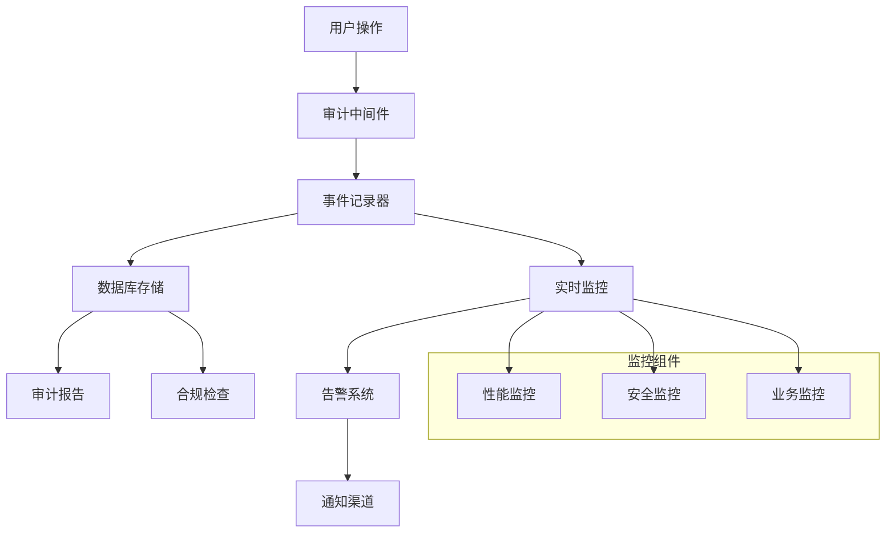

# AI 中台 - 审计监控系统

[](https://grafana.com/) [](https://docs.djangoproject.com/en/stable/topics/logging/)

**部署时间**: 45-60分钟  
**难度级别**: ⭐⭐⭐⭐⭐  
**前置要求**: API安全系统已部署

## 📋 审计监控概览

审计监控系统是 AI 中台安全体系的重要组成部分，负责记录、分析和监控所有系统活动，确保合规性和安全性。

## 🏗️ 监控架构



## 🚀 快速部署

### 一键部署脚本

```bash
#!/bin/bash
# 创建并运行 deploy_audit_monitoring.sh

echo "开始部署审计监控系统..."

# 1. 安装监控依赖
cd /opt/ai-platform/backend
source /opt/ai-platform/venv/bin/activate

pip install django-auditlog
pip install celery[redis]
pip install flower
pip install prometheus-client
pip install django-prometheus
pip install python-telegram-bot
pip install slack-sdk

# 2. 创建日志目录
mkdir -p /opt/ai-platform/backend/logs/{audit,security,performance,error}
chmod 755 /opt/ai-platform/backend/logs

# 3. 迁移数据库
python manage.py makemigrations
python manage.py migrate

# 4. 创建监控超级用户
python manage.py shell -c "
from django.contrib.auth import get_user_model
User = get_user_model()
if not User.objects.filter(username='monitor_admin').exists():
    User.objects.create_superuser('monitor_admin', 'monitor@ai-platform.com', 'Monitor@2024')
    print('监控管理员账户已创建')
"

# 5. 启动 Celery 任务队列
celery -A config worker --loglevel=info --detach
celery -A config beat --loglevel=info --detach

# 6. 启动 Flower 监控
flower -A config --port=5555 --basic_auth=admin:Monitor@2024 &

echo "审计监控系统部署完成!"
echo "Flower 监控界面: http://localhost:5555"
echo "用户名: admin, 密码: Monitor@2024"
```

## 📊 审计系统配置

### 步骤 1: 安装审计依赖

```bash
# 进入项目目录
cd /opt/ai-platform/backend
source /opt/ai-platform/venv/bin/activate

# 安装审计相关包
pip install django-auditlog
pip install django-simple-history
pip install django-model-utils
pip install celery[redis]
pip install flower
pip install prometheus-client

# 更新 requirements.txt
pip freeze > requirements.txt
```

### 步骤 2: 配置审计设置

在 `config/settings.py` 中添加审计配置：

```python
# 添加到 INSTALLED_APPS
INSTALLED_APPS = [
    # ...existing apps...
    'auditlog',
    'simple_history',
    'django_prometheus',
    'apps.audit',  # 自定义审计应用
]

# 审计日志配置
AUDITLOG_INCLUDE_TRACKING_MODELS = [
    'auth.User',
    'authentication.Organization',
    'authentication.UserProfile',
    'authentication.APIKey',
]

# 简单历史记录配置
SIMPLE_HISTORY_HISTORY_ID_USE_UUID = True
SIMPLE_HISTORY_REVERT_DISABLED = False

# Celery 配置（用于异步任务）
CELERY_BROKER_URL = 'redis://localhost:6379/0'
CELERY_RESULT_BACKEND = 'redis://localhost:6379/0'
CELERY_ACCEPT_CONTENT = ['json']
CELERY_TASK_SERIALIZER = 'json'
CELERY_RESULT_SERIALIZER = 'json'
CELERY_TIMEZONE = 'Asia/Shanghai'

# 审计数据保留策略
AUDIT_DATA_RETENTION_DAYS = 365  # 保留1年
AUDIT_LOG_LEVEL = 'INFO'
AUDIT_ENABLED = True

# Prometheus 监控配置
PROMETHEUS_EXPORT_MIGRATIONS = False
```

### 步骤 3: 创建审计应用

```bash
cd /opt/ai-platform/backend
python manage.py startapp audit apps/audit
```

创建 `apps/audit/models.py`：

```python
from django.db import models
from django.contrib.auth import get_user_model
from django.contrib.contenttypes.models import ContentType
from django.contrib.contenttypes.fields import GenericForeignKey
from django.utils import timezone
import json

User = get_user_model()

class AuditLog(models.Model):
    """审计日志模型"""
    
    ACTION_TYPES = [
        ('create', '创建'),
        ('read', '读取'),
        ('update', '更新'),
        ('delete', '删除'),
        ('login', '登录'),
        ('logout', '登出'),
        ('permission_check', '权限检查'),
        ('api_access', 'API访问'),
        ('file_upload', '文件上传'),
        ('file_download', '文件下载'),
        ('export', '数据导出'),
        ('import', '数据导入'),
        ('backup', '数据备份'),
        ('restore', '数据恢复'),
    ]
    
    RESULT_TYPES = [
        ('success', '成功'),
        ('failed', '失败'),
        ('partial', '部分成功'),
        ('denied', '拒绝'),
    ]
    
    # 基本信息
    timestamp = models.DateTimeField(default=timezone.now, db_index=True)
    user = models.ForeignKey(User, on_delete=models.SET_NULL, null=True, blank=True)
    session_key = models.CharField(max_length=40, blank=True)
    
    # 操作信息
    action = models.CharField(max_length=50, choices=ACTION_TYPES, db_index=True)
    result = models.CharField(max_length=20, choices=RESULT_TYPES, db_index=True)
    description = models.TextField()
    
    # 请求信息
    ip_address = models.GenericIPAddressField()
    user_agent = models.TextField(blank=True)
    request_method = models.CharField(max_length=10, blank=True)
    request_path = models.TextField(blank=True)
    request_params = models.JSONField(default=dict, blank=True)
    
    # 对象信息
    content_type = models.ForeignKey(ContentType, on_delete=models.CASCADE, null=True, blank=True)
    object_id = models.PositiveIntegerField(null=True, blank=True)
    content_object = GenericForeignKey('content_type', 'object_id')
    
    # 变更信息
    changes = models.JSONField(default=dict, blank=True)
    old_values = models.JSONField(default=dict, blank=True)
    new_values = models.JSONField(default=dict, blank=True)
    
    # 附加信息
    metadata = models.JSONField(default=dict, blank=True)
    risk_level = models.CharField(max_length=20, choices=[
        ('low', '低'),
        ('medium', '中'),
        ('high', '高'),
        ('critical', '严重'),
    ], default='low', db_index=True)
    
    class Meta:
        db_table = 'audit_log'
        verbose_name = '审计日志'
        verbose_name_plural = '审计日志'
        ordering = ['-timestamp']
        indexes = [
            models.Index(fields=['timestamp', 'action']),
            models.Index(fields=['user', 'timestamp']),
            models.Index(fields=['ip_address', 'timestamp']),
        ]
    
    def __str__(self):
        return f"{self.timestamp} - {self.user} - {self.get_action_display()}"
    
    @classmethod
    def log_action(cls, user, action, result, description, request=None, **kwargs):
        """记录审计动作"""
        log_data = {
            'user': user,
            'action': action,
            'result': result,
            'description': description,
            **kwargs
        }
        
        if request:
            log_data.update({
                'ip_address': cls._get_client_ip(request),
                'user_agent': request.META.get('HTTP_USER_AGENT', ''),
                'request_method': request.method,
                'request_path': request.path,
                'session_key': request.session.session_key,
            })
        
        return cls.objects.create(**log_data)
    
    @staticmethod
    def _get_client_ip(request):
        """获取客户端IP"""
        x_forwarded_for = request.META.get('HTTP_X_FORWARDED_FOR')
        if x_forwarded_for:
            ip = x_forwarded_for.split(',')[0]
        else:
            ip = request.META.get('REMOTE_ADDR', '127.0.0.1')
        return ip

class ComplianceReport(models.Model):
    """合规报告"""
    
    REPORT_TYPES = [
        ('daily', '日报'),
        ('weekly', '周报'),
        ('monthly', '月报'),
        ('quarterly', '季报'),
        ('annual', '年报'),
        ('custom', '自定义'),
    ]
    
    report_type = models.CharField(max_length=20, choices=REPORT_TYPES)
    title = models.CharField(max_length=200)
    description = models.TextField(blank=True)
    
    # 时间范围
    start_date = models.DateTimeField()
    end_date = models.DateTimeField()
    
    # 报告内容
    total_actions = models.IntegerField(default=0)
    failed_actions = models.IntegerField(default=0)
    high_risk_actions = models.IntegerField(default=0)
    unique_users = models.IntegerField(default=0)
    unique_ips = models.IntegerField(default=0)
    
    # 详细数据
    summary_data = models.JSONField(default=dict)
    detailed_data = models.JSONField(default=dict)
    
    # 状态
    created_at = models.DateTimeField(auto_now_add=True)
    created_by = models.ForeignKey(User, on_delete=models.CASCADE)
    is_exported = models.BooleanField(default=False)
    export_path = models.CharField(max_length=500, blank=True)
    
    class Meta:
        db_table = 'compliance_report'
        verbose_name = '合规报告'
        verbose_name_plural = '合规报告'
        ordering = ['-created_at']
    
    def __str__(self):
        return f"{self.title} - {self.start_date.date()}"

class SystemMetrics(models.Model):
    """系统指标"""
    
    timestamp = models.DateTimeField(default=timezone.now, db_index=True)
    
    # 性能指标
    cpu_usage = models.FloatField(default=0.0)
    memory_usage = models.FloatField(default=0.0)
    disk_usage = models.FloatField(default=0.0)
    
    # 请求指标
    request_count = models.IntegerField(default=0)
    response_time_avg = models.FloatField(default=0.0)
    error_rate = models.FloatField(default=0.0)
    
    # 用户指标
    active_users = models.IntegerField(default=0)
    concurrent_users = models.IntegerField(default=0)
    
    # 数据库指标
    db_connections = models.IntegerField(default=0)
    db_query_time_avg = models.FloatField(default=0.0)
    
    # 自定义指标
    custom_metrics = models.JSONField(default=dict, blank=True)
    
    class Meta:
        db_table = 'system_metrics'
        verbose_name = '系统指标'
        verbose_name_plural = '系统指标'
        ordering = ['-timestamp']
        indexes = [
            models.Index(fields=['timestamp']),
        ]
    
    @classmethod
    def record_metrics(cls, **metrics):
        """记录系统指标"""
        return cls.objects.create(**metrics)
```

## 📈 监控中间件

创建 `apps/audit/middleware.py`：

```python
import time
import json
import logging
from django.utils.deprecation import MiddlewareMixin
from django.contrib.contenttypes.models import ContentType
from .models import AuditLog
from .tasks import async_log_audit

logger = logging.getLogger('audit')

class AuditMiddleware(MiddlewareMixin):
    """审计中间件"""
    
    def __init__(self, get_response):
        super().__init__(get_response)
        self.sensitive_fields = ['password', 'token', 'secret', 'key']
    
    def process_request(self, request):
        """请求处理"""
        request._audit_start_time = time.time()
        
        # 记录请求数据（过滤敏感信息）
        request._audit_data = {
            'method': request.method,
            'path': request.path,
            'get_params': self._filter_sensitive_data(dict(request.GET)),
            'post_params': self._get_post_params(request),
            'headers': self._get_safe_headers(request),
        }
        
        return None
    
    def process_response(self, request, response):
        """响应处理"""
        if not hasattr(request, '_audit_start_time'):
            return response
        
        # 计算响应时间
        response_time = time.time() - request._audit_start_time
        
        # 确定是否需要审计
        if self._should_audit(request, response):
            audit_data = {
                'user': getattr(request, 'user', None) if hasattr(request, 'user') and request.user.is_authenticated else None,
                'action': self._determine_action(request),
                'result': self._determine_result(response),
                'description': self._generate_description(request, response),
                'ip_address': self._get_client_ip(request),
                'user_agent': request.META.get('HTTP_USER_AGENT', ''),
                'request_method': request.method,
                'request_path': request.path,
                'session_key': getattr(request.session, 'session_key', ''),
                'request_params': request._audit_data,
                'metadata': {
                    'response_time': response_time,
                    'status_code': response.status_code,
                    'content_length': len(response.content) if hasattr(response, 'content') else 0,
                },
                'risk_level': self._assess_risk_level(request, response),
            }
            
            # 异步记录审计日志
            async_log_audit.delay(audit_data)
        
        return response
    
    def _should_audit(self, request, response):
        """判断是否需要审计"""
        # 跳过静态文件和健康检查
        skip_paths = ['/static/', '/media/', '/health/', '/favicon.ico']
        if any(request.path.startswith(path) for path in skip_paths):
            return False
        
        # 审计API请求和重要操作
        audit_paths = ['/api/', '/admin/', '/auth/']
        if any(request.path.startswith(path) for path in audit_paths):
            return True
        
        # 审计错误响应
        if response.status_code >= 400:
            return True
        
        return False
    
    def _determine_action(self, request):
        """确定操作类型"""
        method_action_map = {
            'GET': 'read',
            'POST': 'create',
            'PUT': 'update',
            'PATCH': 'update',
            'DELETE': 'delete',
        }
        
        # 特殊路径处理
        if 'login' in request.path:
            return 'login'
        elif 'logout' in request.path:
            return 'logout'
        elif 'upload' in request.path:
            return 'file_upload'
        elif 'download' in request.path:
            return 'file_download'
        elif 'export' in request.path:
            return 'export'
        elif 'import' in request.path:
            return 'import'
        
        return method_action_map.get(request.method, 'read')
    
    def _determine_result(self, response):
        """确定操作结果"""
        if response.status_code < 300:
            return 'success'
        elif response.status_code < 400:
            return 'partial'
        elif response.status_code == 403:
            return 'denied'
        else:
            return 'failed'
    
    def _assess_risk_level(self, request, response):
        """评估风险级别"""
        # 高风险操作
        high_risk_patterns = ['delete', 'admin', 'superuser', 'permission']
        if any(pattern in request.path.lower() for pattern in high_risk_patterns):
            return 'high'
        
        # 中风险操作
        if request.method in ['POST', 'PUT', 'DELETE'] or response.status_code >= 400:
            return 'medium'
        
        return 'low'
    
    def _generate_description(self, request, response):
        """生成操作描述"""
        action = self._determine_action(request)
        result = self._determine_result(response)
        
        return f"用户{action}操作 {request.path}，结果：{result}，状态码：{response.status_code}"
    
    def _filter_sensitive_data(self, data):
        """过滤敏感数据"""
        if not isinstance(data, dict):
            return data
        
        filtered = {}
        for key, value in data.items():
            if any(sensitive in key.lower() for sensitive in self.sensitive_fields):
                filtered[key] = '***FILTERED***'
            else:
                filtered[key] = value
        return filtered
    
    def _get_post_params(self, request):
        """获取POST参数"""
        try:
            if request.content_type == 'application/json':
                data = json.loads(request.body.decode('utf-8'))
                return self._filter_sensitive_data(data)
            else:
                return self._filter_sensitive_data(dict(request.POST))
        except:
            return {}
    
    def _get_safe_headers(self, request):
        """获取安全的请求头"""
        safe_headers = {}
        include_headers = ['content-type', 'accept', 'authorization']
        
        for key, value in request.META.items():
            if key.lower().startswith('http_'):
                header_name = key[5:].lower().replace('_', '-')
                if header_name in include_headers:
                    if 'authorization' in header_name:
                        safe_headers[header_name] = '***FILTERED***'
                    else:
                        safe_headers[header_name] = value
        
        return safe_headers
    
    def _get_client_ip(self, request):
        """获取客户端IP"""
        x_forwarded_for = request.META.get('HTTP_X_FORWARDED_FOR')
        if x_forwarded_for:
            ip = x_forwarded_for.split(',')[0]
        else:
            ip = request.META.get('REMOTE_ADDR', '127.0.0.1')
        return ip

class PerformanceMonitoringMiddleware(MiddlewareMixin):
    """性能监控中间件"""
    
    def process_request(self, request):
        request._monitoring_start_time = time.time()
    
    def process_response(self, request, response):
        if hasattr(request, '_monitoring_start_time'):
            response_time = time.time() - request._monitoring_start_time
            
            # 记录慢查询
            if response_time > 2.0:  # 超过2秒的请求
                logger.warning(
                    f"Slow request detected: {request.method} {request.path} "
                    f"took {response_time:.2f}s"
                )
            
            # 添加响应时间头
            response['X-Response-Time'] = f"{response_time:.3f}s"
        
        return response
```

## 🔄 异步任务

创建 `apps/audit/tasks.py`：

```python
from celery import shared_task
from django.utils import timezone
from django.db.models import Count, Q
from .models import AuditLog, ComplianceReport, SystemMetrics
import psutil
import logging

logger = logging.getLogger('audit')

@shared_task
def async_log_audit(audit_data):
    """异步记录审计日志"""
    try:
        AuditLog.objects.create(**audit_data)
    except Exception as e:
        logger.error(f"Failed to create audit log: {e}")

@shared_task
def cleanup_old_audit_logs():
    """清理旧的审计日志"""
    from django.conf import settings
    retention_days = getattr(settings, 'AUDIT_DATA_RETENTION_DAYS', 365)
    cutoff_date = timezone.now() - timezone.timedelta(days=retention_days)
    
    deleted_count = AuditLog.objects.filter(timestamp__lt=cutoff_date).delete()[0]
    logger.info(f"Cleaned up {deleted_count} old audit logs")
    
    return deleted_count

@shared_task
def generate_daily_compliance_report():
    """生成日度合规报告"""
    end_date = timezone.now()
    start_date = end_date - timezone.timedelta(days=1)
    
    # 统计数据
    total_actions = AuditLog.objects.filter(
        timestamp__range=[start_date, end_date]
    ).count()
    
    failed_actions = AuditLog.objects.filter(
        timestamp__range=[start_date, end_date],
        result='failed'
    ).count()
    
    high_risk_actions = AuditLog.objects.filter(
        timestamp__range=[start_date, end_date],
        risk_level='high'
    ).count()
    
    unique_users = AuditLog.objects.filter(
        timestamp__range=[start_date, end_date]
    ).values('user').distinct().count()
    
    unique_ips = AuditLog.objects.filter(
        timestamp__range=[start_date, end_date]
    ).values('ip_address').distinct().count()
    
    # 详细统计
    action_stats = AuditLog.objects.filter(
        timestamp__range=[start_date, end_date]
    ).values('action').annotate(count=Count('id'))
    
    result_stats = AuditLog.objects.filter(
        timestamp__range=[start_date, end_date]
    ).values('result').annotate(count=Count('id'))
    
    # 创建报告
    from django.contrib.auth import get_user_model
    User = get_user_model()
    
    try:
        admin_user = User.objects.filter(is_superuser=True).first()
        
        report = ComplianceReport.objects.create(
            report_type='daily',
            title=f'日度合规报告 - {start_date.date()}',
            description=f'{start_date.date()} 的系统审计和合规情况',
            start_date=start_date,
            end_date=end_date,
            total_actions=total_actions,
            failed_actions=failed_actions,
            high_risk_actions=high_risk_actions,
            unique_users=unique_users,
            unique_ips=unique_ips,
            created_by=admin_user,
            summary_data={
                'action_stats': list(action_stats),
                'result_stats': list(result_stats),
                'error_rate': (failed_actions / total_actions * 100) if total_actions > 0 else 0,
                'risk_rate': (high_risk_actions / total_actions * 100) if total_actions > 0 else 0,
            }
        )
        
        logger.info(f"Generated daily compliance report: {report.id}")
        return report.id
        
    except Exception as e:
        logger.error(f"Failed to generate daily compliance report: {e}")
        return None

@shared_task
def collect_system_metrics():
    """收集系统指标"""
    try:
        # CPU 使用率
        cpu_usage = psutil.cpu_percent(interval=1)
        
        # 内存使用率
        memory = psutil.virtual_memory()
        memory_usage = memory.percent
        
        # 磁盘使用率
        disk = psutil.disk_usage('/')
        disk_usage = disk.percent
        
        # 活跃用户数（最近5分钟）
        from django.contrib.auth import get_user_model
        User = get_user_model()
        
        five_minutes_ago = timezone.now() - timezone.timedelta(minutes=5)
        active_users = AuditLog.objects.filter(
            timestamp__gte=five_minutes_ago
        ).values('user').distinct().count()
        
        # 请求统计（最近1分钟）
        one_minute_ago = timezone.now() - timezone.timedelta(minutes=1)
        recent_logs = AuditLog.objects.filter(timestamp__gte=one_minute_ago)
        
        request_count = recent_logs.count()
        error_count = recent_logs.filter(result='failed').count()
        error_rate = (error_count / request_count * 100) if request_count > 0 else 0
        
        # 平均响应时间
        response_times = [
            log.metadata.get('response_time', 0) 
            for log in recent_logs 
            if log.metadata.get('response_time')
        ]
        response_time_avg = sum(response_times) / len(response_times) if response_times else 0
        
        # 记录指标
        metrics = SystemMetrics.objects.create(
            cpu_usage=cpu_usage,
            memory_usage=memory_usage,
            disk_usage=disk_usage,
            request_count=request_count,
            response_time_avg=response_time_avg,
            error_rate=error_rate,
            active_users=active_users,
            custom_metrics={
                'disk_free_gb': disk.free / (1024**3),
                'memory_available_gb': memory.available / (1024**3),
            }
        )
        
        logger.info(f"Collected system metrics: {metrics.id}")
        return metrics.id
        
    except Exception as e:
        logger.error(f"Failed to collect system metrics: {e}")
        return None

@shared_task
def check_security_alerts():
    """检查安全告警"""
    try:
        now = timezone.now()
        last_hour = now - timezone.timedelta(hours=1)
        
        # 检查失败登录尝试
        failed_logins = AuditLog.objects.filter(
            timestamp__gte=last_hour,
            action='login',
            result='failed'
        ).count()
        
        if failed_logins > 50:  # 1小时内超过50次失败登录
            send_security_alert.delay(
                'high',
                '异常登录尝试',
                f'检测到过去1小时内有{failed_logins}次失败登录尝试'
            )
        
        # 检查高风险操作
        high_risk_ops = AuditLog.objects.filter(
            timestamp__gte=last_hour,
            risk_level='high'
        ).count()
        
        if high_risk_ops > 20:  # 1小时内超过20次高风险操作
            send_security_alert.delay(
                'medium',
                '频繁高风险操作',
                f'检测到过去1小时内有{high_risk_ops}次高风险操作'
            )
        
        # 检查系统性能
        latest_metrics = SystemMetrics.objects.order_by('-timestamp').first()
        if latest_metrics:
            if latest_metrics.cpu_usage > 90:
                send_security_alert.delay(
                    'medium',
                    'CPU使用率过高',
                    f'当前CPU使用率: {latest_metrics.cpu_usage}%'
                )
            
            if latest_metrics.memory_usage > 90:
                send_security_alert.delay(
                    'medium',
                    '内存使用率过高',
                    f'当前内存使用率: {latest_metrics.memory_usage}%'
                )
        
        logger.info("Security alert check completed")
        return True
        
    except Exception as e:
        logger.error(f"Failed to check security alerts: {e}")
        return False

@shared_task
def send_security_alert(severity, title, message):
    """发送安全告警"""
    try:
        # 记录告警
        logger.warning(f"SECURITY ALERT [{severity.upper()}]: {title} - {message}")
        
        # 这里可以集成邮件、Slack、微信等通知方式
        # send_email_alert(severity, title, message)
        # send_slack_alert(severity, title, message)
        
        return True
    except Exception as e:
        logger.error(f"Failed to send security alert: {e}")
        return False
```

## ⏰ 定时任务配置

创建 `config/celery.py`：

```python
import os
from celery import Celery
from celery.schedules import crontab

# 设置 Django 环境变量
os.environ.setdefault('DJANGO_SETTINGS_MODULE', 'config.settings')

app = Celery('ai_platform')

# 使用 Django 设置配置 Celery
app.config_from_object('django.conf:settings', namespace='CELERY')

# 自动发现任务
app.autodiscover_tasks()

# 定时任务配置
app.conf.beat_schedule = {
    # 每5分钟收集系统指标
    'collect-system-metrics': {
        'task': 'apps.audit.tasks.collect_system_metrics',
        'schedule': crontab(minute='*/5'),
    },
    
    # 每10分钟检查安全告警
    'check-security-alerts': {
        'task': 'apps.audit.tasks.check_security_alerts',
        'schedule': crontab(minute='*/10'),
    },
    
    # 每天凌晨2点生成合规报告
    'daily-compliance-report': {
        'task': 'apps.audit.tasks.generate_daily_compliance_report',
        'schedule': crontab(hour=2, minute=0),
    },
    
    # 每周日凌晨3点清理旧日志
    'cleanup-old-audit-logs': {
        'task': 'apps.audit.tasks.cleanup_old_audit_logs',
        'schedule': crontab(hour=3, minute=0, day_of_week=0),
    },
}

app.conf.timezone = 'Asia/Shanghai'
```

## 📊 监控仪表板

创建 `apps/audit/views.py`：

```python
from django.shortcuts import render
from django.contrib.admin.views.decorators import staff_member_required
from django.http import JsonResponse
from django.utils import timezone
from django.db.models import Count, Q, Avg
from .models import AuditLog, ComplianceReport, SystemMetrics
from datetime import timedelta

@staff_member_required
def audit_dashboard(request):
    """审计仪表板"""
    # 基础统计
    now = timezone.now()
    today = now.date()
    yesterday = today - timedelta(days=1)
    last_week = now - timedelta(days=7)
    
    context = {
        'today_actions': AuditLog.objects.filter(timestamp__date=today).count(),
        'yesterday_actions': AuditLog.objects.filter(timestamp__date=yesterday).count(),
        'week_actions': AuditLog.objects.filter(timestamp__gte=last_week).count(),
        'failed_actions_today': AuditLog.objects.filter(
            timestamp__date=today, result='failed'
        ).count(),
        'high_risk_actions_today': AuditLog.objects.filter(
            timestamp__date=today, risk_level='high'
        ).count(),
    }
    
    return render(request, 'audit/dashboard.html', context)

@staff_member_required
def audit_api_stats(request):
    """审计API统计数据"""
    days = int(request.GET.get('days', 7))
    start_date = timezone.now() - timedelta(days=days)
    
    # 按日期统计
    daily_stats = AuditLog.objects.filter(
        timestamp__gte=start_date
    ).extra(
        select={'date': 'DATE(timestamp)'}
    ).values('date').annotate(
        total=Count('id'),
        failed=Count('id', filter=Q(result='failed')),
        high_risk=Count('id', filter=Q(risk_level='high'))
    ).order_by('date')
    
    # 按操作类型统计
    action_stats = AuditLog.objects.filter(
        timestamp__gte=start_date
    ).values('action').annotate(count=Count('id')).order_by('-count')
    
    # 按用户统计
    user_stats = AuditLog.objects.filter(
        timestamp__gte=start_date
    ).exclude(user__isnull=True).values(
        'user__username'
    ).annotate(count=Count('id')).order_by('-count')[:10]
    
    # 系统指标
    latest_metrics = SystemMetrics.objects.order_by('-timestamp').first()
    
    return JsonResponse({
        'daily_stats': list(daily_stats),
        'action_stats': list(action_stats),
        'user_stats': list(user_stats),
        'system_metrics': {
            'cpu_usage': latest_metrics.cpu_usage if latest_metrics else 0,
            'memory_usage': latest_metrics.memory_usage if latest_metrics else 0,
            'disk_usage': latest_metrics.disk_usage if latest_metrics else 0,
            'active_users': latest_metrics.active_users if latest_metrics else 0,
        } if latest_metrics else {}
    })
```

## 🎨 前端模板

创建监控仪表板模板 `templates/audit/dashboard.html`：

```html
<!DOCTYPE html>
<html lang="zh-CN">
<head>
    <meta charset="UTF-8">
    <meta name="viewport" content="width=device-width, initial-scale=1.0">
    <title>审计监控仪表板</title>
    <script src="https://cdn.jsdelivr.net/npm/chart.js"></script>
    <link href="https://cdn.jsdelivr.net/npm/bootstrap@5.1.3/dist/css/bootstrap.min.css" rel="stylesheet">
    <style>
        .metric-card {
            background: linear-gradient(135deg, #667eea 0%, #764ba2 100%);
            color: white;
            border-radius: 10px;
            padding: 20px;
            margin-bottom: 20px;
        }
        .metric-value {
            font-size: 2rem;
            font-weight: bold;
        }
        .chart-container {
            background: white;
            border-radius: 10px;
            padding: 20px;
            box-shadow: 0 2px 10px rgba(0,0,0,0.1);
            margin-bottom: 20px;
        }
        .status-indicator {
            width: 12px;
            height: 12px;
            border-radius: 50%;
            display: inline-block;
            margin-right: 8px;
        }
        .status-online { background-color: #28a745; }
        .status-warning { background-color: #ffc107; }
        .status-error { background-color: #dc3545; }
    </style>
</head>
<body>
    <div class="container-fluid">
        <div class="row">
            <div class="col-12">
                <h1 class="mb-4">
                    <span class="status-indicator status-online"></span>
                    审计监控仪表板
                </h1>
            </div>
        </div>
        
        <!-- 核心指标 -->
        <div class="row">
            <div class="col-md-3">
                <div class="metric-card">
                    <div class="metric-value">{{ today_actions }}</div>
                    <div>今日操作</div>
                    <small>昨日: {{ yesterday_actions }}</small>
                </div>
            </div>
            <div class="col-md-3">
                <div class="metric-card">
                    <div class="metric-value">{{ failed_actions_today }}</div>
                    <div>今日失败</div>
                    <small>失败率: {{ failed_actions_today|floatformat:1 }}%</small>
                </div>
            </div>
            <div class="col-md-3">
                <div class="metric-card">
                    <div class="metric-value">{{ high_risk_actions_today }}</div>
                    <div>高风险操作</div>
                    <small>风险率: {{ high_risk_actions_today|floatformat:1 }}%</small>
                </div>
            </div>
            <div class="col-md-3">
                <div class="metric-card">
                    <div class="metric-value">{{ week_actions }}</div>
                    <div>本周操作</div>
                    <small>平均每日: {{ week_actions|floatformat:0 }}</small>
                </div>
            </div>
        </div>
        
        <!-- 图表区域 -->
        <div class="row">
            <div class="col-md-8">
                <div class="chart-container">
                    <h5>操作趋势</h5>
                    <canvas id="activityChart" height="200"></canvas>
                </div>
            </div>
            <div class="col-md-4">
                <div class="chart-container">
                    <h5>操作类型分布</h5>
                    <canvas id="actionChart" height="200"></canvas>
                </div>
            </div>
        </div>
        
        <div class="row">
            <div class="col-md-6">
                <div class="chart-container">
                    <h5>系统性能</h5>
                    <canvas id="performanceChart" height="200"></canvas>
                </div>
            </div>
            <div class="col-md-6">
                <div class="chart-container">
                    <h5>活跃用户</h5>
                    <div id="usersList"></div>
                </div>
            </div>
        </div>
    </div>

    <script>
        // 初始化图表
        document.addEventListener('DOMContentLoaded', function() {
            loadDashboardData();
            
            // 每30秒刷新数据
            setInterval(loadDashboardData, 30000);
        });
        
        function loadDashboardData() {
            fetch('/admin/audit/api-stats/?days=7')
                .then(response => response.json())
                .then(data => {
                    updateActivityChart(data.daily_stats);
                    updateActionChart(data.action_stats);
                    updatePerformanceChart(data.system_metrics);
                    updateUsersList(data.user_stats);
                });
        }
        
        function updateActivityChart(data) {
            const ctx = document.getElementById('activityChart').getContext('2d');
            
            new Chart(ctx, {
                type: 'line',
                data: {
                    labels: data.map(d => d.date),
                    datasets: [{
                        label: '总操作',
                        data: data.map(d => d.total),
                        borderColor: '#007bff',
                        backgroundColor: 'rgba(0, 123, 255, 0.1)',
                        tension: 0.4
                    }, {
                        label: '失败操作',
                        data: data.map(d => d.failed),
                        borderColor: '#dc3545',
                        backgroundColor: 'rgba(220, 53, 69, 0.1)',
                        tension: 0.4
                    }]
                },
                options: {
                    responsive: true,
                    maintainAspectRatio: false,
                    scales: {
                        y: {
                            beginAtZero: true
                        }
                    }
                }
            });
        }
        
        function updateActionChart(data) {
            const ctx = document.getElementById('actionChart').getContext('2d');
            
            new Chart(ctx, {
                type: 'doughnut',
                data: {
                    labels: data.map(d => d.action),
                    datasets: [{
                        data: data.map(d => d.count),
                        backgroundColor: [
                            '#007bff', '#28a745', '#ffc107', 
                            '#dc3545', '#6f42c1', '#fd7e14'
                        ]
                    }]
                },
                options: {
                    responsive: true,
                    maintainAspectRatio: false,
                    plugins: {
                        legend: {
                            position: 'bottom'
                        }
                    }
                }
            });
        }
        
        function updatePerformanceChart(metrics) {
            const ctx = document.getElementById('performanceChart').getContext('2d');
            
            new Chart(ctx, {
                type: 'bar',
                data: {
                    labels: ['CPU使用率', '内存使用率', '磁盘使用率'],
                    datasets: [{
                        data: [
                            metrics.cpu_usage || 0,
                            metrics.memory_usage || 0,
                            metrics.disk_usage || 0
                        ],
                        backgroundColor: [
                            metrics.cpu_usage > 80 ? '#dc3545' : '#28a745',
                            metrics.memory_usage > 80 ? '#dc3545' : '#28a745',
                            metrics.disk_usage > 80 ? '#dc3545' : '#28a745'
                        ]
                    }]
                },
                options: {
                    responsive: true,
                    maintainAspectRatio: false,
                    scales: {
                        y: {
                            beginAtZero: true,
                            max: 100
                        }
                    },
                    plugins: {
                        legend: {
                            display: false
                        }
                    }
                }
            });
        }
        
        function updateUsersList(users) {
            const container = document.getElementById('usersList');
            container.innerHTML = users.map(user => 
                `<div class="d-flex justify-content-between align-items-center mb-2">
                    <span>${user.user__username}</span>
                    <span class="badge bg-primary">${user.count}</span>
                </div>`
            ).join('');
        }
    </script>
</body>
</html>
```

## 📊 Grafana 配置

创建 `monitoring/grafana-dashboard.json`：

```json
{
  "dashboard": {
    "id": null,
    "title": "AI中台审计监控",
    "tags": ["ai-platform", "audit", "monitoring"],
    "timezone": "Asia/Shanghai",
    "panels": [
      {
        "id": 1,
        "title": "操作总量",
        "type": "stat",
        "targets": [
          {
            "expr": "sum(rate(audit_operations_total[5m]))",
            "legendFormat": "操作/秒"
          }
        ],
        "fieldConfig": {
          "defaults": {
            "color": {
              "mode": "thresholds"
            },
            "thresholds": {
              "steps": [
                {"color": "green", "value": null},
                {"color": "yellow", "value": 50},
                {"color": "red", "value": 100}
              ]
            }
          }
        },
        "gridPos": {"h": 8, "w": 6, "x": 0, "y": 0}
      },
      {
        "id": 2,
        "title": "错误率",
        "type": "stat",
        "targets": [
          {
            "expr": "rate(audit_operations_failed_total[5m]) / rate(audit_operations_total[5m]) * 100",
            "legendFormat": "错误率 %"
          }
        ],
        "fieldConfig": {
          "defaults": {
            "unit": "percent",
            "color": {
              "mode": "thresholds"
            },
            "thresholds": {
              "steps": [
                {"color": "green", "value": null},
                {"color": "yellow", "value": 5},
                {"color": "red", "value": 10}
              ]
            }
          }
        },
        "gridPos": {"h": 8, "w": 6, "x": 6, "y": 0}
      },
      {
        "id": 3,
        "title": "系统性能",
        "type": "timeseries",
        "targets": [
          {
            "expr": "system_cpu_usage",
            "legendFormat": "CPU使用率"
          },
          {
            "expr": "system_memory_usage",
            "legendFormat": "内存使用率"
          },
          {
            "expr": "system_disk_usage",
            "legendFormat": "磁盘使用率"
          }
        ],
        "fieldConfig": {
          "defaults": {
            "unit": "percent",
            "min": 0,
            "max": 100
          }
        },
        "gridPos": {"h": 8, "w": 12, "x": 12, "y": 0}
      }
    ],
    "time": {
      "from": "now-1h",
      "to": "now"
    },
    "refresh": "30s"
  }
}
```

## 🐳 Docker 监控配置

创建 `monitoring/docker-compose.yml`：

```yaml
version: '3.8'

services:
  prometheus:
    image: prom/prometheus:latest
    container_name: ai_platform_prometheus
    ports:
      - "9090:9090"
    volumes:
      - ./prometheus.yml:/etc/prometheus/prometheus.yml
      - prometheus_data:/prometheus
    command:
      - '--config.file=/etc/prometheus/prometheus.yml'
      - '--storage.tsdb.path=/prometheus'
      - '--web.console.libraries=/etc/prometheus/console_libraries'
      - '--web.console.templates=/etc/prometheus/consoles'
      - '--storage.tsdb.retention.time=90d'
      - '--web.enable-lifecycle'
    networks:
      - monitoring

  grafana:
    image: grafana/grafana:latest
    container_name: ai_platform_grafana
    ports:
      - "3000:3000"
    environment:
      - GF_SECURITY_ADMIN_PASSWORD=admin123
      - GF_USERS_ALLOW_SIGN_UP=false
    volumes:
      - grafana_data:/var/lib/grafana
      - ./grafana-dashboard.json:/var/lib/grafana/dashboards/ai-platform.json
    networks:
      - monitoring

  node_exporter:
    image: prom/node-exporter:latest
    container_name: ai_platform_node_exporter
    ports:
      - "9100:9100"
    volumes:
      - /proc:/host/proc:ro
      - /sys:/host/sys:ro
      - /:/rootfs:ro
    command:
      - '--path.procfs=/host/proc'
      - '--path.rootfs=/rootfs'
      - '--path.sysfs=/host/sys'
      - '--collector.filesystem.mount-points-exclude=^/(sys|proc|dev|host|etc)($$|/)'
    networks:
      - monitoring

  redis_exporter:
    image: oliver006/redis_exporter:latest
    container_name: ai_platform_redis_exporter
    ports:
      - "9121:9121"
    environment:
      - REDIS_ADDR=redis://redis:6379
    networks:
      - monitoring

volumes:
  prometheus_data:
  grafana_data:

networks:
  monitoring:
    driver: bridge
```

创建 `monitoring/prometheus.yml`：

```yaml
global:
  scrape_interval: 15s
  evaluation_interval: 15s

rule_files:
  - "alerts.yml"

scrape_configs:
  - job_name: 'ai-platform'
    static_configs:
      - targets: ['localhost:8000']
    metrics_path: '/metrics'
    scrape_interval: 30s

  - job_name: 'node-exporter'
    static_configs:
      - targets: ['node_exporter:9100']

  - job_name: 'redis'
    static_configs:
      - targets: ['redis_exporter:9121']

  - job_name: 'celery'
    static_configs:
      - targets: ['localhost:5555']

alerting:
  alertmanagers:
    - static_configs:
        - targets: ['alertmanager:9093']
```

## 📈 性能指标导出

创建 `apps/audit/metrics.py`：

```python
from prometheus_client import Counter, Histogram, Gauge, CollectorRegistry
from django.utils import timezone
import time

# 创建指标注册器
registry = CollectorRegistry()

# 定义指标
AUDIT_OPERATIONS_TOTAL = Counter(
    'audit_operations_total',
    '审计操作总数',
    ['action', 'result', 'risk_level'],
    registry=registry
)

AUDIT_OPERATIONS_DURATION = Histogram(
    'audit_operations_duration_seconds',
    '审计操作耗时',
    ['action'],
    registry=registry
)

SYSTEM_CPU_USAGE = Gauge(
    'system_cpu_usage_percent',
    'CPU使用率',
    registry=registry
)

SYSTEM_MEMORY_USAGE = Gauge(
    'system_memory_usage_percent',
    '内存使用率',
    registry=registry
)

SYSTEM_DISK_USAGE = Gauge(
    'system_disk_usage_percent',
    '磁盘使用率',
    registry=registry
)

ACTIVE_USERS = Gauge(
    'active_users_total',
    '活跃用户数',
    registry=registry
)

REQUEST_RESPONSE_TIME = Histogram(
    'request_response_time_seconds',
    '请求响应时间',
    ['method', 'endpoint'],
    registry=registry
)

def record_audit_operation(action, result, risk_level):
    """记录审计操作指标"""
    AUDIT_OPERATIONS_TOTAL.labels(
        action=action,
        result=result,
        risk_level=risk_level
    ).inc()

def record_operation_duration(action, duration):
    """记录操作耗时"""
    AUDIT_OPERATIONS_DURATION.labels(action=action).observe(duration)

def update_system_metrics(cpu_usage, memory_usage, disk_usage, active_users):
    """更新系统指标"""
    SYSTEM_CPU_USAGE.set(cpu_usage)
    SYSTEM_MEMORY_USAGE.set(memory_usage)
    SYSTEM_DISK_USAGE.set(disk_usage)
    ACTIVE_USERS.set(active_users)

def record_request_time(method, endpoint, duration):
    """记录请求时间"""
    REQUEST_RESPONSE_TIME.labels(
        method=method,
        endpoint=endpoint
    ).observe(duration)
```

创建指标导出视图 `apps/audit/views.py`（添加到现有文件）:

```python
from django.http import HttpResponse
from prometheus_client import generate_latest, CONTENT_TYPE_LATEST
from .metrics import registry

def prometheus_metrics(request):
    """Prometheus指标导出端点"""
    return HttpResponse(
        generate_latest(registry),
        content_type=CONTENT_TYPE_LATEST
    )
```

## 🔧 配置总结

### 完整配置文件更新

在 `config/settings.py` 中添加审计监控配置：

```python
# 审计监控配置
AUDIT_ENABLED = True
AUDIT_ASYNC = True  # 启用异步审计
AUDIT_DATA_RETENTION_DAYS = 365  # 数据保留天数
AUDIT_SENSITIVE_FIELDS = [
    'password', 'token', 'secret', 'key', 'auth',
    'credit_card', 'ssn', 'phone', 'email'
]

# 性能监控配置
PERFORMANCE_MONITORING = True
SLOW_REQUEST_THRESHOLD = 2.0  # 慢请求阈值（秒）

# 安全告警配置
SECURITY_ALERTS = {
    'FAILED_LOGIN_THRESHOLD': 50,  # 1小时内失败登录阈值
    'HIGH_RISK_THRESHOLD': 20,     # 1小时内高风险操作阈值
    'CPU_THRESHOLD': 90,           # CPU使用率告警阈值
    'MEMORY_THRESHOLD': 90,        # 内存使用率告警阈值
    'DISK_THRESHOLD': 90,          # 磁盘使用率告警阈值
}

# Celery配置
CELERY_BROKER_URL = 'redis://localhost:6379/0'
CELERY_RESULT_BACKEND = 'redis://localhost:6379/0'
CELERY_ACCEPT_CONTENT = ['json']
CELERY_TASK_SERIALIZER = 'json'
CELERY_RESULT_SERIALIZER = 'json'
CELERY_TIMEZONE = 'Asia/Shanghai'

# 中间件配置
MIDDLEWARE = [
    'django.middleware.security.SecurityMiddleware',
    'corsheaders.middleware.CorsMiddleware',
    'django.contrib.sessions.middleware.SessionMiddleware',
    'django.middleware.common.CommonMiddleware',
    'django.middleware.csrf.CsrfViewMiddleware',
    'django.contrib.auth.middleware.AuthenticationMiddleware',
    'django.contrib.messages.middleware.MessageMiddleware',
    'django.middleware.clickjacking.XFrameOptionsMiddleware',
    
    # 审计监控中间件
    'apps.audit.middleware.AuditMiddleware',
    'apps.audit.middleware.PerformanceMonitoringMiddleware',
]

# 监控相关URL
MONITORING_URLS = {
    'dashboard': '/admin/audit/dashboard/',
    'metrics': '/metrics/',
    'api_stats': '/admin/audit/api-stats/',
}
```

### URL配置

在 `config/urls.py` 中添加监控路由：

```python
from django.contrib import admin
from django.urls import path, include
from apps.audit.views import prometheus_metrics

urlpatterns = [
    path('admin/', admin.site.urls),
    path('api/', include('apps.auth.urls')),
    path('api/permissions/', include('apps.permissions.urls')),
    
    # 监控相关URL
    path('metrics/', prometheus_metrics, name='prometheus_metrics'),
    path('admin/audit/', include('apps.audit.urls')),
]
```

创建 `apps/audit/urls.py`：

```python
from django.urls import path
from . import views

urlpatterns = [
    path('dashboard/', views.audit_dashboard, name='audit_dashboard'),
    path('api-stats/', views.audit_api_stats, name='audit_api_stats'),
]
```

## 📋 最终部署检查清单

### 1. 基础环境检查
- [ ] Python 3.8 已安装
- [ ] Redis 服务运行正常
- [ ] PostgreSQL/MySQL 数据库运行正常
- [ ] 必要的Python包已安装（见requirements.txt）

### 2. 应用配置检查
- [ ] Django settings.py 审计配置已添加
- [ ] 中间件已正确配置
- [ ] 数据库迁移已执行
- [ ] 静态文件已收集

### 3. 监控服务检查
- [ ] Celery Worker 正在运行
- [ ] Celery Beat 正在运行
- [ ] Flower 监控界面可访问
- [ ] 日志目录权限正确

### 4. 安全配置检查
- [ ] 敏感字段过滤配置正确
- [ ] 告警阈值设置合理
- [ ] 日志轮转配置正确
- [ ] 访问权限控制正确

### 5. 性能监控检查
- [ ] Prometheus 指标导出正常
- [ ] Grafana 仪表板配置正确
- [ ] 系统指标收集正常
- [ ] 响应时间监控正常

### 6. 功能测试检查
- [ ] 审计日志记录正常
- [ ] 监控仪表板显示正常
- [ ] 定时任务执行正常
- [ ] 告警机制工作正常

## 🎯 监控运维建议

### 日常维护
1. **定期检查日志大小**，避免磁盘空间不足
2. **监控Celery队列长度**，防止任务积压
3. **关注系统性能指标**，及时处理性能问题
4. **定期备份审计数据**，确保数据安全

### 告警响应
1. **高CPU/内存使用率**: 检查系统负载，必要时扩容
2. **大量失败请求**: 检查应用日志，定位问题原因
3. **异常登录尝试**: 检查是否有安全威胁
4. **慢查询告警**: 优化数据库查询性能

### 容量规划
1. **审计数据增长**: 根据操作频率预估存储需求
2. **Redis内存**: 监控Celery队列占用的内存
3. **数据库性能**: 定期优化查询和索引
4. **系统资源**: 根据监控数据制定扩容计划

---

## 📚 相关文档

- [基于角色的访问控制 (RBAC) 系统](./05_role_based_access.md)
- [API安全配置](./06_api_security.md)
- [部署测试验证](./08_deployment_testing.md)

**审计监控系统配置完成！** 🎉

这个系统提供了全面的审计日志记录、性能监控、安全告警和可视化仪表板功能，确保AI中台系统的安全性和合规性。通过Prometheus和Grafana的集成，可以实现专业级的监控和告警能力。
