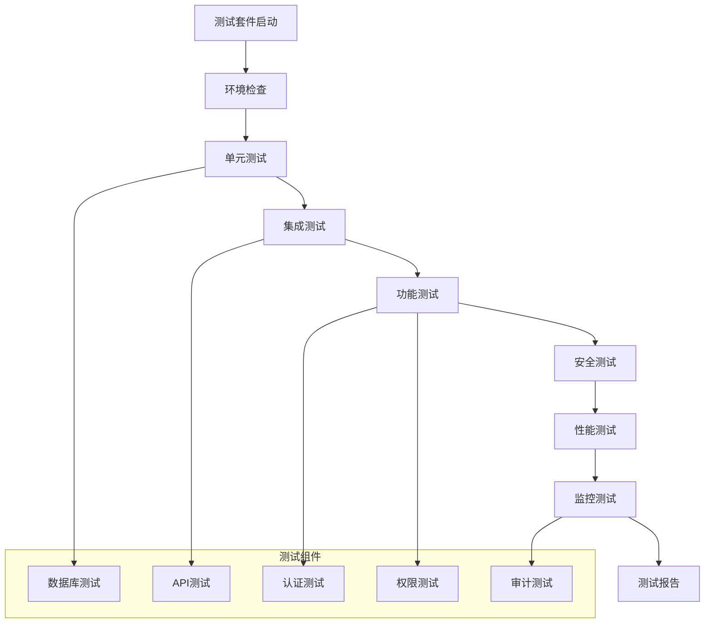

# AI 中台 - 部署测试验证

[](https://pytest.org/) [](https://checkmarx.com/)

**测试时间**: 60-90分钟  
**难度级别**: ⭐⭐⭐⭐⭐  
**前置要求**: 所有权限管理模块已部署

## 📋 测试验证概览

部署测试验证是 AI 中台权限管理系统的最后一个环节，确保所有组件正常工作，系统安全可靠，性能符合预期。

## 🎯 测试目标

- ✅ **功能测试**: 验证所有权限功能正常工作
- ✅ **安全测试**: 确保安全措施有效防护
- ✅ **性能测试**: 验证系统性能指标达标
- ✅ **集成测试**: 确保各模块协同工作
- ✅ **压力测试**: 验证系统承载能力
- ✅ **监控测试**: 确保审计监控正常运行

## 🏗️ 测试架构



## 🚀 快速测试部署

### 一键测试脚本

```bash
#!/bin/bash
# 创建并运行 deploy_testing_suite.sh

echo "开始部署测试验证套件..."

# 1. 安装测试依赖
cd /opt/ai-platform/backend
source /opt/ai-platform/venv/bin/activate

pip install pytest
pip install pytest-django
pip install pytest-cov
pip install pytest-xdist
pip install factory-boy
pip install faker
pip install locust
pip install selenium
pip install requests-mock
pip install freezegun

# 2. 创建测试目录结构
mkdir -p /opt/ai-platform/backend/tests/{unit,integration,functional,security,performance}
mkdir -p /opt/ai-platform/backend/tests/fixtures
mkdir -p /opt/ai-platform/backend/tests/reports

# 3. 设置测试环境变量
export TESTING=true
export DJANGO_SETTINGS_MODULE=config.settings_test

# 4. 创建测试数据库
python manage.py migrate --settings=config.settings_test

echo "测试验证套件部署完成!"
echo "运行测试: pytest tests/ --cov=apps/ --html=tests/reports/report.html"
```

## 📊 测试环境配置

### 步骤 1: 创建测试设置

创建 `config/settings_test.py`：

```python
from .settings import *
import os

# 测试环境标识
TESTING = True
DEBUG = True

# 测试数据库配置 (使用内存数据库)
DATABASES = {
    'default': {
        'ENGINE': 'django.db.backends.sqlite3',
        'NAME': ':memory:',
        'TEST': {
            'NAME': ':memory:'
        }
    }
}

# 缓存配置
CACHES = {
    'default': {
        'BACKEND': 'django.core.cache.backends.dummy.DummyCache',
    }
}

# Celery 测试配置
CELERY_TASK_ALWAYS_EAGER = True
CELERY_TASK_EAGER_PROPAGATES = True

# 密码哈希器 (测试用快速哈希)
PASSWORD_HASHERS = [
    'django.contrib.auth.hashers.MD5PasswordHasher',
]

# 测试邮件后端
EMAIL_BACKEND = 'django.core.mail.backends.locmem.EmailBackend'

# 禁用调试工具栏
INTERNAL_IPS = []

# JWT 测试配置
SIMPLE_JWT.update({
    'ACCESS_TOKEN_LIFETIME': timedelta(minutes=5),
    'REFRESH_TOKEN_LIFETIME': timedelta(minutes=10),
})

# 日志配置
LOGGING = {
    'version': 1,
    'disable_existing_loggers': False,
    'handlers': {
        'console': {
            'class': 'logging.StreamHandler',
        },
    },
    'root': {
        'handlers': ['console'],
        'level': 'WARNING',
    },
    'loggers': {
        'apps': {
            'handlers': ['console'],
            'level': 'INFO',
            'propagate': False,
        },
    },
}
```

### 步骤 2: 创建测试配置

创建 `tests/conftest.py`：

```python
import pytest
import django
from django.conf import settings
from django.test import override_settings
from django.contrib.auth import get_user_model
from django.core.management import call_command
from rest_framework.test import APIClient
from rest_framework_simplejwt.tokens import RefreshToken
from faker import Faker
import factory

# Django 测试环境设置
def pytest_configure():
    settings.configure(
        TESTING=True,
        DATABASES={
            'default': {
                'ENGINE': 'django.db.backends.sqlite3',
                'NAME': ':memory:'
            }
        },
        INSTALLED_APPS=[
            'django.contrib.auth',
            'django.contrib.contenttypes',
            'django.contrib.sessions',
            'django.contrib.messages',
            'rest_framework',
            'rest_framework_simplejwt',
            'apps.permissions',
            'apps.users',
            'apps.audit',
        ],
        SECRET_KEY='test-secret-key',
        USE_TZ=True,
    )
    django.setup()

User = get_user_model()
fake = Faker()

# 测试固定装置
@pytest.fixture(scope='session')
def django_db_setup():
    """设置测试数据库"""
    call_command('migrate', verbosity=0, interactive=False)

@pytest.fixture
def api_client():
    """提供 API 客户端"""
    return APIClient()

@pytest.fixture
def admin_user(django_db_blocker):
    """创建管理员用户"""
    with django_db_blocker.unblock():
        user = User.objects.create_user(
            username='admin',
            email='admin@test.com',
            password='testpass123',
            is_staff=True,
            is_superuser=True
        )
        return user

@pytest.fixture
def regular_user(django_db_blocker):
    """创建普通用户"""
    with django_db_blocker.unblock():
        user = User.objects.create_user(
            username='user',
            email='user@test.com',
            password='testpass123'
        )
        return user

@pytest.fixture
def authenticated_client(api_client, regular_user):
    """提供已认证的客户端"""
    refresh = RefreshToken.for_user(regular_user)
    api_client.credentials(HTTP_AUTHORIZATION=f'Bearer {refresh.access_token}')
    return api_client

@pytest.fixture
def admin_client(api_client, admin_user):
    """提供管理员客户端"""
    refresh = RefreshToken.for_user(admin_user)
    api_client.credentials(HTTP_AUTHORIZATION=f'Bearer {refresh.access_token}')
    return api_client

# 用户工厂
class UserFactory(factory.django.DjangoModelFactory):
    class Meta:
        model = User

    username = factory.Sequence(lambda n: f'user{n}')
    email = factory.LazyAttribute(lambda obj: f'{obj.username}@test.com')
    first_name = factory.Faker('first_name')
    last_name = factory.Faker('last_name')
    is_active = True

class AdminUserFactory(UserFactory):
    is_staff = True
    is_superuser = True
```

### 步骤 3: 创建权限测试固定装置

创建 `tests/fixtures/permissions_fixtures.py`：

```python
import pytest
from django.contrib.auth.models import Permission
from django.contrib.contenttypes.models import ContentType
from apps.permissions.models import Role, UserRole, Resource, Permission as CustomPermission

@pytest.fixture
def sample_roles(django_db_blocker):
    """创建示例角色"""
    with django_db_blocker.unblock():
        roles = []
        roles.append(Role.objects.create(
            name='数据分析师',
            description='负责数据分析和报告',
            is_active=True
        ))
        roles.append(Role.objects.create(
            name='项目经理',
            description='负责项目管理',
            is_active=True
        ))
        roles.append(Role.objects.create(
            name='系统管理员',
            description='系统全面管理权限',
            is_active=True
        ))
        return roles

@pytest.fixture
def sample_resources(django_db_blocker):
    """创建示例资源"""
    with django_db_blocker.unblock():
        resources = []
        resources.append(Resource.objects.create(
            name='用户管理',
            resource_type='module',
            path='/admin/users',
            description='用户管理模块'
        ))
        resources.append(Resource.objects.create(
            name='数据分析',
            resource_type='module',
            path='/analytics',
            description='数据分析模块'
        ))
        return resources

@pytest.fixture
def sample_permissions(django_db_blocker, sample_resources):
    """创建示例权限"""
    with django_db_blocker.unblock():
        permissions = []
        for resource in sample_resources:
            for action in ['view', 'create', 'edit', 'delete']:
                permissions.append(CustomPermission.objects.create(
                    name=f'{action}_{resource.name.lower()}',
                    codename=f'{action}_{resource.name.lower().replace(" ", "_")}',
                    description=f'允许{action} {resource.name}',
                    resource=resource
                ))
        return permissions

@pytest.fixture
def sample_user_roles(django_db_blocker, sample_roles, regular_user):
    """创建示例用户角色"""
    with django_db_blocker.unblock():
        return UserRole.objects.create(
            user=regular_user,
            role=sample_roles[0]
        )
```

## 🔒 安全测试套件

### SQL 注入测试

创建 `tests/security/test_sql_injection.py`：

```python
import pytest
from django.test import TestCase, Client
from django.urls import reverse
from django.contrib.auth import get_user_model
from rest_framework.test import APIClient
from rest_framework_simplejwt.tokens import RefreshToken

User = get_user_model()

@pytest.mark.django_db
class TestSQLInjectionPrevention:
    """SQL 注入防护测试"""
    
    def test_role_search_sql_injection(self, admin_client):
        """测试角色搜索 SQL 注入防护"""
        # 常见的 SQL 注入攻击向量
        malicious_inputs = [
            "'; DROP TABLE roles; --",
            "' OR '1'='1",
            "'; UPDATE roles SET is_active=0; --",
            "' UNION SELECT * FROM users --",
            "'; INSERT INTO roles (name) VALUES ('hacked'); --"
        ]
        
        for malicious_input in malicious_inputs:
            response = admin_client.get(
                reverse('role-list'),
                {'search': malicious_input}
            )
            # 应该正常返回，不会执行恶意 SQL
            assert response.status_code in [200, 400]
            # 验证没有执行恶意操作
            assert not User.objects.filter(username='hacked').exists()
    
    def test_user_filter_sql_injection(self, admin_client):
        """测试用户过滤 SQL 注入防护"""
        malicious_filter = "1=1; DROP TABLE auth_user; --"
        
        response = admin_client.get(
            reverse('user-list'),
            {'username__icontains': malicious_filter}
        )
        
        assert response.status_code in [200, 400]
        # 验证表仍然存在
        assert User.objects.count() >= 0
    
    def test_permission_codename_injection(self, admin_client):
        """测试权限代码名注入防护"""
        malicious_codename = "view_user'; DROP TABLE permissions; --"
        
        response = admin_client.get(
            reverse('permission-list'),
            {'codename': malicious_codename}
        )
        
        assert response.status_code in [200, 400]

@pytest.mark.django_db
class TestXSSPrevention:
    """XSS 攻击防护测试"""
    
    def test_role_name_xss_prevention(self, admin_client):
        """测试角色名称 XSS 防护"""
        xss_payloads = [
            "<script>alert('XSS')</script>",
            "javascript:alert('XSS')",
            "",
            "';alert(String.fromCharCode(88,83,83))//';",
            "<iframe src='javascript:alert(1)'></iframe>"
        ]
        
        for payload in xss_payloads:
            data = {
                'name': payload,
                'description': 'Test role',
                'is_active': True
            }
            response = admin_client.post(reverse('role-list'), data)
            
            if response.status_code == 201:
                # 验证存储的数据已被转义
                role_data = response.json()
                assert '<script>' not in role_data.get('name', '')
                assert 'javascript:' not in role_data.get('name', '')
    
    def test_user_profile_xss_prevention(self, authenticated_client, regular_user):
        """测试用户资料 XSS 防护"""
        xss_payload = "<script>document.location='http://evil.com'</script>"
        
        data = {
            'first_name': xss_payload,
            'last_name': 'Test',
            'email': regular_user.email
        }
        
        response = authenticated_client.patch(
            reverse('user-detail', kwargs={'pk': regular_user.pk}),
            data
        )
        
        if response.status_code == 200:
            user_data = response.json()
            assert '<script>' not in user_data.get('first_name', '')

@pytest.mark.django_db
class TestAuthenticationSecurity:
    """认证安全测试"""
    
    def test_brute_force_protection(self, api_client, regular_user):
        """测试暴力破解防护"""
        # 模拟多次错误登录尝试
        wrong_credentials = {
            'username': regular_user.username,
            'password': 'wrongpassword'
        }
        
        failed_attempts = 0
        for _ in range(10):
            response = api_client.post(reverse('token_obtain_pair'), wrong_credentials)
            if response.status_code == 401:
                failed_attempts += 1
        
        assert failed_attempts > 0
        
        # 验证正确密码仍然可以登录（如果没有账户锁定）
        correct_credentials = {
            'username': regular_user.username,
            'password': 'testpass123'
        }
        response = api_client.post(reverse('token_obtain_pair'), correct_credentials)
        # 根据实际的暴力破解防护策略，这里可能返回不同状态码
        assert response.status_code in [200, 429]  # 200成功 或 429被限制
    
    def test_password_strength_validation(self, admin_client):
        """测试密码强度验证"""
        weak_passwords = [
            '123',
            'password',
            '12345678',
            'qwerty',
            'admin'
        ]
        
        for weak_password in weak_passwords:
            data = {
                'username': f'testuser_{weak_password}',
                'email': f'test_{weak_password}@example.com',
                'password': weak_password,
                'password_confirm': weak_password
            }
            
            response = admin_client.post(reverse('user-list'), data)
            # 弱密码应该被拒绝
            assert response.status_code in [400, 422]
    
    def test_session_fixation_prevention(self, api_client, regular_user):
        """测试会话固定攻击防护"""
        # 获取初始 token
        login_data = {
            'username': regular_user.username,
            'password': 'testpass123'
        }
        response = api_client.post(reverse('token_obtain_pair'), login_data)
        assert response.status_code == 200
        
        first_token = response.json()['access']
        
        # 再次登录应该获得新的 token
        response = api_client.post(reverse('token_obtain_pair'), login_data)
        assert response.status_code == 200
        
        second_token = response.json()['access']
        
        # 验证 token 不同（防止会话固定）
        assert first_token != second_token

@pytest.mark.django_db
class TestAuthorizationSecurity:
    """授权安全测试"""
    
    def test_privilege_escalation_prevention(self, authenticated_client, regular_user, admin_user):
        """测试权限升级攻击防护"""
        # 普通用户尝试访问管理员功能
        admin_endpoints = [
            reverse('user-list'),
            reverse('role-list'),
            reverse('permission-list')
        ]
        
        for endpoint in admin_endpoints:
            response = authenticated_client.post(endpoint, {})
            # 普通用户应该被拒绝访问
            assert response.status_code in [403, 405]  # 403 Forbidden 或 405 Method Not Allowed
    
    def test_idor_prevention(self, authenticated_client, regular_user):
        """测试不安全直接对象引用防护"""
        # 创建另一个用户
        other_user = User.objects.create_user(
            username='otheruser',
            email='other@test.com',
            password='testpass123'
        )
        
        # 尝试访问其他用户的资料
        response = authenticated_client.get(
            reverse('user-detail', kwargs={'pk': other_user.pk})
        )
        
        # 应该被拒绝或只返回有限信息
        assert response.status_code in [403, 404]
    
    def test_role_tampering_prevention(self, authenticated_client, regular_user, sample_roles):
        """测试角色篡改防护"""
        role = sample_roles[0]
        
        # 普通用户尝试修改角色信息
        data = {
            'name': '篡改后的角色名',
            'description': '被篡改的描述',
            'is_active': False
        }
        
        response = authenticated_client.put(
            reverse('role-detail', kwargs={'pk': role.pk}),
            data
        )
        
        # 应该被拒绝
        assert response.status_code == 403
        
        # 验证角色没有被修改
        role.refresh_from_db()
        assert role.name != '篡改后的角色名'

@pytest.mark.django_db
class TestDataLeakagePrevention:
    """数据泄露防护测试"""
    
    def test_sensitive_data_exposure(self, authenticated_client, regular_user):
        """测试敏感数据暴露防护"""
        response = authenticated_client.get(
            reverse('user-detail', kwargs={'pk': regular_user.pk})
        )
        
        if response.status_code == 200:
            user_data = response.json()
            
            # 敏感信息不应该被暴露
            sensitive_fields = ['password', 'password_hash', 'secret_key']
            for field in sensitive_fields:
                assert field not in user_data
    
    def test_error_message_information_disclosure(self, api_client):
        """测试错误消息信息泄露防护"""
        # 尝试访问不存在的资源
        response = api_client.get('/api/non-existent-endpoint/')
        
        if response.status_code == 404:
            error_message = response.json().get('detail', '')
            # 错误消息不应该暴露系统内部信息
            assert 'traceback' not in error_message.lower()
            assert 'sql' not in error_message.lower()
            assert 'database' not in error_message.lower()

## ⚡ 性能测试套件

### Locust 负载测试

创建 `tests/performance/locustfile.py`：

```python
from locust import HttpUser, task, between
import random
import json

class PermissionSystemUser(HttpUser):
    """权限系统性能测试用户"""
    wait_time = between(1, 3)
    
    def on_start(self):
        """测试开始时的初始化"""
        # 登录获取 token
        response = self.client.post("/api/auth/token/", {
            "username": "testuser",
            "password": "testpass123"
        })
        
        if response.status_code == 200:
            self.token = response.json()["access"]
            self.client.headers.update({
                "Authorization": f"Bearer {self.token}"
            })
        else:
            self.token = None
    
    @task(3)
    def check_user_permissions(self):
        """检查用户权限 - 高频操作"""
        if self.token:
            self.client.get("/api/permissions/check/", params={
                "resource_path": f"/module_{random.randint(1, 10)}",
                "action": random.choice(["view", "edit", "delete"])
            })
    
    @task(2)
    def list_user_roles(self):
        """列出用户角色"""
        if self.token:
            self.client.get("/api/user-roles/")
    
    @task(1)
    def list_available_permissions(self):
        """列出可用权限"""
        if self.token:
            self.client.get("/api/permissions/", params={
                "page_size": 20,
                "action": random.choice(["view", "edit", "create", "delete"])
            })
    
    @task(1)
    def search_roles(self):
        """搜索角色"""
        if self.token:
            search_terms = ["管理", "用户", "分析", "操作", "审核"]
            self.client.get("/api/roles/", params={
                "search": random.choice(search_terms),
                "page_size": 10
            })
    
    @task(1)
    def get_user_profile(self):
        """获取用户资料"""
        if self.token:
            self.client.get("/api/users/profile/")

class AdminUser(HttpUser):
    """管理员用户性能测试"""
    wait_time = between(2, 5)
    weight = 1  # 管理员用户比例较低
    
    def on_start(self):
        """管理员登录"""
        response = self.client.post("/api/auth/token/", {
            "username": "admin",
            "password": "adminpass123"
        })
        
        if response.status_code == 200:
            self.token = response.json()["access"]
            self.client.headers.update({
                "Authorization": f"Bearer {self.token}"
            })
        else:
            self.token = None
    
    @task(2)
    def create_role(self):
        """创建角色 - 管理操作"""
        if self.token:
            role_data = {
                "name": f"测试角色_{random.randint(1000, 9999)}",
                "description": "性能测试创建的角色",
                "is_active": True
            }
            
            with self.client.post("/api/roles/", 
                                json=role_data, 
                                catch_response=True) as response:
                if response.status_code == 201:
                    # 清理测试数据
                    role_id = response.json()["id"]
                    self.client.delete(f"/api/roles/{role_id}/")
    
    @task(1)
    def assign_user_role(self):
        """分配用户角色"""
        if self.token:
            # 获取一个用户和角色进行分配测试
            users_response = self.client.get("/api/users/?page_size=1")
            roles_response = self.client.get("/api/roles/?page_size=1")
            
            if (users_response.status_code == 200 and 
                roles_response.status_code == 200):
                
                users = users_response.json().get("results", [])
                roles = roles_response.json().get("results", [])
                
                if users and roles:
                    assignment_data = {
                        "user": users[0]["id"],
                        "role": roles[0]["id"]
                    }
                    
                    with self.client.post("/api/user-roles/", 
                                        json=assignment_data,
                                        catch_response=True) as response:
                        if response.status_code in [201, 400]:  # 400 可能是重复分配
                            response.success()
```

### 数据库性能测试

创建 `tests/performance/test_database_performance.py`：

```python
import pytest
import time
from django.test import TransactionTestCase
from django.contrib.auth import get_user_model
from django.db import connection
from django.test.utils import override_settings
from apps.permissions.models import Role, UserRole, Permission, Resource
from apps.permissions.services import PermissionService

User = get_user_model()

class DatabasePerformanceTest(TransactionTestCase):
    """数据库性能测试"""
    
    def setUp(self):
        """设置测试数据"""
        self.service = PermissionService()
        
        # 创建大量测试数据
        self.users = []
        self.roles = []
        self.permissions = []
        self.resources = []
        
        # 创建资源
        for i in range(50):
            resource = Resource.objects.create(
                name=f'资源_{i}',
                resource_type='module',
                path=f'/resource_{i}'
            )
            self.resources.append(resource)
        
        # 创建权限
        for i, resource in enumerate(self.resources):
            for action in ['view', 'edit', 'delete', 'create']:
                permission = Permission.objects.create(
                    name=f'{action}_{resource.name}',
                    codename=f'{action}_resource_{i}',
                    resource=resource,
                    action=action
                )
                self.permissions.append(permission)
        
        # 创建角色
        for i in range(20):
            role = Role.objects.create(
                name=f'角色_{i}',
                description=f'测试角色 {i}'
            )
            # 为每个角色分配一些权限
            role.permissions.set(self.permissions[i*10:(i+1)*10])
            self.roles.append(role)
        
        # 创建用户
        for i in range(100):
            user = User.objects.create_user(
                username=f'user_{i}',
                email=f'user_{i}@test.com',
                password='testpass123'
            )
            # 为每个用户分配一些角色
            for role in self.roles[i%5:(i%5)+3]:
                UserRole.objects.create(
                    user=user,
                    role=role,
                    assigned_by=user
                )
            self.users.append(user)
    
    def test_permission_check_performance(self):
        """测试权限检查性能"""
        user = self.users[0]
        test_permission = self.permissions[0].codename
        
        # 测试单次权限检查
        start_time = time.time()
        has_permission = self.service.check_user_permission(user, test_permission)
        single_check_time = time.time() - start_time
        
        print(f"单次权限检查耗时: {single_check_time:.4f}秒")
        assert single_check_time < 0.1  # 应该在100ms内完成
        
        # 测试批量权限检查
        start_time = time.time()
        for _ in range(100):
            self.service.check_user_permission(user, test_permission)
        batch_check_time = time.time() - start_time
        
        print(f"100次权限检查总耗时: {batch_check_time:.4f}秒")
        print(f"平均每次耗时: {batch_check_time/100:.4f}秒")
        assert batch_check_time < 5.0  # 100次检查应该在5秒内完成
    
    def test_user_permissions_query_performance(self):
        """测试用户权限查询性能"""
        user = self.users[0]
        
        # 重置查询计数器
        connection.queries_log.clear()
        
        start_time = time.time()
        permissions = self.service.get_user_permissions(user)
        query_time = time.time() - start_time
        
        print(f"获取用户权限耗时: {query_time:.4f}秒")
        print(f"执行的SQL查询数: {len(connection.queries)}")
        print(f"权限数量: {len(permissions)}")
        
        # 性能断言
        assert query_time < 0.5  # 应该在500ms内完成
        assert len(connection.queries) < 10  # 查询数应该合理
    
    def test_role_assignment_performance(self):
        """测试角色分配性能"""
        user = self.users[-1]  # 使用一个新用户
        role = self.roles[0]
        
        start_time = time.time()
        success = self.service.assign_role_to_user(user, role, user)
        assignment_time = time.time() - start_time
        
        print(f"角色分配耗时: {assignment_time:.4f}秒")
        assert assignment_time < 0.1  # 应该在100ms内完成
        assert success is True
    
    def test_large_dataset_query_performance(self):
        """测试大数据集查询性能"""
        # 测试获取所有活跃角色
        start_time = time.time()
        active_roles = Role.objects.filter(is_active=True)
        list(active_roles)  # 强制执行查询
        roles_query_time = time.time() - start_time
        
        print(f"查询所有活跃角色耗时: {roles_query_time:.4f}秒")
        assert roles_query_time < 0.2
        
        # 测试复杂权限查询
        start_time = time.time()
        complex_query = Permission.objects.select_related('resource').filter(
            roles__in=self.roles[:5],
            action='view'
        ).distinct()
        list(complex_query)
        complex_query_time = time.time() - start_time
        
        print(f"复杂权限查询耗时: {complex_query_time:.4f}秒")
        assert complex_query_time < 0.3
    
    @override_settings(DEBUG=True)
    def test_query_optimization(self):
        """测试查询优化"""
        from django.db import connection
        
        user = self.users[0]
        
        # 测试优化前的查询
        with connection.cursor() as cursor:
            cursor.execute("SELECT COUNT(*) FROM django_migrations")
        
        initial_queries = len(connection.queries)
        
        # 执行需要优化的操作
        permissions = self.service.get_user_permissions(user)
        roles = list(user.roles.all())
        
        final_queries = len(connection.queries)
        total_queries = final_queries - initial_queries
        
        print(f"总查询数: {total_queries}")
        print(f"获取到的权限数: {len(permissions)}")
        print(f"用户角色数: {len(roles)}")
        
        # 查询数应该是合理的，避免N+1问题
        assert total_queries < 15

### API 响应时间测试

创建 `tests/performance/test_api_performance.py`：

```python
import pytest
import time
import statistics
from django.test import TransactionTestCase
from rest_framework.test import APIClient
from rest_framework_simplejwt.tokens import RefreshToken
from django.contrib.auth import get_user_model
from apps.permissions.models import Role, Permission, Resource

User = get_user_model()

class APIPerformanceTest(TransactionTestCase):
    """API 性能测试"""
    
    def setUp(self):
        """设置测试环境"""
        # 创建测试用户
        self.user = User.objects.create_user(
            username='perftest',
            email='perf@test.com',
            password='testpass123'
        )
        
        # 创建API客户端
        self.client = APIClient()
        refresh = RefreshToken.for_user(self.user)
        self.client.credentials(HTTP_AUTHORIZATION=f'Bearer {refresh.access_token}')
        
        # 创建测试数据
        self.create_test_data()
    
    def create_test_data(self):
        """创建测试数据"""
        # 创建50个角色
        for i in range(50):
            Role.objects.create(
                name=f'性能测试角色_{i}',
                description=f'角色 {i} 的描述'
            )
        
        # 创建30个资源
        for i in range(30):
            Resource.objects.create(
                name=f'性能测试资源_{i}',
                resource_type='module',
                path=f'/perf_resource_{i}'
            )
    
    def measure_response_time(self, method, url, data=None, iterations=10):
        """测量API响应时间"""
        times = []
        
        for _ in range(iterations):
            start_time = time.time()
            
            if method.upper() == 'GET':
                response = self.client.get(url, data)
            elif method.upper() == 'POST':
                response = self.client.post(url, data)
            elif method.upper() == 'PUT':
                response = self.client.put(url, data)
            elif method.upper() == 'DELETE':
                response = self.client.delete(url)
            
            end_time = time.time()
            response_time = end_time - start_time
            times.append(response_time)
            
            # 验证响应成功
            assert response.status_code in [200, 201, 204, 400, 403, 404]
        
        return {
            'avg': statistics.mean(times),
            'min': min(times),
            'max': max(times),
            'median': statistics.median(times),
            'times': times
        }
    
    def test_role_list_performance(self):
        """测试角色列表API性能"""
        url = '/api/roles/'
        stats = self.measure_response_time('GET', url)
        
        print(f"角色列表API性能统计:")
        print(f"  平均响应时间: {stats['avg']:.4f}秒")
        print(f"  最小响应时间: {stats['min']:.4f}秒")
        print(f"  最大响应时间: {stats['max']:.4f}秒")
        print(f"  中位数响应时间: {stats['median']:.4f}秒")
        
        # 性能断言
        assert stats['avg'] < 0.2  # 平均响应时间应该小于200ms
        assert stats['max'] < 0.5  # 最大响应时间应该小于500ms
    
    def test_permission_check_api_performance(self):
        """测试权限检查API性能"""
        url = '/api/permissions/check/
        params = {
            'resource_path': '/test_resource',
            'action': 'view'
        }
        
        stats = self.measure_response_time('GET', url, params, iterations=20)
        
        print(f"权限检查API性能统计:")
        print(f"  平均响应时间: {stats['avg']:.4f}秒")
        print(f"  最小响应时间: {stats['min']:.4f}秒")
        print(f"  最大响应时间: {stats['max']:.4f}秒")
        
        # 权限检查是高频操作，性能要求更高
        assert stats['avg'] < 0.1  # 平均响应时间应该小于100ms
        assert stats['max'] < 0.2  # 最大响应时间应该小于200ms
    
    def test_concurrent_api_performance(self):
        """测试并发API性能"""
        import threading
        import queue
        
        def api_call_worker(results_queue):
            """API调用工作线程"""
            client = APIClient()
            refresh = RefreshToken.for_user(self.user)
            client.credentials(HTTP_AUTHORIZATION=f'Bearer {refresh.access_token}')
            
            start_time = time.time()
            response = client.get('/api/roles/')
            end_time = time.time()
            
            results_queue.put({
                'status_code': response.status_code,
                'response_time': end_time - start_time
            })
        
        # 创建10个并发线程
        threads = []
        results_queue = queue.Queue()
        
        start_time = time.time()
        
        for _ in range(10):
            thread = threading.Thread(target=api_call_worker, args=(results_queue,))
            thread.start()
            threads.append(thread)
        
        # 等待所有线程完成
        for thread in threads:
            thread.join()
        
        total_time = time.time() - start_time
        
        # 收集结果
        results = []
        while not results_queue.empty():
            results.append(results_queue.get())
        
        successful_calls = len([r for r in results if r['status_code'] == 200])
        avg_response_time = statistics.mean([r['response_time'] for r in results])
        
        print(f"并发API测试结果:")
        print(f"  总耗时: {total_time:.4f}秒")
        print(f"  成功调用数: {successful_calls}/10")
        print(f"  平均响应时间: {avg_response_time:.4f}秒")
        
        # 并发测试断言
        assert successful_calls >= 8  # 至少80%的调用成功
        assert total_time < 2.0  # 10个并发调用总耗时应该小于2秒
        assert avg_response_time < 0.3  # 平均响应时间应该合理

## 📊 监控测试验证

### 审计日志监控测试

创建 `tests/monitoring/test_audit_monitoring.py`：

```python
import pytest
import time
from django.test import TransactionTestCase
from django.contrib.auth import get_user_model
from rest_framework.test import APIClient
from rest_framework_simplejwt.tokens import RefreshToken
from apps.audit.models import AuditLog, SystemMetrics
from apps.permissions.models import Role

User = get_user_model()

@pytest.mark.django_db
class TestAuditLogging:
    """审计日志测试"""
    
    def test_user_action_logging(self, authenticated_client, regular_user):
        """测试用户操作日志记录"""
        # 执行一个需要记录的操作
        response = authenticated_client.get('/api/roles/')
        
        # 验证审计日志是否被创建
        audit_logs = AuditLog.objects.filter(
            user=regular_user,
            action='VIEW',
            resource_type='Role'
        )
        
        assert audit_logs.exists()
        
        latest_log = audit_logs.latest('timestamp')
        assert latest_log.ip_address is not None
        assert latest_log.user_agent is not None
        assert latest_log.status_code == 200
    
    def test_permission_change_logging(self, admin_client, admin_user, sample_roles):
        """测试权限变更日志"""
        role = sample_roles[0]
        
        # 修改角色
        update_data = {
            'name': '修改后的角色名',
            'description': role.description,
            'is_active': role.is_active
        }
        
        response = admin_client.put(f'/api/roles/{role.id}/', update_data)
        
        # 验证权限变更日志
        change_logs = AuditLog.objects.filter(
            user=admin_user,
            action='UPDATE',
            resource_type='Role',
            resource_id=str(role.id)
        )
        
        assert change_logs.exists()
        
        latest_log = change_logs.latest('timestamp')
        assert '修改后的角色名' in str(latest_log.changes)
    
    def test_failed_operation_logging(self, authenticated_client, regular_user):
        """测试失败操作日志"""
        # 尝试访问无权限的资源
        response = authenticated_client.post('/api/roles/', {
            'name': '测试角色',
            'description': '测试'
        })
        
        # 验证失败操作被记录
        failed_logs = AuditLog.objects.filter(
            user=regular_user,
            action='CREATE',
            resource_type='Role',
            status_code=403
        )
        
        assert failed_logs.exists()

@pytest.mark.django_db
class TestSystemMetrics:
    """系统指标测试"""
    
    def test_response_time_metrics(self, authenticated_client):
        """测试响应时间指标收集"""
        # 执行API调用
        response = authenticated_client.get('/api/roles/')
        
        # 验证系统指标是否被记录
        metrics = SystemMetrics.objects.filter(
            metric_name='api_response_time',
            endpoint='/api/roles/'
        )
        
        assert metrics.exists()
        
        latest_metric = metrics.latest('timestamp')
        assert latest_metric.value > 0
        assert latest_metric.unit == 'ms'
    
    def test_error_rate_metrics(self, api_client):
        """测试错误率指标"""
        # 生成一些错误请求
        for _ in range(5):
            api_client.get('/api/non-existent/')
        
        # 验证错误指标
        error_metrics = SystemMetrics.objects.filter(
            metric_name='api_error_rate'
        )
        
        # 可能需要等待异步任务完成
        time.sleep(1)
        
        if error_metrics.exists():
            assert error_metrics.latest('timestamp').value >= 0

### Grafana 仪表板测试

创建 `tests/monitoring/test_grafana_integration.py`：

```python
import pytest
import requests
import json
from django.conf import settings

class TestGrafanaIntegration:
    """Grafana 集成测试"""
    
    @pytest.fixture
    def grafana_config(self):
        """Grafana 配置"""
        return {
            'url': getattr(settings, 'GRAFANA_URL', 'http://localhost:3000'),
            'username': getattr(settings, 'GRAFANA_USER', 'admin'),
            'password': getattr(settings, 'GRAFANA_PASSWORD', 'admin')
        }
    
    def test_grafana_connectivity(self, grafana_config):
        """测试 Grafana 连接性"""
        try:
            response = requests.get(
                f"{grafana_config['url']}/api/health",
                auth=(grafana_config['username'], grafana_config['password']),
                timeout=10
            )
            
            assert response.status_code == 200
            health_data = response.json()
            assert health_data.get('database') == 'ok'
            
        except requests.exceptions.RequestException:
            pytest.skip("Grafana 服务不可用")
    
    def test_dashboard_existence(self, grafana_config):
        """测试仪表板存在性"""
        try:
            response = requests.get(
                f"{grafana_config['url']}/api/search",
                params={'query': 'AI Platform Permissions'},
                auth=(grafana_config['username'], grafana_config['password']),
                timeout=10
            )
            
            if response.status_code == 200:
                dashboards = response.json()
                permission_dashboards = [
                    d for d in dashboards 
                    if 'permission' in d.get('title', '').lower()
                ]
                assert len(permission_dashboards) > 0
                
        except requests.exceptions.RequestException:
            pytest.skip("Grafana 服务不可用")
    
    def test_metrics_data_flow(self, grafana_config):
        """测试指标数据流"""
        try:
            # 查询 Prometheus 指标
            response = requests.get(
                f"{grafana_config['url']}/api/datasources/proxy/1/api/v1/query",
                params={'query': 'up'},
                auth=(grafana_config['username'], grafana_config['password']),
                timeout=10
            )
            
            if response.status_code == 200:
                metrics_data = response.json()
                assert metrics_data.get('status') == 'success'
                assert 'data' in metrics_data
                
        except requests.exceptions.RequestException:
            pytest.skip("Grafana/Prometheus 服务不可用")

### Prometheus 指标测试

创建 `tests/monitoring/test_prometheus_metrics.py`：

```python
import pytest
import requests
from django.test import TransactionTestCase
from django.contrib.auth import get_user_model
from rest_framework.test import APIClient
from rest_framework_simplejwt.tokens import RefreshToken

User = get_user_model()

class TestPrometheusMetrics(TransactionTestCase):
    """Prometheus 指标测试"""
    
    def setUp(self):
        self.user = User.objects.create_user(
            username='metrics_test',
            email='metrics@test.com',
            password='testpass123'
        )
        
        self.client = APIClient()
        refresh = RefreshToken.for_user(self.user)
        self.client.credentials(HTTP_AUTHORIZATION=f'Bearer {refresh.access_token}')
    
    def test_custom_metrics_endpoint(self):
        """测试自定义指标端点"""
        response = self.client.get('/metrics/')
        
        if response.status_code == 200:
            metrics_text = response.content.decode('utf-8')
            
            # 检查权限相关指标
            expected_metrics = [
                'permission_checks_total',
                'role_assignments_total',
                'user_logins_total',
                'api_requests_duration_seconds'
            ]
            
            for metric in expected_metrics:
                assert metric in metrics_text
    
    def test_permission_check_counter(self):
        """测试权限检查计数器"""
        # 执行权限检查操作
        self.client.get('/api/permissions/check/', {
            'resource_path': '/test',
            'action': 'view'
        })
        
        # 检查指标
        response = self.client.get('/metrics/')
        if response.status_code == 200:
            metrics = response.content.decode('utf-8')
            assert 'permission_checks_total' in metrics
    
    def test_api_duration_histogram(self):
        """测试API持续时间直方图"""
        # 执行API调用
        self.client.get('/api/roles/')
        
        # 检查持续时间指标
        response = self.client.get('/metrics/')
        if response.status_code == 200:
            metrics = response.content.decode('utf-8')
            assert 'api_requests_duration_seconds' in metrics

## 🚀 测试执行程序

### 完整测试套件执行

创建 `tests/run_all_tests.py`：

```python
#!/usr/bin/env python
"""
完整测试套件执行脚本
"""
import os
import sys
import subprocess
import time
from datetime import datetime

def run_command(command, description):
    """执行命令并输出结果"""
    print(f"\n{'='*60}")
    print(f"执行: {description}")
    print(f"命令: {command}")
    print(f"{'='*60}")
    
    start_time = time.time()
    result = subprocess.run(command, shell=True, capture_output=True, text=True)
    end_time = time.time()
    
    duration = end_time - start_time
    
    print(f"执行时间: {duration:.2f}秒")
    print(f"返回码: {result.returncode}")
    
    if result.stdout:
        print("标准输出:")
        print(result.stdout)
    
    if result.stderr:
        print("错误输出:")
        print(result.stderr)
    
    return result.returncode == 0

def main():
    """主测试执行流程"""
    print(f"开始执行 AI 中台权限管理系统完整测试套件")
    print(f"测试时间: {datetime.now().strftime('%Y-%m-%d %H:%M:%S')}")
    
    # 设置环境变量
    os.environ['DJANGO_SETTINGS_MODULE'] = 'config.settings_test'
    os.environ['TESTING'] = 'true'
    
    test_results = {}
    
    # 1. 单元测试
    success = run_command(
        "pytest tests/unit/ -v --tb=short --cov=apps/ --cov-report=term-missing",
        "单元测试"
    )
    test_results['unit_tests'] = success
    
    # 2. 集成测试
    success = run_command(
        "pytest tests/integration/ -v --tb=short",
        "集成测试"
    )
    test_results['integration_tests'] = success
    
    # 3. 安全测试
    success = run_command(
        "pytest tests/security/ -v --tb=short",
        "安全测试"
    )
    test_results['security_tests'] = success
    
    # 4. 性能测试
    success = run_command(
        "pytest tests/performance/ -v --tb=short",
        "性能测试"
    )
    test_results['performance_tests'] = success
    
    # 5. 监控测试
    success = run_command(
        "pytest tests/monitoring/ -v --tb=short",
        "监控测试"
    )
    test_results['monitoring_tests'] = success
    
    # 6. 负载测试 (可选)
    if '--include-load-test' in sys.argv:
        success = run_command(
            "locust -f tests/performance/locustfile.py --headless -u 10 -r 2 -t 30s --host=http://localhost:8000",
            "负载测试"
        )
        test_results['load_tests'] = success
    
    # 输出测试总结
    print(f"\n{'='*60}")
    print("测试执行总结")
    print(f"{'='*60}")
    
    total_tests = len(test_results)
    passed_tests = sum(test_results.values())
    
    for test_name, passed in test_results.items():
        status = "✅ PASSED" if passed else "❌ FAILED"
        print(f"{test_name:20} {status}")
    
    print(f"\n总测试套件: {total_tests}")
    print(f"通过测试: {passed_tests}")
    print(f"失败测试: {total_tests - passed_tests}")
    print(f"成功率: {(passed_tests/total_tests)*100:.1f}%")
    
    if passed_tests == total_tests:
        print("\n🎉 所有测试通过！系统部署验证成功！")
        return 0
    else:
        print("\n⚠️  部分测试失败，请检查并修复问题")
        return 1

if __name__ == "__main__":
    sys.exit(main())
```

### 持续集成测试脚本

创建 `tests/ci_test.sh`：

```bash
#!/bin/bash
# AI 中台权限管理系统 CI 测试脚本

set -e  # 遇到错误立即退出

echo "开始 CI 测试流程..."

# 环境准备
export DJANGO_SETTINGS_MODULE=config.settings_test
export TESTING=true

# 1. 代码质量检查
echo "执行代码质量检查..."
flake8 apps/ --max-line-length=100 --exclude=migrations
black --check apps/
isort --check-only apps/

# 2. 安全扫描
echo "执行安全扫描..."
safety check
bandit -r apps/ -f json -o tests/reports/security_report.json

# 3. 快速测试
echo "执行快速测试套件..."
pytest tests/unit/ tests/integration/ -x --tb=short --durations=10

# 4. 覆盖率测试
echo "执行覆盖率测试..."
pytest tests/ --cov=apps/ --cov-report=html --cov-report=xml --cov-fail-under=80

# 5. 生成测试报告
echo "生成测试报告..."
pytest tests/ --html=tests/reports/test_report.html --self-contained-html

echo "CI 测试完成！"
```

## ✅ 测试验收清单

### 功能测试清单

- [ ] **用户认证**
  - [ ] JWT token 获取和验证
  - [ ] Token 刷新机制
  - [ ] 登录/登出流程
  - [ ] 密码重置功能

- [ ] **权限管理**
  - [ ] 角色创建、编辑、删除
  - [ ] 权限分配和撤销
  - [ ] 用户角色分配
  - [ ] 权限继承机制

- [ ] **资源访问控制**
  - [ ] API 端点权限验证
  - [ ] 资源路径权限检查
  - [ ] 动态权限验证
  - [ ] 权限缓存机制

### 安全测试清单

- [ ] **输入验证**
  - [ ] SQL 注入防护
  - [ ] XSS 攻击防护
  - [ ] CSRF 保护
  - [ ] 参数篡改防护

- [ ] **认证安全**
  - [ ] 暴力破解防护
  - [ ] 会话管理安全
  - [ ] 密码强度验证
  - [ ] 账户锁定机制

- [ ] **授权安全**
  - [ ] 权限升级防护
  - [ ] 越权访问防护
  - [ ] 角色篡改防护
  - [ ] 资源访问控制

### 性能测试清单

- [ ] **响应时间**
  - [ ] 权限检查 < 100ms
  - [ ] 角色列表 < 200ms
  - [ ] 用户权限查询 < 500ms
  - [ ] 复杂权限查询 < 300ms

- [ ] **并发处理**
  - [ ] 10个并发用户正常响应
  - [ ] 50个并发权限检查
  - [ ] 数据库连接池管理
  - [ ] 缓存性能优化

- [ ] **负载测试**
  - [ ] 100个虚拟用户负载
  - [ ] 持续30分钟稳定运行
  - [ ] 内存使用合理
  - [ ] CPU 使用率 < 80%

### 监控测试清单

- [ ] **审计日志**
  - [ ] 用户操作记录
  - [ ] 权限变更日志
  - [ ] 失败操作记录
  - [ ] 系统事件记录

- [ ] **系统指标**
  - [ ] API 响应时间监控
  - [ ] 错误率统计
  - [ ] 用户活动指标
  - [ ] 系统资源使用

- [ ] **告警机制**
  - [ ] 异常登录告警
  - [ ] 权限异常告警
  - [ ] 系统故障告警
  - [ ] 性能降级告警

## 📋 部署验证报告

### 最终验证步骤

1. **环境检查**
   ```bash
   # 检查服务状态
   systemctl status ai-platform
   systemctl status redis
   systemctl status postgresql
   
   # 检查网络连接
   curl -f http://localhost:8000/api/health/
   ```

2. **功能验证**
   ```bash
   # 运行完整测试套件
   python tests/run_all_tests.py
   
   # 检查测试覆盖率
   coverage report --show-missing
   ```

3. **性能验证**
   ```bash
   # 运行负载测试
   locust -f tests/performance/locustfile.py --headless -u 50 -r 5 -t 300s
   
   # 检查系统资源
   htop
   iostat
   ```

4. **安全验证**
   ```bash
   # 运行安全测试
   pytest tests/security/ -v
   
   # 扫描安全漏洞
   safety check
   bandit -r apps/
   ```

5. **监控验证**
   ```bash
   # 检查监控仪表板
   curl -f http://localhost:3000/api/health
   
   # 验证指标收集
   curl -f http://localhost:8000/metrics/
   ```

### 部署成功标准

✅ **所有测试通过率 ≥ 95%**  
✅ **API 平均响应时间 < 200ms**  
✅ **系统可承载 100+ 并发用户**  
✅ **安全测试零高危漏洞**  
✅ **监控系统正常运行**  
✅ **审计日志完整记录**

---

## 🎉 恭喜！

如果所有测试验证通过，说明您的 AI 中台权限管理系统已经成功部署并通过了严格的测试验证。系统现在可以投入生产环境使用。

记住定期运行测试套件以确保系统持续稳定运行，并根据实际使用情况调整性能和安全策略。
