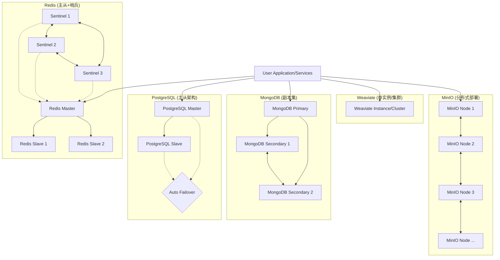
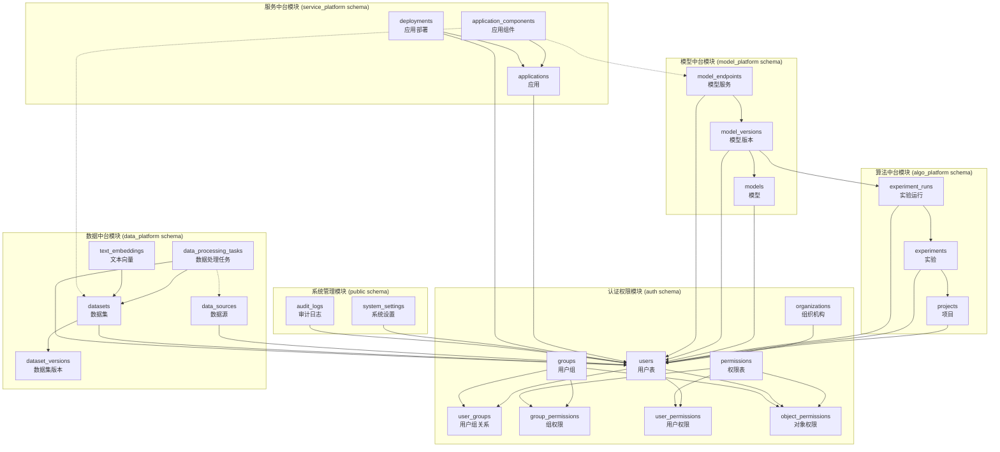
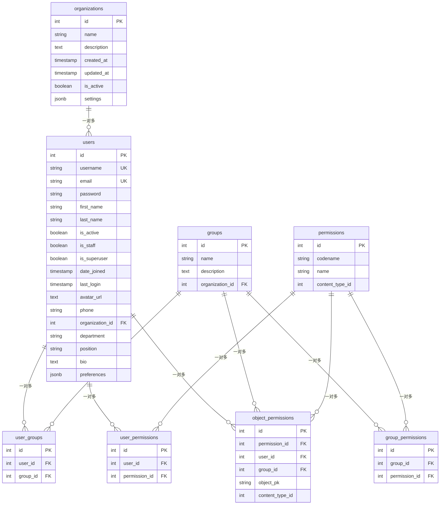
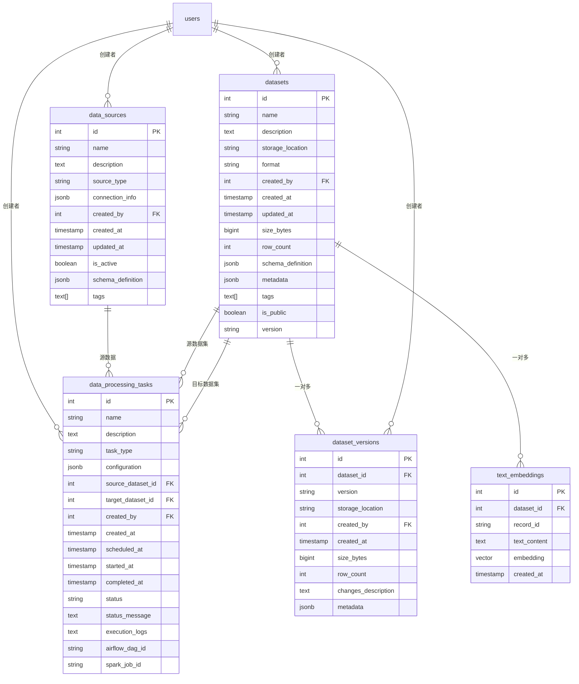
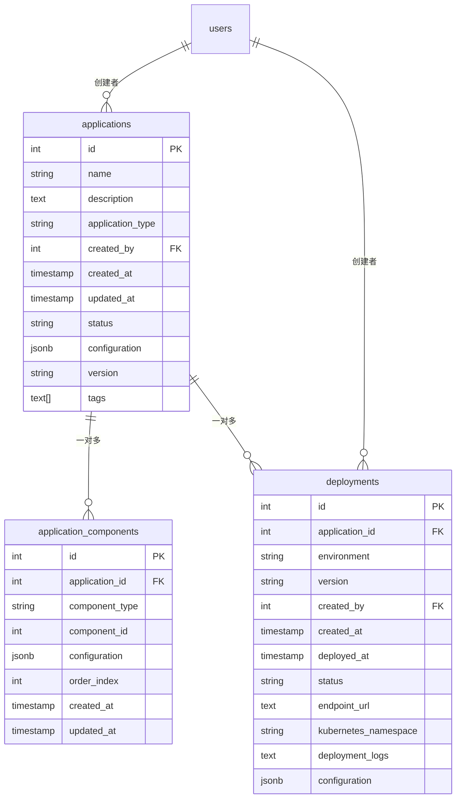
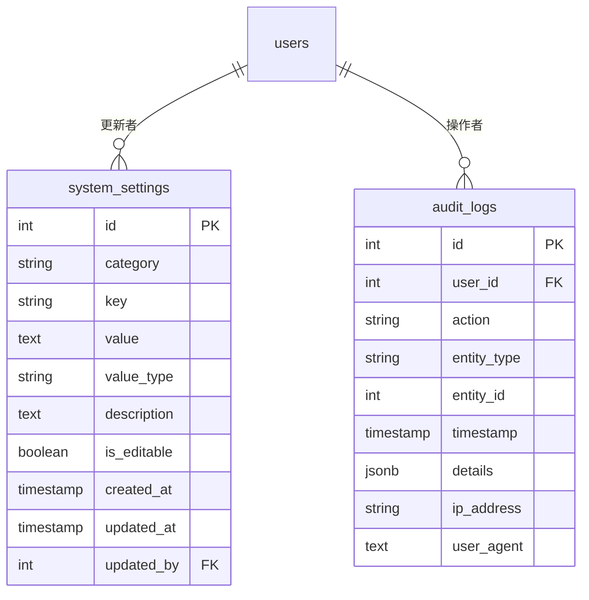
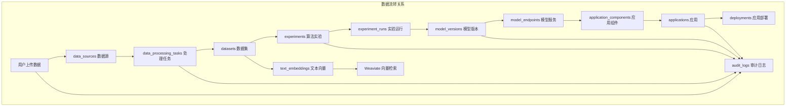
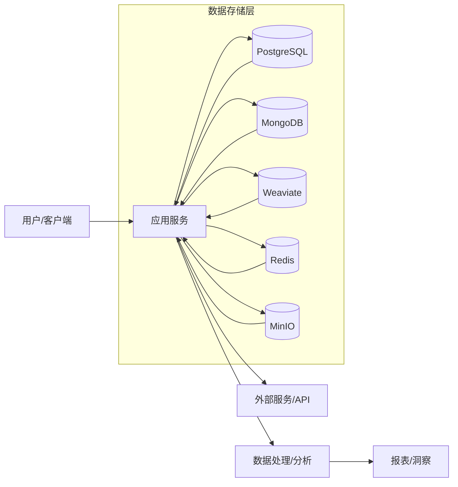

# AI 中台 - 数据库设计文档

本文档详细描述了 AI 中台系统的数据库设计，包括数据库选型、表结构设计及关系、索引优化等内容。

## 1. 数据库选型与架构

### 1.1 数据库类型与版本

根据 `docs/Outline.md` 中的技术规范，AI 中台使用以下数据库：

- **关系型数据库**：PostgreSQL 16
- **NoSQL 数据库**：MongoDB 6.0（辅助作用）
- **向量数据库**：Weaviate 1.22
- **缓存系统**：Redis 7.0
- **消息队列**：Kafka 3.6（数据流处理）

### 1.2 数据分布与存储策略

| 数据类型 | 存储位置 | 说明 |
|---------|---------|-----|
| 用户信息与权限 | PostgreSQL | 用户账号、角色、权限模型等核心结构化数据 |
| 系统配置 | PostgreSQL | 系统参数、组件配置等 |
| 任务调度记录 | PostgreSQL | 各类任务的执行记录、状态跟踪 |
| 模型元数据 | PostgreSQL | 模型版本、参数、性能指标等 |
| 日志数据 | MongoDB/ELK | 系统日志、用户操作日志、审计日志等 |
| 向量数据 | Weaviate | 文本向量、图像特征向量、Embedding等 |
| 非结构化数据 | MinIO | 原始数据、模型文件、大型二进制数据等 |

### 1.3 数据库部署架构



- PostgreSQL: 主从架构，配置自动故障转移
- MongoDB: 副本集部署，确保高可用性
- Weaviate: 单实例或集群部署
- Redis: 主从+哨兵模式
- MinIO: 分布式部署

## 2. PostgreSQL 数据库设计

PostgreSQL 作为主要的关系型数据库，存储系统核心的结构化数据。

### 2.1 核心架构

采用模式（Schema）进行逻辑分区：

- `public`: 默认模式，存放核心表
- `auth`: 认证与权限相关表
- `data_platform`: 数据中台相关表
- `algo_platform`: 算法中台相关表  
- `model_platform`: 模型中台相关表
- `service_platform`: 服务中台相关表

### 2.2 用户与权限表结构

#### 2.2.1 用户管理表

**auth.users** （扩展自Django的auth_user表）
```sql
CREATE TABLE auth.users (
    id SERIAL PRIMARY KEY,
    username VARCHAR(150) UNIQUE NOT NULL,
    email VARCHAR(254) UNIQUE NOT NULL,
    password VARCHAR(128) NOT NULL,
    first_name VARCHAR(150),
    last_name VARCHAR(150),
    is_active BOOLEAN DEFAULT TRUE,
    is_staff BOOLEAN DEFAULT FALSE,
    is_superuser BOOLEAN DEFAULT FALSE,
    date_joined TIMESTAMP WITH TIME ZONE DEFAULT NOW(),
    last_login TIMESTAMP WITH TIME ZONE,
    avatar_url TEXT,
    phone VARCHAR(20),
    organization_id INTEGER REFERENCES auth.organizations(id),
    department VARCHAR(100),
    position VARCHAR(100),
    bio TEXT,
    preferences JSONB
);
```

**auth.organizations**
```sql
CREATE TABLE auth.organizations (
    id SERIAL PRIMARY KEY,
    name VARCHAR(200) NOT NULL,
    description TEXT,
    created_at TIMESTAMP WITH TIME ZONE DEFAULT NOW(),
    updated_at TIMESTAMP WITH TIME ZONE DEFAULT NOW(),
    is_active BOOLEAN DEFAULT TRUE,
    settings JSONB
);
```

**auth.groups**
```sql
CREATE TABLE auth.groups (
    id SERIAL PRIMARY KEY,
    name VARCHAR(150) NOT NULL,
    description TEXT,
    organization_id INTEGER REFERENCES auth.organizations(id)
);
```

**auth.user_groups**
```sql
CREATE TABLE auth.user_groups (
    id SERIAL PRIMARY KEY,
    user_id INTEGER REFERENCES auth.users(id),
    group_id INTEGER REFERENCES auth.groups(id),
    UNIQUE(user_id, group_id)
);
```

#### 2.2.2 权限管理表

**auth.permissions**
```sql
CREATE TABLE auth.permissions (
    id SERIAL PRIMARY KEY,
    codename VARCHAR(100) NOT NULL,
    name VARCHAR(255) NOT NULL,
    content_type_id INTEGER NOT NULL, -- 引用Django content_type表
    UNIQUE(codename, content_type_id)
);
```

**auth.group_permissions**
```sql
CREATE TABLE auth.group_permissions (
    id SERIAL PRIMARY KEY,
    group_id INTEGER REFERENCES auth.groups(id),
    permission_id INTEGER REFERENCES auth.permissions(id),
    UNIQUE(group_id, permission_id)
);
```

**auth.user_permissions**
```sql
CREATE TABLE auth.user_permissions (
    id SERIAL PRIMARY KEY,
    user_id INTEGER REFERENCES auth.users(id),
    permission_id INTEGER REFERENCES auth.permissions(id),
    UNIQUE(user_id, permission_id)
);
```

**auth.object_permissions** （用于对象级权限）
```sql
CREATE TABLE auth.object_permissions (
    id SERIAL PRIMARY KEY,
    permission_id INTEGER REFERENCES auth.permissions(id),
    user_id INTEGER REFERENCES auth.users(id),
    group_id INTEGER REFERENCES auth.groups(id),
    object_pk VARCHAR(255) NOT NULL,
    content_type_id INTEGER NOT NULL, -- 引用Django content_type表
    CHECK ((user_id IS NULL AND group_id IS NOT NULL) OR (user_id IS NOT NULL AND group_id IS NULL))
);
```

### 2.3 数据中台表结构

#### 2.3.1 数据源管理

**data_platform.data_sources**
```sql
CREATE TABLE data_platform.data_sources (
    id SERIAL PRIMARY KEY,
    name VARCHAR(200) NOT NULL,
    description TEXT,
    source_type VARCHAR(50) NOT NULL, -- 'database', 'file', 'api', etc.
    connection_info JSONB NOT NULL, -- 连接信息（加密存储）
    created_by INTEGER REFERENCES auth.users(id),
    created_at TIMESTAMP WITH TIME ZONE DEFAULT NOW(),
    updated_at TIMESTAMP WITH TIME ZONE DEFAULT NOW(),
    is_active BOOLEAN DEFAULT TRUE,
    schema_definition JSONB, -- 数据结构定义
    tags TEXT[]
);
```

#### 2.3.2 数据集管理

**data_platform.datasets**
```sql
CREATE TABLE data_platform.datasets (
    id SERIAL PRIMARY KEY,
    name VARCHAR(200) NOT NULL,
    description TEXT,
    storage_location VARCHAR(500) NOT NULL, -- MinIO路径或其他存储位置
    format VARCHAR(50) NOT NULL, -- 'csv', 'parquet', 'json', etc.
    created_by INTEGER REFERENCES auth.users(id),
    created_at TIMESTAMP WITH TIME ZONE DEFAULT NOW(),
    updated_at TIMESTAMP WITH TIME ZONE DEFAULT NOW(),
    size_bytes BIGINT,
    row_count INTEGER,
    schema_definition JSONB, -- 数据结构定义
    metadata JSONB, -- 其他元数据
    tags TEXT[],
    is_public BOOLEAN DEFAULT FALSE,
    version VARCHAR(50) DEFAULT '1.0'
);
```

**data_platform.dataset_versions**
```sql
CREATE TABLE data_platform.dataset_versions (
    id SERIAL PRIMARY KEY,
    dataset_id INTEGER REFERENCES data_platform.datasets(id),
    version VARCHAR(50) NOT NULL,
    storage_location VARCHAR(500) NOT NULL,
    created_by INTEGER REFERENCES auth.users(id),
    created_at TIMESTAMP WITH TIME ZONE DEFAULT NOW(),
    size_bytes BIGINT,
    row_count INTEGER,
    changes_description TEXT,
    metadata JSONB
);
```

#### 2.3.3 数据处理任务

**data_platform.data_processing_tasks**
```sql
CREATE TABLE data_platform.data_processing_tasks (
    id SERIAL PRIMARY KEY,
    name VARCHAR(200) NOT NULL,
    description TEXT,
    task_type VARCHAR(50) NOT NULL, -- 'etl', 'transform', 'clean', etc.
    configuration JSONB NOT NULL, -- 任务配置
    source_dataset_id INTEGER REFERENCES data_platform.datasets(id),
    target_dataset_id INTEGER REFERENCES data_platform.datasets(id),
    created_by INTEGER REFERENCES auth.users(id),
    created_at TIMESTAMP WITH TIME ZONE DEFAULT NOW(),
    scheduled_at TIMESTAMP WITH TIME ZONE,
    started_at TIMESTAMP WITH TIME ZONE,
    completed_at TIMESTAMP WITH TIME ZONE,
    status VARCHAR(20) DEFAULT 'pending', -- 'pending', 'running', 'completed', 'failed'
    status_message TEXT,
    execution_logs TEXT,
    airflow_dag_id VARCHAR(200),
    spark_job_id VARCHAR(200)
);
```

### 2.4 算法中台表结构

#### 2.4.1 项目管理

**algo_platform.projects**
```sql
CREATE TABLE algo_platform.projects (
    id SERIAL PRIMARY KEY,
    name VARCHAR(200) NOT NULL,
    description TEXT,
    git_repository_url TEXT,
    created_by INTEGER REFERENCES auth.users(id),
    created_at TIMESTAMP WITH TIME ZONE DEFAULT NOW(),
    updated_at TIMESTAMP WITH TIME ZONE DEFAULT NOW(),
    is_active BOOLEAN DEFAULT TRUE,
    configuration JSONB, -- 项目配置
    tags TEXT[]
);
```

#### 2.4.2 实验管理

**algo_platform.experiments**
```sql
CREATE TABLE algo_platform.experiments (
    id SERIAL PRIMARY KEY,
    name VARCHAR(200) NOT NULL,
    description TEXT,
    project_id INTEGER REFERENCES algo_platform.projects(id),
    created_by INTEGER REFERENCES auth.users(id),
    created_at TIMESTAMP WITH TIME ZONE DEFAULT NOW(),
    updated_at TIMESTAMP WITH TIME ZONE DEFAULT NOW(),
    status VARCHAR(20) DEFAULT 'active', -- 'active', 'completed', 'archived'
    git_branch VARCHAR(100),
    git_commit_hash VARCHAR(40),
    mlflow_experiment_id VARCHAR(100),
    configuration JSONB, -- 实验配置
    tags TEXT[]
);
```

**algo_platform.experiment_runs**
```sql
CREATE TABLE algo_platform.experiment_runs (
    id SERIAL PRIMARY KEY,
    experiment_id INTEGER REFERENCES algo_platform.experiments(id),
    run_name VARCHAR(200),
    created_by INTEGER REFERENCES auth.users(id),
    created_at TIMESTAMP WITH TIME ZONE DEFAULT NOW(),
    started_at TIMESTAMP WITH TIME ZONE,
    completed_at TIMESTAMP WITH TIME ZONE,
    status VARCHAR(20) DEFAULT 'pending', -- 'pending', 'running', 'completed', 'failed'
    parameters JSONB, -- 运行参数
    metrics JSONB, -- 性能指标
    artifacts_location TEXT, -- MinIO路径或其他存储位置
    mlflow_run_id VARCHAR(100),
    kubeflow_run_id VARCHAR(100),
    logs_location TEXT
);
```

### 2.5 模型中台表结构

#### 2.5.1 模型管理

**model_platform.models**
```sql
CREATE TABLE model_platform.models (
    id SERIAL PRIMARY KEY,
    name VARCHAR(200) NOT NULL,
    description TEXT,
    model_type VARCHAR(50) NOT NULL, -- 'classification', 'regression', 'nlp', etc.
    created_by INTEGER REFERENCES auth.users(id),
    created_at TIMESTAMP WITH TIME ZONE DEFAULT NOW(),
    updated_at TIMESTAMP WITH TIME ZONE DEFAULT NOW(),
    is_active BOOLEAN DEFAULT TRUE,
    framework VARCHAR(50), -- 'pytorch', 'tensorflow', etc.
    tags TEXT[],
    metadata JSONB
);
```

**model_platform.model_versions**
```sql
CREATE TABLE model_platform.model_versions (
    id SERIAL PRIMARY KEY,
    model_id INTEGER REFERENCES model_platform.models(id),
    version VARCHAR(50) NOT NULL,
    experiment_run_id INTEGER REFERENCES algo_platform.experiment_runs(id),
    created_by INTEGER REFERENCES auth.users(id),
    created_at TIMESTAMP WITH TIME ZONE DEFAULT NOW(),
    status VARCHAR(20) DEFAULT 'draft', -- 'draft', 'production', 'archived'
    storage_location TEXT NOT NULL, -- MinIO路径或其他存储位置
    metrics JSONB, -- 性能指标
    parameters JSONB, -- 模型参数
    size_bytes BIGINT,
    mlflow_model_uri TEXT,
    is_onnx_available BOOLEAN DEFAULT FALSE,
    onnx_location TEXT,
    torchserve_model_store TEXT,
    triton_model_repository TEXT,
    metadata JSONB
);
```

#### 2.5.2 模型服务管理

**model_platform.model_endpoints**
```sql
CREATE TABLE model_platform.model_endpoints (
    id SERIAL PRIMARY KEY,
    name VARCHAR(200) NOT NULL,
    description TEXT,
    model_version_id INTEGER REFERENCES model_platform.model_versions(id),
    service_type VARCHAR(50) NOT NULL, -- 'torchserve', 'triton', 'custom', etc.
    endpoint_url TEXT NOT NULL,
    created_by INTEGER REFERENCES auth.users(id),
    created_at TIMESTAMP WITH TIME ZONE DEFAULT NOW(),
    updated_at TIMESTAMP WITH TIME ZONE DEFAULT NOW(),
    status VARCHAR(20) DEFAULT 'deploying', -- 'deploying', 'running', 'stopped', 'failed'
    kubernetes_deployment VARCHAR(200),
    kubernetes_service VARCHAR(200),
    configuration JSONB, -- 服务配置
    resource_allocation JSONB, -- CPU/GPU/内存分配
    autoscaling_config JSONB, -- 自动扩缩配置
    metrics JSONB -- 性能指标
);
```

### 2.6 服务中台表结构

#### 2.6.1 应用管理

**service_platform.applications**
```sql
CREATE TABLE service_platform.applications (
    id SERIAL PRIMARY KEY,
    name VARCHAR(200) NOT NULL,
    description TEXT,
    application_type VARCHAR(50) NOT NULL, -- 'web', 'api', 'workflow', etc.
    created_by INTEGER REFERENCES auth.users(id),
    created_at TIMESTAMP WITH TIME ZONE DEFAULT NOW(),
    updated_at TIMESTAMP WITH TIME ZONE DEFAULT NOW(),
    status VARCHAR(20) DEFAULT 'draft', -- 'draft', 'published', 'archived'
    configuration JSONB, -- 应用配置
    version VARCHAR(50) DEFAULT '1.0',
    tags TEXT[]
);
```

**service_platform.application_components**
```sql
CREATE TABLE service_platform.application_components (
    id SERIAL PRIMARY KEY,
    application_id INTEGER REFERENCES service_platform.applications(id),
    component_type VARCHAR(50) NOT NULL, -- 'model_endpoint', 'data_service', 'ui_component', etc.
    component_id INTEGER, -- 引用相关组件ID
    configuration JSONB, -- 组件配置
    order_index INTEGER,
    created_at TIMESTAMP WITH TIME ZONE DEFAULT NOW(),
    updated_at TIMESTAMP WITH TIME ZONE DEFAULT NOW()
);
```

#### 2.6.2 应用部署

**service_platform.deployments**
```sql
CREATE TABLE service_platform.deployments (
    id SERIAL PRIMARY KEY,
    application_id INTEGER REFERENCES service_platform.applications(id),
    environment VARCHAR(50) NOT NULL, -- 'dev', 'test', 'prod', etc.
    version VARCHAR(50) NOT NULL,
    created_by INTEGER REFERENCES auth.users(id),
    created_at TIMESTAMP WITH TIME ZONE DEFAULT NOW(),
    deployed_at TIMESTAMP WITH TIME ZONE,
    status VARCHAR(20) DEFAULT 'pending', -- 'pending', 'deploying', 'running', 'failed'
    endpoint_url TEXT,
    kubernetes_namespace VARCHAR(100),
    deployment_logs TEXT,
    configuration JSONB
);
```

### 2.7 系统管理表

**public.system_settings**
```sql
CREATE TABLE public.system_settings (
    id SERIAL PRIMARY KEY,
    category VARCHAR(100) NOT NULL,
    key VARCHAR(100) NOT NULL,
    value TEXT,
    value_type VARCHAR(20) DEFAULT 'string', -- 'string', 'number', 'boolean', 'json'
    description TEXT,
    is_editable BOOLEAN DEFAULT TRUE,
    created_at TIMESTAMP WITH TIME ZONE DEFAULT NOW(),
    updated_at TIMESTAMP WITH TIME ZONE DEFAULT NOW(),
    updated_by INTEGER REFERENCES auth.users(id),
    UNIQUE(category, key)
);
```

**public.audit_logs**
```sql
CREATE TABLE public.audit_logs (
    id SERIAL PRIMARY KEY,
    user_id INTEGER REFERENCES auth.users(id),
    action VARCHAR(100) NOT NULL,
    entity_type VARCHAR(100),
    entity_id INTEGER,
    timestamp TIMESTAMP WITH TIME ZONE DEFAULT NOW(),
    details JSONB,
    ip_address VARCHAR(45),
    user_agent TEXT
);
```

### 2.8 索引策略

为提高查询性能，对关键字段创建索引：

```sql
-- 用户与权限相关索引
CREATE INDEX idx_users_username ON auth.users(username);
CREATE INDEX idx_users_email ON auth.users(email);
CREATE INDEX idx_users_org_id ON auth.users(organization_id);
CREATE INDEX idx_object_permissions_content_type_object ON auth.object_permissions(content_type_id, object_pk);

-- 数据中台索引
CREATE INDEX idx_datasets_name ON data_platform.datasets(name);
CREATE INDEX idx_datasets_created_by ON data_platform.datasets(created_by);
CREATE INDEX idx_datasets_created_at ON data_platform.datasets(created_at);
CREATE INDEX idx_data_processing_tasks_status ON data_platform.data_processing_tasks(status);

-- 算法中台索引
CREATE INDEX idx_experiments_project_id ON algo_platform.experiments(project_id);
CREATE INDEX idx_experiment_runs_experiment_id ON algo_platform.experiment_runs(experiment_id);
CREATE INDEX idx_experiment_runs_status ON algo_platform.experiment_runs(status);

-- 模型中台索引
CREATE INDEX idx_model_versions_model_id ON model_platform.model_versions(model_id);
CREATE INDEX idx_model_versions_status ON model_platform.model_versions(status);
CREATE INDEX idx_model_endpoints_model_version_id ON model_platform.model_endpoints(model_version_id);
CREATE INDEX idx_model_endpoints_status ON model_platform.model_endpoints(status);

-- 服务中台索引
CREATE INDEX idx_applications_created_by ON service_platform.applications(created_by);
CREATE INDEX idx_deployments_application_id ON service_platform.deployments(application_id);
CREATE INDEX idx_deployments_status ON service_platform.deployments(status);

-- 审计日志索引
CREATE INDEX idx_audit_logs_user_id ON public.audit_logs(user_id);
CREATE INDEX idx_audit_logs_action ON public.audit_logs(action);
CREATE INDEX idx_audit_logs_timestamp ON public.audit_logs(timestamp);
CREATE INDEX idx_audit_logs_entity_type_id ON public.audit_logs(entity_type, entity_id);
```

### 2.9 使用pgvector扩展

为向量搜索需求配置pgvector扩展：

```sql
-- 安装pgvector扩展
CREATE EXTENSION IF NOT EXISTS vector;

-- 创建向量表示例（用于文本嵌入）
CREATE TABLE data_platform.text_embeddings (
    id SERIAL PRIMARY KEY,
    dataset_id INTEGER REFERENCES data_platform.datasets(id),
    record_id VARCHAR(100),
    text_content TEXT,
    embedding vector(1536), -- 例如使用OpenAI ada模型的1536维向量
    created_at TIMESTAMP WITH TIME ZONE DEFAULT NOW()
);

-- 创建向量索引
CREATE INDEX idx_text_embeddings_vector ON data_platform.text_embeddings USING ivfflat (embedding vector_cosine_ops) WITH (lists = 100);
```

## 3. MongoDB 数据库设计

MongoDB主要用于存储日志数据、临时缓存和非结构化文档。

### 3.1 集合设计

#### 3.1.1 系统日志集合

```javascript
// system_logs集合
{
    "_id": ObjectId("..."),
    "timestamp": ISODate("2025-05-23T10:30:00Z"),
    "level": "INFO", // INFO, WARNING, ERROR, CRITICAL
    "service": "data_pipeline",
    "component": "spark_job",
    "message": "Job completed successfully",
    "details": {
        "job_id": "spark_job_123",
        "duration_seconds": 145,
        "records_processed": 10000
    },
    "metadata": {
        "host": "worker-node-3",
        "pod_name": "spark-worker-5"
    }
}
```

#### 3.1.2 配置集合

```javascript
// configurations集合
{
    "_id": ObjectId("..."),
    "component": "data_pipeline",
    "environment": "production",
    "version": "2.3.0",
    "config": {
        "batch_size": 1000,
        "parallelism": 8,
        "retry_attempts": 3,
        "timeout_seconds": 600
    },
    "created_at": ISODate("2025-01-15T08:00:00Z"),
    "created_by": "system_admin",
    "is_active": true,
    "description": "Production configuration for data pipeline"
}
```

#### 3.1.3 任务状态缓存集合

```javascript
// task_status_cache集合
{
    "_id": ObjectId("..."),
    "task_id": "airflow_dag_123456",
    "task_type": "etl_pipeline",
    "status": "running",
    "progress": 65, // 百分比
    "start_time": ISODate("2025-05-23T09:15:00Z"),
    "last_updated": ISODate("2025-05-23T10:30:00Z"),
    "estimated_completion": ISODate("2025-05-23T11:45:00Z"),
    "current_stage": "data_transformation",
    "stages_completed": ["data_extraction", "data_validation"],
    "stages_remaining": ["data_loading", "post_processing"],
    "metrics": {
        "records_processed": 75000,
        "errors_encountered": 12,
        "processing_rate": 1250 // 每秒处理记录数
    }
}
```

### 3.2 索引策略

```javascript
// 系统日志索引
db.system_logs.createIndex({ "timestamp": 1 });
db.system_logs.createIndex({ "level": 1, "timestamp": 1 });
db.system_logs.createIndex({ "service": 1, "timestamp": 1 });

// 配置索引
db.configurations.createIndex({ "component": 1, "environment": 1, "version": 1 });
db.configurations.createIndex({ "is_active": 1 });

// 任务状态缓存索引
db.task_status_cache.createIndex({ "task_id": 1 });
db.task_status_cache.createIndex({ "status": 1, "last_updated": 1 });
db.task_status_cache.createIndex({ "task_type": 1, "status": 1 });
```

## 4. Weaviate 向量数据库设计

Weaviate用于存储和检索向量数据，支持语义搜索和RAG应用。

### 4.1 类（Class）设计

```json
{
  "classes": [
    {
      "class": "Document",
      "description": "A document with vector representation for semantic search",
      "vectorizer": "text2vec-transformers",
      "properties": [
        {
          "name": "title",
          "dataType": ["text"],
          "description": "The title of the document"
        },
        {
          "name": "content",
          "dataType": ["text"],
          "description": "The content of the document"
        },
        {
          "name": "source",
          "dataType": ["text"],
          "description": "Source of the document"
        },
        {
          "name": "category",
          "dataType": ["text"],
          "description": "Category of the document"
        },
        {
          "name": "creationDate",
          "dataType": ["date"],
          "description": "The date this document was created"
        },
        {
          "name": "author",
          "dataType": ["text"],
          "description": "Author of the document"
        },
        {
          "name": "tags",
          "dataType": ["text[]"],
          "description": "Tags associated with the document"
        }
      ]
    },
    {
      "class": "Image",
      "description": "Images with vector embeddings",
      "vectorizer": "img2vec-neural",
      "properties": [
        {
          "name": "filename",
          "dataType": ["text"],
          "description": "The filename of the image"
        },
        {
          "name": "caption",
          "dataType": ["text"],
          "description": "Caption or description of the image"
        },
        {
          "name": "mimeType",
          "dataType": ["text"],
          "description": "MIME type of the image"
        },
        {
          "name": "imageUrl",
          "dataType": ["text"],
          "description": "URL to the image file"
        },
        {
          "name": "resolution",
          "dataType": ["text"],
          "description": "Resolution of the image"
        },
        {
          "name": "tags",
          "dataType": ["text[]"],
          "description": "Tags associated with the image"
        },
        {
          "name": "uploadDate",
          "dataType": ["date"],
          "description": "Upload date of the image"
        }
      ]
    },
    {
      "class": "ModelData",
      "description": "Data related to machine learning models",
      "vectorizer": "text2vec-transformers",
      "properties": [
        {
          "name": "modelName",
          "dataType": ["text"],
          "description": "Name of the model"
        },
        {
          "name": "modelDescription",
          "dataType": ["text"],
          "description": "Description of the model"
        },
        {
          "name": "framework",
          "dataType": ["text"],
          "description": "Framework used (PyTorch, TensorFlow, etc.)"
        },
        {
          "name": "metrics",
          "dataType": ["text"],
          "description": "Model performance metrics as JSON string"
        },
        {
          "name": "useCase",
          "dataType": ["text"],
          "description": "Use case for this model"
        },
        {
          "name": "version",
          "dataType": ["text"],
          "description": "Version of the model"
        },
        {
          "name": "createdBy",
          "dataType": ["text"],
          "description": "Creator of the model"
        }
      ]
    }
  ]
}
```

## 5. 数据库表关系图

本节展示AI中台系统中各数据库表之间的关系，帮助理解数据模型的整体架构。

### 5.1 整体架构关系图



### 5.2 认证权限模块详细关系



### 5.3 数据中台模块详细关系



### 5.4 算法中台和模型中台模块关系

```mermaid
erDiagram
    users ||--o{ projects : "创建者"
    projects ||--o{ experiments : "一对多"
    users ||--o{ experiments : "创建者"
    experiments ||--o{ experiment_runs : "一对多"
    users ||--o{ experiment_runs : "创建者"
    users ||--o{ models : "创建者"
    models ||--o{ model_versions : "一对多"
    experiment_runs ||--o{ model_versions : "一对多"
    users ||--o{ model_versions : "创建者"
    model_versions ||--o{ model_endpoints : "一对多"
    users ||--o{ model_endpoints : "创建者"

    projects {
        int id PK
        string name
        text description
        text git_repository_url
        int created_by FK
        timestamp created_at
        timestamp updated_at
        boolean is_active
        jsonb configuration
        text[] tags
    }

    experiments {
        int id PK
        string name
        text description
        int project_id FK
        int created_by FK
        timestamp created_at
        timestamp updated_at
        string status
        string git_branch
        string git_commit_hash
        string mlflow_experiment_id
        jsonb configuration
        text[] tags
    }

    experiment_runs {
        int id PK
        int experiment_id FK
        string run_name
        int created_by FK
        timestamp created_at
        timestamp started_at
        timestamp completed_at
        string status
        jsonb parameters
        jsonb metrics
        text artifacts_location
        string mlflow_run_id
        string kubeflow_run_id
        text logs_location
    }

    models {
        int id PK
        string name
        text description
        string model_type
        int created_by FK
        timestamp created_at
        timestamp updated_at
        boolean is_active
        string framework
        text[] tags
        jsonb metadata
    }

    model_versions {
        int id PK
        int model_id FK
        string version
        int experiment_run_id FK
        int created_by FK
        timestamp created_at
        string status
        text storage_location
        jsonb metrics
        jsonb parameters
        bigint size_bytes
        text mlflow_model_uri
        boolean is_onnx_available
        text onnx_location
        text torchserve_model_store
        text triton_model_repository
        jsonb metadata
    }

    model_endpoints {
        int id PK
        string name
        text description
        int model_version_id FK
        string service_type
        text endpoint_url
        int created_by FK
        timestamp created_at
        timestamp updated_at
        string status
        string kubernetes_deployment
        string kubernetes_service
        jsonb configuration
        jsonb resource_allocation
        jsonb autoscaling_config
        jsonb metrics
    }
```



### 5.5 服务中台模块关系



### 5.6 系统管理模块关系



### 5.7 跨模块数据流关系



### 5.8 外键约束总结

| 子表 | 外键字段 | 父表 | 父表主键 | 约束说明 |
|------|---------|------|---------|----------|
| users | organization_id | organizations | id | 用户所属组织 |
| user_groups | user_id | users | id | 用户组关系 |
| user_groups | group_id | groups | id | 用户组关系 |
| group_permissions | group_id | groups | id | 组权限关系 |
| group_permissions | permission_id | permissions | id | 组权限关系 |
| user_permissions | user_id | users | id | 用户权限关系 |
| user_permissions | permission_id | permissions | id | 用户权限关系 |
| data_sources | created_by | users | id | 数据源创建者 |
| datasets | created_by | users | id | 数据集创建者 |
| dataset_versions | dataset_id | datasets | id | 数据集版本关系 |
| dataset_versions | created_by | users | id | 版本创建者 |
| data_processing_tasks | source_dataset_id | datasets | id | 源数据集 |
| data_processing_tasks | target_dataset_id | datasets | id | 目标数据集 |
| data_processing_tasks | created_by | users | id | 任务创建者 |
| text_embeddings | dataset_id | datasets | id | 向量所属数据集 |
| projects | created_by | users | id | 项目创建者 |
| experiments | project_id | projects | id | 实验所属项目 |
| experiments | created_by | users | id | 实验创建者 |
| experiment_runs | experiment_id | experiments | id | 运行所属实验 |
| experiment_runs | created_by | users | id | 运行创建者 |
| models | created_by | users | id | 模型创建者 |
| model_versions | model_id | models | id | 版本所属模型 |
| model_versions | experiment_run_id | experiment_runs | id | 版本来源运行 |
| model_versions | created_by | users | id | 版本创建者 |
| model_endpoints | model_version_id | model_versions | id | 服务部署版本 |
| model_endpoints | created_by | users | id | 服务创建者 |
| applications | created_by | users | id | 应用创建者 |
| application_components | application_id | applications | id | 组件所属应用 |
| deployments | application_id | applications | id | 部署所属应用 |
| deployments | created_by | users | id | 部署创建者 |
| system_settings | updated_by | users | id | 设置更新者 |
| audit_logs | user_id | users | id | 日志操作者 |

## 6. Redis 设计

Redis用于缓存和临时数据存储，提高系统性能。

### 6.1 键空间设计

| 前缀 | 用途 | 数据类型 | TTL | 示例 |
|------|------|---------|-----|------|
| `session:` | 用户会话数据 | Hash | 24小时 | `session:user123` |
| `token:` | JWT令牌 | String | 1小时 | `token:refresh:user123` |
| `cache:dataset:` | 数据集缓存 | Hash | 30分钟 | `cache:dataset:123` |
| `cache:model:` | 模型元数据缓存 | Hash | 30分钟 | `cache:model:456` |
| `rate:api:` | API速率限制 | String/Counter | 1分钟 | `rate:api:user123:endpoint` |
| `lock:` | 分布式锁 | String | 变动 | `lock:task123` |
| `queue:` | 轻量级任务队列 | List | 无 | `queue:notifications` |
| `pubsub:` | 发布/订阅通道 | PubSub | 无 | `pubsub:model-updates` |
| `stats:` | 实时统计数据 | Hash/Sorted Set | 1小时 | `stats:endpoint123:performance` |

### 6.2 数据示例

```
// 用户会话数据
HSET session:user123 username "john_doe" role "data_scientist" permissions "dataset:read,model:execute" last_activity "2025-05-23T10:15:00Z"

// API速率限制
INCR rate:api:user123:model-inference
EXPIRE rate:api:user123:model-inference 60

// 数据集缓存
HSET cache:dataset:123 name "customer_transactions" record_count "15000" last_updated "2025-05-22" schema "{\"fields\":[{\"name\":\"id\",\"type\":\"integer\"}]}"
EXPIRE cache:dataset:123 1800

// 分布式锁
SET lock:deploy-model-45 "worker-3" EX 120 NX
```

## 6. 数据库交互模式

### 6.1 读写模式

| 操作类型 | 主要数据库 | 缓存策略 | 备注 |
|---------|----------|----------|------|
| 用户认证 | PostgreSQL | Redis缓存会话 | JWT存储于Redis |
| 模型元数据查询 | PostgreSQL | Redis缓存热门模型 | |
| 向量搜索 | Weaviate | | 可结合前置缓存提高性能 |
| 日志写入 | MongoDB | | 异步批量写入 |
| 配置读取 | PostgreSQL | Redis缓存 | |
| 任务状态更新 | PostgreSQL + MongoDB | Redis缓存最新状态 | |
| 大文件存储 | MinIO | | 元数据存于PostgreSQL |

### 6.2 数据流转关系



1. 用户数据 → PostgreSQL → Redis(缓存)
2. 日志数据 → MongoDB/ELK
3. 向量数据 → Weaviate (检索) / PostgreSQL+pgvector(存储)
4. 模型文件 → MinIO → 元数据存入PostgreSQL
5. 实时任务状态 → Redis → 定期同步至PostgreSQL

## 7. 数据库安全策略

### 7.1 访问控制

- PostgreSQL: 基于角色的访问控制，应用通过单独服务账户连接
- MongoDB: 启用认证，使用专用账户和角色
- Redis: 配置密码认证和ACL
- Weaviate: API密钥认证
- MinIO: IAM权限策略

### 7.2 数据保护

- 敏感数据加密存储
- 传输中加密(TLS/SSL)
- 定期自动备份
- 仅在内部网络访问数据库服务

### 7.3 审计与监控

- 数据库操作审计日志
- 性能监控与告警
- 异常访问模式检测

## 8. 扩展与高可用性

### 8.1 扩展策略

- PostgreSQL: 读写分离，主从复制
- MongoDB: 分片集群
- Weaviate: 水平扩展集群
- Redis: 主从复制，哨兵/集群模式
- 数据分区: 基于时间和租户的分区策略

### 8.2 高可用性配置

- 自动故障转移
- 多可用区部署
- 定期备份与恢复演练
- 灾难恢复计划

## 9. 数据库运维

### 9.1 监控指标

| 数据库 | 关键指标 |
|-------|---------|
| PostgreSQL | 连接数、缓存命中率、锁等待、查询延迟 |
| MongoDB | 操作延迟、连接数、内存使用、写入队列 |
| Weaviate | 查询延迟、内存使用、向量索引性能 |
| Redis | 命中率、内存使用、客户端连接、延迟 |

### 9.2 维护计划

- 定期备份与验证
- 索引优化与重建
- 数据归档与清理
- 版本升级计划

## 10. 迁移与初始化

### 10.1 数据库初始化脚本

Kubernetes Job或初始化容器将负责:

- Schema创建
- 初始数据填充
- 索引创建
- 扩展安装(如pgvector)

### 10.2 版本管理

使用数据库迁移工具(如Flyway或Django Migrations)管理数据库结构变更。
