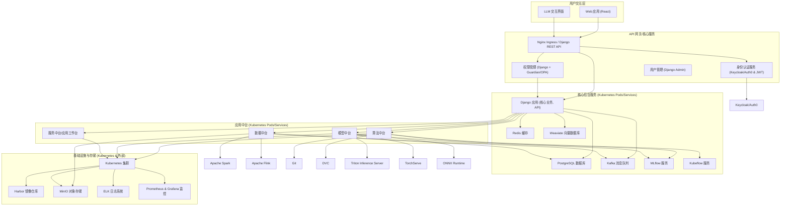

# AI 中台详细开发规划

## 1. 项目概述与目标

### 1.1. 项目概述
本项目旨在构建一个功能完善、可扩展、易于维护的 AI 中台系统。该中台将提供从数据接入、处理、分析到模型训练、部署、监控的全链路 AI 能力，并通过统一的 Web 界面供用户访问和使用。

### 1.2. 项目目标
- **能力整合**: 整合数据处理、算法开发、模型服务等多种 AI 相关能力。
- **资源共享**: 实现计算资源、数据资源、模型资源的统一管理和高效共享。
- **流程加速**: 加速 AI 应用的开发、部署和迭代过程。
- **易用性**: 提供友好的用户交互界面，降低 AI 技术的使用门槛。
- **可扩展性**: 系统架构应具备良好的水平和垂直扩展能力。
- **安全性**: 保证系统、数据和模型的安全性，实现精细化的权限控制。

## 2. 技术选型

技术选型严格遵循 `docs/Outline.md` 中定义的规范。

### 2.1. 系统层
- **操作系统**: Ubuntu 22.04 LTS
- **容器化**:
    - Kubernetes: 1.28.8 
    - Docker: 25.0.6+ (启用 BuildKit 和 Containerd, 配置 `native.cgroupdriver=systemd`)
    - CRI-Dockerd: 0.2.x (若 Docker 作为 CRI)
- **网络**:
    - SDN: Calico / Cilium / OVN (根据实际需求选择其一)
    - 反向代理: Nginx
- **存储**:
    - 容器镜像: Harbor
    - 日志: ELK Stack (Elasticsearch, Logstash, Kibana), Prometheus
    - 持久化数据: MinIO (对象存储), PostgreSQL 16 (关系型数据)
- **资源管理**:
    - 可视化: Prometheus, Grafana
    - GPU 资源池化: NVIDIA Device Plugin, k8s + CRI-O
- **权限管理**: (详见第 8 节)

### 2.2. 核心服务层
- **后端**:
    - Python 3.10
    - Django (管理后台、核心业务逻辑)
    - Django REST Framework (RESTful API)
- **数据库**:
    - RDBMS: PostgreSQL 16 (元数据、用户权限、配置、任务记录)
    - NoSQL: MongoDB 6.0 (日志、配置文件、缓存 - 可选，优先使用 PostgreSQL 和 Redis)
    - 向量数据库: Weaviate 1.22 (Embedding, RAG)
- **缓存**: Redis 7.0
- **消息队列**: Kafka 3.6

### 2.3. 应用层
- **容器编排**: Kubernetes
- **资源监控**: Grafana
- **数据中台**:
    - 数据采集: Flume (文件), Kafka (网络), 自研脚本 (数据库)
    - 数据存储: MinIO/HDFS (非结构化), PostgreSQL+pgvector (结构化/向量), Weaviate (向量)
    - 数据处理/标注: Label Studio (文本), CVAT (图像), VATIC (视频)
    - 数据分析/处理: Pandas, OpenRefine, Apache Spark (批处理), Apache Flink (流处理), Scikit-learn, XGBoost, LightGBM, Pytorch, Tensorflow, Featuretools
    - 数据服务/可视化: ClickHouse (OLAP), Elasticsearch+Kibana (日志分析), Apache Superset (交互式分析), FastAPI (API), Apache Airflow (任务调度)
- **算法中台**:
    - 代码/数据/模型版本: Git, DVC
    - 实验追踪: MLflow
    - 模型开发: PyTorch, TensorFlow, Horovod
    - 超参优化: Optuna, Ray Tune
    - ML 流水线: Kubeflow
- **模型中台**:
    - 推理加速: ONNX Runtime, OpenVINO
    - 模型压缩: PyTorch Lightning
    - 模型服务化: TorchServe, Triton Inference Server
- **服务中台/应用工作台**: (具体技术栈待细化，可基于 FastAPI 或 Django 扩展)

### 2.4. 用户交互层
- **主系统/Web 应用**: 
  - React 18.x
  - 构建工具: Webpack 5
  - UI组件库: Ant Design
  - 运行环境: Node.js 18.x LTS
- **LLM 交互**: OpenWebUI

## 3. 系统架构设计

### 3.1. 总体架构
采用微服务架构，各中台模块（数据、算法、模型、服务）作为独立或一组关联的服务运行在 Kubernetes 集群中。通过 API Gateway (如 Nginx Ingress Controller 结合后端 API 服务) 统一对外提供服务。

### 3.2. 网络架构
- Kubernetes CNI: Calico/Cilium，提供 Pod 间网络和网络策略。
- Ingress Controller: Nginx Ingress Controller，处理外部流量，进行 SSL 终止和路由。
- 服务发现: Kubernetes DNS。

### 3.3. 数据流架构
- **数据采集**: 数据通过 Flume, Kafka Connectors 或自定义脚本进入 Kafka。
- **数据处理**: Spark/Flink 消费 Kafka 数据进行处理，结果存入 MinIO 或 PostgreSQL。
- **模型训练**: 算法中台从 MinIO/PostgreSQL 读取数据，训练结果（模型、实验数据）存入 MLflow 和 MinIO。
- **模型部署**: 模型中台从 MLflow/MinIO 获取模型，部署为 Triton/TorchServe 服务。
- **API 调用**: 用户通过 WebApp 与后端 API 交互，API 调用各中台服务。

## 4. 模块划分与功能定义

### 4.1. 统一门户与用户交互层 (Frontend)
- **技术栈**: React 18.x
- **主要功能**:
    - **用户登录/注册**: 对接 Keycloak/Auth0。
    - **仪表盘**: 展示系统概览、资源使用情况、任务状态等。
    - **数据中台界面**:
        - 数据源管理
        - 数据集管理与浏览
        - 数据标注任务管理
        - 数据处理任务配置与监控
        - 数据分析与可视化工具入口
    - **算法中台界面**:
        - 项目/代码仓库管理
        - 实验管理与追踪 (MLflow 集成)
        - 模型训练任务提交与监控
        - 超参数优化配置
        - Kubeflow Pipeline 可视化与管理
    - **模型中台界面**:
        - 模型仓库浏览与管理
        - 模型部署与版本控制
        - 模型服务监控与性能分析
        - 模型转换与优化工具
    - **服务中台/应用工作台界面**:
        - AI 应用创建与编排
        - 服务发布与管理
        - 服务监控
    - **LLM 交互界面 (OpenWebUI)**:
        - 与大语言模型对话
        - 本地知识库问答
    - **管理后台 (部分功能前端化)**:
        - 用户管理
        - 角色与权限管理 (对接后端)
        - 系统配置

### 4.2. 核心后端服务 (Backend - Django)
- **技术栈**: Python, Django, Django REST Framework
- **主要功能**:
    - **API 接口**: 为前端和各中台服务提供统一的 RESTful API。
    - **用户与身份认证**:
        - JWT 生成、验证、刷新 (djangorestframework-simplejwt)。
        - 与 Keycloak/Auth0 用户信息同步。
    - **权限管理**:
        - RBAC 核心逻辑实现。
        - Django-Guardian 集成，实现对象级权限。
        - OPA 策略管理接口 (如果采用 OPA)。
        - 权限配置 API。
    - **元数据管理**:
        - 数据集、模型、实验、任务等元数据存储与管理 (PostgreSQL)。
    - **任务调度与管理**:
        - 协调 Airflow、Kubeflow 等执行的任务。
        - 任务状态跟踪。
    - **系统配置管理**:
        - 中台各组件的配置信息。
    - **审计日志**:
        - 记录关键操作日志。
    - **Django Admin**:
        - 基础的用户、组、权限管理。
        - 系统数据后台管理。

### 4.3. 数据中台 (Data Platform)
- **开发内容**:
    - **数据采集模块**:
        - 实现数据库采集适配器 (JDBC/ODBC)。
        - Flume 配置文件管理。
        - Kafka Connector 配置与管理。
    - **数据存储接口**:
        - 封装 MinIO、PostgreSQL (pgvector)、Weaviate 的 SDK 调用。
    - **数据处理与标注服务**:
        - Label Studio, CVAT, VATIC 的集成或 API 调用封装。
        - Spark/Flink 作业提交与监控接口。
    - **数据分析与服务模块**:
        - Superset, ClickHouse, Elasticsearch 的查询代理或嵌入。
        - FastAPI 服务封装，用于快速数据 API 发布。
        - Airflow DAG 定义与管理接口。
- **部署**: Kubernetes (Deployments, Services, CronJobs for Airflow tasks)

### 4.4. 算法中台 (Algorithm Platform)
- **开发内容**:
    - **代码与版本管理集成**:
        - Git API 交互 (如创建项目、分支管理)。
        - DVC 命令封装或 API 调用。
    - **实验管理服务 (MLflow Proxy/Wrapper)**:
        - 代理 MLflow API，增加权限控制和与中台用户的关联。
    - **模型训练服务**:
        - 封装 PyTorch, TensorFlow, Horovod 训练脚本的执行逻辑。
        - Kubernetes Job 模板，用于分布式训练。
        - 与 Kubeflow Pipelines SDK/API 集成，用于定义和运行训练流水线。
    - **超参优化服务**:
        - Optuna/Ray Tune 脚本执行与结果收集。
- **部署**: Kubernetes (Deployments for services, Jobs for training/tuning)

### 4.5. 模型中台 (Model Platform)
- **开发内容**:
    - **模型仓库接口**:
        - 与 MLflow Model Registry 或自建模型仓库交互。
    - **模型转换与优化服务**:
        - ONNX Runtime, OpenVINO, PyTorch Lighting 工具的封装。
    - **模型部署服务**:
        - TorchServe/Triton Inference Server 管理 API 的封装。
        - 自动化模型打包和 Kubernetes 部署 YAML 生成。
    - **模型监控服务**:
        - 收集模型服务的性能指标 (QPS, latency, error rate)。
        - 与 Prometheus 集成。
- **部署**: Kubernetes (Deployments for model serving, Jobs for conversion/optimization)

### 4.6. 服务中台/应用工作台 (Service Platform)
- **开发内容**:
    - **应用编排引擎**:
        - 允许用户通过拖拽或配置方式组合现有模型服务、数据处理流程，形成 AI 应用。
    - **服务发布与版本管理**:
        - 管理已发布应用的版本。
        - 一键部署到 Kubernetes。
    - **服务监控接口**:
        - 汇总应用层面的监控数据。
- **部署**: Kubernetes

### 4.7. 基础设施与运维模块
- **Kubernetes 集群搭建与维护脚本/指南**
- **Harbor, MinIO, ELK, Prometheus, Grafana, Keycloak 等组件的部署与配置脚本/指南**
- **CI/CD 流水线**: (GitLab CI/CD, Jenkins, or GitHub Actions)
    - 自动化构建、测试、打包、部署。

## 5. 开发阶段与里程碑

### 阶段一: 基础设施搭建与核心服务开发 (预计 3-4 个月)
- **M1.1**: 完成 Kubernetes 集群、网络 (Calico/Cilium)、存储 (MinIO, PostgreSQL, Harbor) 的搭建与基础配置。
- **M1.2**: 完成 Keycloak/Auth0 部署与基础用户体系建立。
- **M1.3**: Django 后端核心框架搭建：用户认证 (JWT)、基础 API 结构、数据库模型设计。
- **M1.4**: 权限管理初步实现：基于 Django RBAC 的用户、角色、权限定义，Admin 后台管理。
- **M1.5**: 前端门户框架搭建：技术选型确定 (React/Vue)，基础布局，登录/注册页面，仪表盘雏形。
- **M1.6**: CI/CD 基础流水线建立。

### 阶段二: 数据中台核心功能开发 (预计 3-4 个月)
- **M2.1**: 数据采集模块：实现至少一种数据库和文件/网络数据源的接入。
- **M2.2**: 数据存储接口：完成 MinIO 和 PostgreSQL 的基本数据读写封装。
- **M2.3**: 数据中台前端：数据集管理、浏览功能。
- **M2.4**: 数据处理：集成 Pandas 和 Spark (通过 Livy 或 K8s Spark Operator) 进行简单批处理任务。
- **M2.5**: MLflow 初步集成：实验追踪基本功能可用。

### 阶段三: 算法中台核心功能开发 (预计 3-4 个月)
- **M3.1**: 算法中台后端：项目管理、代码版本 (Git) 集成。
- **M3.2**: 模型训练服务：支持提交 PyTorch/TensorFlow 训练任务到 Kubernetes (Job)。
- **M3.3**: 算法中台前端：项目创建、实验列表、训练任务提交界面。
- **M3.4**: Kubeflow Pipelines 初步集成：能够运行简单的 Pipeline。

### 阶段四: 模型中台核心功能开发 (预计 2-3 个月)
- **M4.1**: 模型仓库接口：对接 MLflow Model Registry。
- **M4.2**: 模型部署服务：支持将 MLflow 模型部署为 TorchServe/Triton 服务。
- **M4.3**: 模型中台前端：模型列表、一键部署功能。

### 阶段五: 完善与集成 (预计 3-4 个月)
- **M5.1**: 完善各中台高级功能：如数据标注、流处理、超参优化、模型监控等。
- **M5.2**: 服务中台/应用工作台初步开发。
- **M5.3**: OpenWebUI 集成。
- **M5.4**: 权限管理细化：集成 Django-Guardian 或 OPA，实现更细粒度的权限控制。
- **M5.5**: 统一监控与日志系统 (ELK, Prometheus, Grafana) 全面集成。
- **M5.6**: 系统测试、性能优化、安全加固。
- **M5.7**: 编写详细的用户文档和运维文档。

### 阶段六: 试运行与迭代 (持续)
- **M6.1**: 系统上线试运行，收集用户反馈。
- **M6.2**: 根据反馈进行功能迭代和优化。

## 6. 开发规范与流程

### 6.1. 代码管理
- **版本控制**: Git, 使用 GitLab/GitHub 等平台。
- **分支模型**: Gitflow (master, develop, feature, release, hotfix)。
- **代码风格**:
    - Python: PEP 8, Black, Flake8, isort.
    - Frontend (JS/TS): Prettier, ESLint.
- **Commit Message**: Conventional Commits 规范。
- **Code Review**: 所有代码合并到 develop/master 分支前必须经过至少一人 Review。

### 6.2. 测试
- **单元测试**:
    - Python: pytest
    - Frontend: Jest / Vitest
- **集成测试**: 测试模块间接口调用。
- **端到端测试**: Selenium / Cypress (前端驱动)。
- **测试覆盖率**: 设定目标并持续监控。

### 6.3. CI/CD
- 每次代码提交触发自动化构建和单元测试。
- 合并到 develop 分支触发集成测试和部署到开发/测试环境。
- Release 分支触发部署到预生产/生产环境。

### 6.4. 文档
- **API 文档**: Swagger/OpenAPI (自动生成)。
- **架构文档**: Markdown + Mermaid 图。
- **开发文档**: 各模块设计、接口说明。
- **用户手册**: 面向最终用户。
- **运维手册**: 系统部署、监控、故障排除。
- 所有文档纳入版本控制。

### 6.5. 敏捷开发
- 采用 Scrum 或 Kanban 方法。
- 定期迭代会议 (Sprint Planning, Daily Standup, Sprint Review, Retrospective)。
- 使用 Jira, Trello, Azure DevOps 等工具进行任务管理。

## 7. 部署方案概述 (Ubuntu 网页端访问)

### 7.1. 服务器准备
- 准备一台或多台 Ubuntu 22.04 LTS 服务器作为 Kubernetes Master 和 Worker 节点。
- 确保服务器满足 Kubernetes 和各组件的最低硬件要求。
- 配置静态 IP 地址和 DNS。

### 7.2. Kubernetes 集群部署
- 使用 kubeadm, k3s, RKE 或其他工具部署 Kubernetes 集群。
- 安装网络插件 (Calico/Cilium)。
- 安装存储类 (StorageClass) 以支持动态卷分配 (对接 MinIO CSI 或 NFS 等)。

### 7.3. 核心组件部署
- **Harbor**: 部署用于存储 Docker 镜像。
- **PostgreSQL**: 部署高可用的 PostgreSQL 集群 (如使用 Patroni)。
- **Redis**: 部署 Redis 集群。
- **Kafka**: 部署 Kafka 集群 (及 Zookeeper)。
- **MinIO**: 部署 MinIO 集群。
- **ELK Stack**: 部署 Elasticsearch, Logstash, Kibana。
- **Prometheus & Grafana**: 部署用于监控。
- **Keycloak/Auth0**: 部署身份认证服务。

### 7.4. 中台应用部署
- 将各中台模块（Frontend, Backend, Data, Algo, Model, Service）打包为 Docker 镜像，推送到 Harbor。
- 编写 Kubernetes Deployment, Service, Ingress YAML 文件。
- 使用 `kubectl apply` 或 Helm Charts 进行部署。
- **Nginx Ingress Controller**: 配置 Ingress 规则，将域名映射到前端服务和后端 API Gateway。
- **SSL 证书**: 配置 HTTPS 访问 (Let's Encrypt 或其他)。

### 7.5. 访问方式
- 用户通过浏览器访问配置的域名，即可进入 AI 中台的 Web 界面。

## 8. 权限管理方案集成

严格遵循 `docs/deployment/07_permission_management.md` 中定义的方案。

### 8.1. 身份认证
- **前端/用户界面**: Keycloak 或 Auth0。
- **后端 API 服务**: Django REST Framework + JWT (`djangorestframework-simplejwt`)。
- **Kubernetes 内部服务**: ServiceAccount，与 Keycloak 同步。

### 8.2. 管理权限
- **中台管理后台**: Django Admin (用户组、基础权限)。
- **Kubernetes RBAC**: `Roles`, `ClusterRoles`, `RoleBindings`。
- **网络策略**: Calico / Cilium 网络策略。

### 8.3. 应用权限
- **核心模型**: RBAC (角色定义：数据分析师、模型开发者等)。
- **Django 应用**: `django-guardian` 实现对象级权限。
- **微服务/复杂逻辑**: Open Policy Agent (OPA) + Rego (可选，按需引入)。

### 8.4. 资源权限
- **PostgreSQL**: 用户、角色, `GRANT`/`REVOKE`。
- **MinIO**: IAM Policies。
- **Kafka**: ACLs。
- **Kubernetes 资源**: RBAC + Namespace。
- **Harbor, MLflow, Kubeflow, Redis (ACLs)**: 各自内置权限机制。

### 8.5. 统一权限管理与审计
- **密钥管理**: Hashicorp Vault。
- **统一策略管理 (可选)**: Apache Ranger。
- **UI 界面**: 中台管理系统提供统一的权限配置 UI (调用 Django API)。
    - **核心流程**:
        1.  **RBAC 为核心**: 预定义角色及权限模板。
        2.  **统一用户管理界面**: 用户创建、角色分配、细粒度调整 (慎用)。
        3.  **后端实现**: Django 作为权限中枢，联动各功能层权限系统 (事件驱动/专用同步服务/定期同步)。
        4.  **权限视图与审计**: UI 展示用户权限，所有变更记录日志。
- **权限监控**: ELK Stack, Prometheus + Grafana, OpenTelemetry。

### 8.6. 实施策略
- 最小权限原则。
- 定期审计。
- 职责分离。
- 强密码策略 + MFA。
- 安全培训。
- 自动化。
- 权限策略版本控制。

## 9. 后续步骤
1.  组建开发团队，明确角色分工。
2.  根据本规划细化每个阶段的任务，并分配到具体责任人。
3.  搭建开发、测试、预生产环境。
4.  严格按照开发规范和流程执行项目。
5.  定期回顾和调整计划。

---
此开发规划文档旨在提供一个全面的指导框架，具体实施过程中可能需要根据实际情况进行调整和细化。
