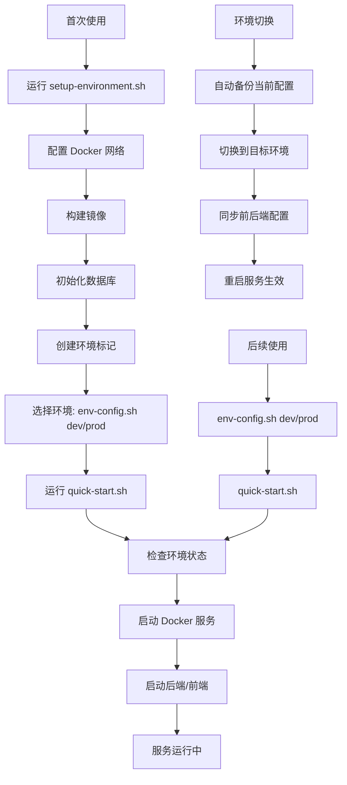

# 🤖 AI 中台最小化示例

> 企业级AI中台的最小化示例项目，基于Django + Next.js构建，包含完整的四大中台功能。

一个完整的 AI 中台解决方案，支持 GPU 加速推理、模型管理、监控和可视化界面。

## ⚡ 快速开始

> **🎯 新用户必读**: 本项目采用现代化的环境配置管理，支持开发/生产环境一键切换：

### 🚀 三步启动流程

```bash
# 第一步：环境配置（仅首次使用）
./scripts/setup-environment.sh

# 第二步：环境切换（自动配置IP地址）
./scripts/env-config.sh dev    # 开发环境 (localhost)
# 或
./scripts/env-config.sh prod   # 生产环境 (192.168.110.88)

# 第三步：启动服务
./quick-start.sh
```

**已配置用户**: 直接运行 `./scripts/env-config.sh dev && ./quick-start.sh` 即可启动所有服务。

### 🔧 环境管理亮点
- ✅ **智能环境切换**: 再也不用手动修改IP地址！
- ✅ **配置自动备份**: 切换前自动备份，安全可靠
- ✅ **多层同步**: 前端/后端/Docker配置自动同步
- ✅ **状态监控**: 实时查看当前环境配置状态

## 🔧 功能特性

### 🌟 核心特性
- ✅ **完整的 AI 中台界面**：React + TypeScript 前端
- ✅ **REST API 后端**：Django + PostgreSQL
- ✅ **智能环境管理**：开发/生产环境一键切换，自动配置IP地址
- ✅ **模型管理**：支持多种模型格式
- ✅ **数据管理**：PostgreSQL + Redis + MinIO
- ✅ **监控系统**：Prometheus + Grafana
- ✅ **快速部署**：优化的启动脚本，支持后台运行
- ✅ **实时监控**：自动启动Grafana监控面板

### 🎯 环境配置管理系统 (NEW!)
- ✅ **一键环境切换**：`dev`/`prod` 环境零配置切换
- ✅ **自动IP配置**：开发环境自动使用 `localhost`，生产环境使用 `192.168.110.88`
- ✅ **配置同步**：前端、后端、Docker 配置自动同步
- ✅ **安全备份**：切换前自动备份配置文件
- ✅ **状态监控**：实时查看环境配置状态
- ✅ **配置恢复**：支持历史配置恢复

### 🤖 Dify AI 平台集成 (NEW!)
- ✅ **AI 应用构建**：集成 Dify AI 平台，支持对话、文本生成、工作流、智能体
- ✅ **统一管理**：在 AI 中台界面中创建和管理 Dify 应用
- ✅ **API 集成**：完整的 RESTful API 支持 Dify 应用管理
- ✅ **一键部署**：默认启用 Dify 集成，可使用 `--no-dify` 参数禁用

### GPU 功能（可选）
- ✅ **GPU 加速推理**：NVIDIA Triton Inference Server
- ✅ **大语言模型**：Ollama + OpenWebUI
- ✅ **GPU 监控**：DCGM Exporter + GPU 仪表板
- ✅ **多 GPU 支持**：自动检测和管理多张 GPU

### 监控功能
- ✅ **系统监控**：CPU、内存、磁盘使用率
- ✅ **GPU 监控**：GPU 使用率、显存、温度、功耗
- ✅ **服务监控**：各服务健康状态和性能指标
- ✅ **自动化监控**：一键启动 Grafana + Prometheus 监控栈
- ✅ **可视化界面**：预配置的 Grafana 仪表板
- ✅ **智能告警**：基于阈值的自动告警系统

## 🚪 系统界面截图

> 以下为中台主要界面示例截图：

- 登录页：
  
  

- 首页：
  
  

- Django 后台管理：
  
  

## 🚀 快速开始

### 前置要求

- Docker 和 Docker Compose
- Python 3.8+ 和 Node.js 18+（用于本地开发）
- 可选：NVIDIA GPU + NVIDIA Container Toolkit（用于 GPU 加速）

### 🎯 两步启动流程

#### 第一步：环境配置（一次性）
```bash
# 初次使用或需要重新配置环境时运行
./scripts/setup-environment.sh

# 选项:
./scripts/setup-environment.sh --no-dify        # 跳过 Dify 环境配置
./scripts/setup-environment.sh --force-rebuild # 强制重新构建所有镜像
```

> **⚠️ 重要**: 这是一次性配置步骤，完成后无需再次运行，除非需要重新配置环境。

#### 第二步：启动服务
```bash
# 启动所有服务（默认包含 Dify AI 平台）
./quick-start.sh

# 仅启动 AI 中台（不包含 Dify）
./quick-start.sh --no-dify

# 停止所有服务
./stop.sh
```

> **🎉 新架构特性**: 
> - **环境配置分离**: 环境配置和服务启动完全分离，提高启动速度
> - **智能检测**: 自动检测环境配置状态，确保服务正常启动
> - **后台运行**: 服务启动后脚本保持运行以监控服务状态，Ctrl+C 停止所有服务
> - **Dify 默认集成**: Dify AI 平台默认启用，提供完整的 AI 应用创建功能

### 🔄 启动流程说明



### 💡 使用建议

- **首次部署**: 完整运行三步流程
- **日常开发**: `./scripts/env-config.sh dev && ./quick-start.sh`
- **生产部署**: `./scripts/env-config.sh prod && ./quick-start.sh`
- **环境重置**: 运行 `./scripts/setup-environment.sh --force-rebuild`
- **快速验证**: 使用 `./quick-start.sh --no-dify` 减少启动时间
- **配置管理**: 使用 `./scripts/env-config.sh status` 查看当前环境状态

## 📁 项目结构

```
minimal-example/
├── quick-start.sh               # 服务启动脚本（主入口）
├── stop.sh                      # 服务停止脚本
├── README.md                    # 项目说明文档
├── backend/                     # Django 后端
│   ├── apps/                    # Django 应用
│   │   ├── service_platform/    # 服务中台（含 Dify 集成）
│   │   ├── data_platform/       # 数据中台
│   │   └── ai_platform/         # AI 中台
│   ├── venv/                    # Python 虚拟环境
│   └── requirements.txt         # Python 依赖
├── frontend/                    # Next.js 前端
│   ├── src/                     # 源码目录
│   ├── node_modules/            # Node.js 依赖
│   └── package.json             # 前端依赖配置
├── docker/                      # Docker 配置
│   ├── docker-compose.yml       # 基础服务配置
│   ├── dify-docker-compose.yml  # Dify 服务配置
│   ├── dify-nginx.conf          # Dify Nginx 配置
│   └── docker-compose.offline.yml # 离线监控配置
├── scripts/                     # 核心脚本目录
│   ├── setup-environment.sh     # 环境配置脚本（一次性）
│   ├── env-config.sh            # 🆕 环境管理脚本（开发/生产切换）
│   ├── quick-start.sh           # 快速启动脚本（已移至根目录）
│   └── stop.sh                  # 停止服务脚本（已移至根目录）
├── configs/                     # 配置文件
│   ├── dify.env                 # Dify 环境变量
│   └── ...                     # 其他配置
├── logs/                        # 服务日志
├── data/                        # 数据目录
├── docs/                        # 详细文档
│   └── environment-config.md    # 🆕 环境配置详细说明
├── .env.development             # 🆕 开发环境配置模板
├── .env.production              # 🆕 生产环境配置模板
├── .env                         # 当前激活的环境配置（自动生成）
├── .env-backup/                 # 🆕 配置文件备份目录
│   └── backup_YYYYMMDD_HHMMSS/  # 按时间戳备份
└── .env-status/                 # 环境状态标记（自动生成）
    ├── last-setup              # 上次环境配置时间
    ├── current-env              # 🆕 当前环境标识 (development/production)
    ├── last-switch              # 🆕 上次环境切换时间
    └── dify-configured          # Dify 配置状态标记
```

### 🔍 关键文件说明

- **`quick-start.sh`**: 主要的服务启动脚本，检查环境后启动所有服务
- **`scripts/setup-environment.sh`**: 一次性环境配置脚本，构建镜像、初始化数据库
- **`scripts/env-config.sh`**: 🆕 **环境管理脚本**，支持开发/生产环境一键切换
- **`stop.sh`**: 停止所有服务的脚本
- **`.env.development`**: 🆕 开发环境配置模板（localhost）
- **`.env.production`**: 🆕 生产环境配置模板（192.168.110.88）
- **`.env`**: 当前激活的环境配置文件（由env-config.sh自动生成）
- **`.env-status/`**: 环境配置状态目录，用于检测环境配置状态
- **`.env-backup/`**: 🆕 配置文件自动备份目录

**注意**: `scripts/` 目录中的 `quick-start.sh` 和 `stop.sh` 已移至项目根目录，请使用根目录下的版本。

### 🎯 环境配置管理命令

```bash
# 环境切换
./scripts/env-config.sh dev      # 切换到开发环境 (localhost)
./scripts/env-config.sh prod     # 切换到生产环境 (192.168.110.88)

# 状态管理
./scripts/env-config.sh status   # 查看当前环境配置状态
./scripts/env-config.sh backup   # 手动备份当前配置
./scripts/env-config.sh restore  # 恢复历史配置

# 帮助信息
./scripts/env-config.sh --help   # 查看详细帮助
```

## 🌐 服务端口与访问信息

系统启动后，可以通过以下地址访问各个服务：

> **💡 智能IP配置**: 系统会根据当前环境自动配置IP地址
> - **开发环境**: 自动使用 `localhost` 
> - **生产环境**: 自动使用 `192.168.110.88`（或您配置的服务器IP）

### 主要服务

| 服务 | 开发环境地址 | 生产环境地址 | 账号 | 密码 | 说明 |
|------|-------------|-------------|------|------|------|
| AI中台前端 | http://localhost:3000 | http://192.168.110.88:3000 | admin@example.com | admin123 | Next.js 前端界面 |
| AI中台后端 API | http://localhost:8000 | http://192.168.110.88:8000 | - | - | Django REST API |
| Dify AI平台 | http://localhost:8001 | http://192.168.110.88:8001 | 需初次设置 | 需初次设置 | Dify AI应用构建平台 |

> **🔧 环境切换提示**: 
> - 使用 `./scripts/env-config.sh dev` 自动配置开发环境地址
> - 使用 `./scripts/env-config.sh prod` 自动配置生产环境地址  
> - 切换环境后需重启服务: `./stop.sh && ./quick-start.sh`

> **🔧 Dify 初始化说明**: 
> - 首次访问 Dify 平台时，需要通过对应环境的地址/install 完成初始设置
> - 设置管理员账号和密码后，即可正常使用 Dify 的所有功能
> - 建议设置账号为: admin@example.com，密码请自定义

### 数据存储服务

| 服务 | 开发环境地址 | 生产环境地址 | 账号 | 密码 | 说明 |
|------|-------------|-------------|------|------|------|
| PostgreSQL (AI中台) | localhost:5432 | 192.168.110.88:5432 | ai_user | ai_password | 主数据库 |
| PostgreSQL (Dify) | localhost:5433 | 192.168.110.88:5433 | dify_user | dify_password | Dify数据库 |
| Redis (AI中台) | localhost:6379 | 192.168.110.88:6379 | - | - | 缓存服务 |
| Redis (Dify) | localhost:6380 | 192.168.110.88:6380 | - | - | Dify缓存 |
| MinIO 存储服务 | http://localhost:9000 | http://192.168.110.88:9000 | minioadmin | minioadmin | 对象存储服务 |
| MinIO 控制台 | http://localhost:9001 | http://192.168.110.88:9001 | minioadmin | minioadmin | MinIO管理界面 |
| Weaviate (Dify) | http://localhost:8081 | http://192.168.110.88:8081 | - | - | 向量数据库 |

### 监控服务

| 服务 | 开发环境地址 | 生产环境地址 | 账号 | 密码 | 说明 |
|------|-------------|-------------|------|------|------|
| Grafana | http://localhost:3002 | http://192.168.110.88:3002 | admin | admin | 监控仪表板 |
| Prometheus | http://localhost:9090 | http://192.168.110.88:9090 | - | - | 指标收集 |

> **注意**: 
> - 生产环境部署时请务必修改所有默认密码
> - 可以通过编辑 `.env.production` 文件修改生产环境的服务器IP地址

## 🔐 默认账号安全

出于安全考虑，请在系统部署后尽快修改以下默认账号密码：

1. **Dify 管理员账号**:
   - 首次访问 Dify 平台 (http://localhost:8001/install)
   - 设置管理员账号和密码（建议使用 admin@example.com）
   - 完成初始设置后即可正常使用

2. **MinIO 管理员账号**:
   - 访问 MinIO 控制台 (http://localhost:9001)
   - 使用默认账号: minioadmin / minioadmin
   - 在 Access Keys 设置中修改密码

3. **Grafana 管理员账号**:
   - 访问 Grafana 界面 (http://localhost:3001)
   - 使用默认账号: admin / admin
   - 在首次登录时会提示修改密码

## 📚 使用指南

### 🚀 系统启动和停止

```bash
# === 完整启动流程 ===
# 1. 环境配置（仅首次使用）
./scripts/setup-environment.sh

# 2. 选择环境（开发/生产）
./scripts/env-config.sh dev     # 开发环境 (localhost)
./scripts/env-config.sh prod    # 生产环境 (192.168.110.88)

# 3. 启动服务
./quick-start.sh                # 启动所有服务（包含 Dify）
./quick-start.sh --no-dify      # 启动服务（不包含 Dify）

# === 日常使用 ===
# 开发模式
./scripts/env-config.sh dev && ./quick-start.sh

# 生产模式  
./scripts/env-config.sh prod && ./quick-start.sh

# 停止所有服务
./stop.sh
```

### 🔧 环境配置管理

```bash
# 查看当前环境状态
./scripts/env-config.sh status

# 环境切换
./scripts/env-config.sh dev     # 切换到开发环境
./scripts/env-config.sh prod    # 切换到生产环境

# 配置备份与恢复
./scripts/env-config.sh backup  # 手动备份当前配置
./scripts/env-config.sh restore # 恢复历史配置

# 帮助信息
./scripts/env-config.sh --help  # 查看详细使用说明
```

### 💡 最佳实践

1. **开发环境设置**:
   ```bash
   ./scripts/env-config.sh dev
   ./quick-start.sh --no-dify    # 快速启动，专注核心功能
   ```

2. **生产环境部署**:
   ```bash
   # 修改生产环境IP（如需要）
   vim .env.production             # 编辑服务器IP地址
   
   ./scripts/env-config.sh prod   # 切换到生产环境
   ./quick-start.sh               # 启动完整服务
   ```

3. **团队协作**:
   ```bash
   # 新成员快速上手
   git clone <repository>
   ./scripts/setup-environment.sh  # 一次性环境配置
   ./scripts/env-config.sh dev     # 切换到开发环境
   ./quick-start.sh                # 启动服务
   ```

### 测试和验证

```bash
# GPU 环境完整测试
python3 tests/test_gpu_stack_complete.py

# 基础GPU环境测试
python3 tests/test_gpu_environment.py

# 部署验证测试
python3 tests/validate_deployment.py

# API功能测试
python3 tests/test_complete_api.py

# 系统完整性验证
python3 tests/system_validation.py

# Triton客户端测试
python3 tests/test_triton_client.py
```

### 故障排查

```bash
# 系统环境诊断（推荐第一步）
bash scripts/diagnose_system.sh

# 查看服务状态
docker compose ps

# 查看服务日志
docker compose logs <service-name>

# 重启特定服务
docker compose restart <service-name>

# 完全重新启动
./stop.sh && ./start.sh
```

## 🛠️ 开发指南

### 本地开发模式

```bash
# 首次开发环境配置
./scripts/setup-environment.sh

# 日常开发启动
./quick-start.sh

# 仅启动 AI 中台（开发时推荐）
./quick-start.sh --no-dify

# 停止服务
./stop.sh
```

### 🔧 环境配置说明

#### 环境配置阶段 (`setup-environment.sh`)
- ✅ 检查和安装依赖（Python venv、Node.js 依赖）
- ✅ 创建 Docker 网络
- ✅ 构建必要的 Docker 镜像
- ✅ 启动并配置基础服务（PostgreSQL、MinIO）
- ✅ 初始化数据库（AI 中台和 Dify）
- ✅ 创建环境状态标记

#### 服务启动阶段 (`quick-start.sh`)
- ✅ 检查环境配置状态
- ✅ 启动 Docker 服务（PostgreSQL、MinIO、Grafana）
- ✅ 可选启动 Dify 服务
- ✅ 启动后端服务（Django）
- ✅ 启动前端服务（Next.js）
- ✅ 监控服务状态

### 📋 开发工作流

1. **初次设置**:
   ```bash
   git clone <repository>
   cd minimal-example
   ./scripts/setup-environment.sh  # 一次性配置
   ./scripts/env-config.sh dev     # 设置开发环境
   ```

2. **日常开发**:
   ```bash
   ./scripts/env-config.sh dev     # 确保开发环境激活
   ./quick-start.sh                # 启动服务
   # 进行开发工作...
   ./stop.sh                       # 停止服务
   ```

3. **生产部署**:
   ```bash
   # 编辑生产环境配置（如需要）
   vim .env.production
   
   ./scripts/env-config.sh prod    # 切换生产环境
   ./quick-start.sh                # 启动生产服务
   ```

4. **环境重置**（如有需要）:
   ```bash
   ./scripts/setup-environment.sh --force-rebuild
   ```

### 🔍 脚本功能对比

| 脚本 | 功能 | 执行频率 | 执行时间 |
|------|------|----------|----------|
| `setup-environment.sh` | 环境配置、镜像构建、数据库初始化 | 一次性 | **30-90分钟**（首次）|
| `env-config.sh` | 🆕 环境切换、配置管理 | 需要时 | **5秒** |
| `quick-start.sh` | 服务启动、状态监控 | 日常使用 | 1-2分钟 |
| `stop.sh` | 服务停止、资源清理 | 需要时 | 30秒 |

### 🎯 使用场景对比

| 场景 | 命令组合 | 说明 |
|------|----------|------|
| 新项目设置 | `setup-environment.sh` → `env-config.sh dev` → `quick-start.sh` | 完整初始化流程 |
| 日常开发 | `env-config.sh dev` → `quick-start.sh` | 快速启动开发环境 |
| 生产部署 | `env-config.sh prod` → `quick-start.sh` | 切换并启动生产环境 |
| 环境切换 | `env-config.sh dev/prod` → `stop.sh` → `quick-start.sh` | 安全切换环境 |
| 配置备份 | `env-config.sh backup` | 备份当前配置 |
| 状态检查 | `env-config.sh status` | 查看环境状态 |

> **⏱️ 构建时间说明**: 
> - **AI 中台构建**: 5-15分钟
> - **Dify 镜像构建**: 30-60分钟（需下载1788个npm包）
> - **网络因素**: 国外服务器访问可能较慢，建议使用国内镜像源

### 💻 本地开发注意事项

- **端口占用**: 确保 3000、8000、5432、9000、9001、3001、8001、5001、6380、8081 端口未被占用
- **Docker 资源**: 确保 Docker 有足够的内存分配（推荐 4GB+）
- **网络配置**: 脚本会自动创建 `ai_platform_network` Docker 网络
- **日志查看**: 服务日志保存在 `logs/` 目录中
- **进程管理**: 进程 PID 保存在 `logs/` 目录中，便于手动管理

## 📖 文档

详细文档请查看 `docs/` 目录：

- [快速参考卡片](QUICK_REFERENCE.md) - **🆕 常用命令速查表**
- [启动指南](docs/STARTUP_GUIDE.md) - **推荐首次使用阅读**
- [环境配置指南](docs/environment-config.md) - **🆕 环境管理详细说明**
- [用户指南](docs/USER_GUIDE.md) - 功能使用和操作指南
- [离线模式指南](docs/OFFLINE_MODE_GUIDE.md) - 网络受限环境使用指南

### 🔗 快速链接

- **快速上手**: [快速参考卡片](QUICK_REFERENCE.md) - 常用命令一页搞定
- **环境配置**: 详见 [环境配置指南](docs/environment-config.md)
- **故障排查**: 参考下方"问题解决"章节
- **API文档**: 启动后访问 http://localhost:8000/swagger/ 或 http://192.168.110.88:8000/swagger/

## 🐛 问题解决

如果遇到问题，请按以下顺序排查：

### 1. 环境配置相关

**环境未配置错误**:
```bash
# 运行环境配置脚本
./scripts/setup-environment.sh

# 如果仍有问题，强制重新构建
./scripts/setup-environment.sh --force-rebuild
```

**环境切换相关**:
```bash
# 查看当前环境状态
./scripts/env-config.sh status

# 重新切换环境
./scripts/env-config.sh dev    # 或 prod

# 如果配置文件损坏，恢复备份
./scripts/env-config.sh restore
```

### 2. IP地址和网络访问问题

**本地访问正常，其他电脑无法访问**:
```bash
# 切换到生产环境（使用服务器IP）
./scripts/env-config.sh prod

# 检查生产环境IP配置
grep "192.168.110.88" .env.production

# 修改为实际服务器IP（如需要）
vim .env.production
./scripts/env-config.sh prod  # 重新切换应用配置

# 重启服务
./stop.sh && ./quick-start.sh
```

**服务器IP地址变更**:
```bash
# 方法1：直接编辑生产环境配置
vim .env.production             # 修改所有IP地址
./scripts/env-config.sh prod    # 重新切换生产环境

# 方法2：创建自定义配置
cp .env.production .env.production.backup
# 修改 .env.production 中的IP地址
./scripts/env-config.sh prod
```

### 3. 服务启动问题

**端口占用**:
```bash
# 检查端口占用
netstat -tlnp | grep -E "(3000|8000|5432|9000)"

# 停止所有服务并清理端口
./stop.sh

# 手动清理特定端口（如果需要）
sudo fuser -k 8000/tcp  # 清理8000端口
sudo fuser -k 3000/tcp  # 清理3000端口
```

**Docker服务问题**:
```bash
# 检查 Docker 服务状态
docker ps

# 查看特定服务日志
docker compose -f docker/docker-compose.yml logs postgres
docker compose -f docker/dify-docker-compose.yml logs dify-api

# 重启Docker服务
docker compose -f docker/docker-compose.yml restart
```

### 4. 网络和连接问题

**Docker网络问题**:
```bash
# 检查 Docker 网络
docker network ls | grep ai_platform_network

# 重新创建网络（如果需要）
docker network rm ai_platform_network
docker network create ai_platform_network

# 重新初始化环境
./scripts/setup-environment.sh --force-rebuild
```

**跨主机访问问题**:
```bash
# 检查防火墙设置
sudo ufw status
sudo firewall-cmd --list-ports  # CentOS/RHEL

# 开放必要端口
sudo ufw allow 3000  # 前端端口
sudo ufw allow 8000  # 后端端口
sudo ufw allow 8001  # Dify端口
```

### 5. 数据库问题

**PostgreSQL连接失败**:
```bash
# 检查 PostgreSQL 连接
docker exec -it ai_platform_postgres pg_isready -U ai_user

# 查看数据库日志
docker compose -f docker/docker-compose.yml logs postgres

# 重新初始化数据库（如果需要）
cd backend && python manage.py migrate
```

**数据库密码问题**:
```bash
# 重置数据库密码（在.env文件中修改后）
docker compose -f docker/docker-compose.yml restart postgres

# 验证连接
docker exec -it ai_platform_postgres psql -U ai_user -d ai_platform_dev
```

### 6. 前端/后端问题

**服务无法启动**:
```bash
# 查看服务日志
tail -f logs/backend.log
tail -f logs/frontend.log

# 检查进程状态
ps aux | grep -E "(python|node)" | grep -E "(8000|3000)"

# 检查依赖是否完整
cd backend && pip check
cd frontend && npm audit
```

**API访问问题**:
```bash
# 测试后端API连接
curl http://localhost:8000/api/health/

# 测试跨域访问
curl -H "Origin: http://localhost:3000" http://localhost:8000/api/health/
```

### 7. 环境配置问题排查

**配置文件状态检查**:
```bash
# 查看当前环境配置状态
./scripts/env-config.sh status

# 查看具体配置内容
head -20 .env                    # 查看主配置
head -10 frontend/.env.local     # 查看前端配置
head -10 backend/.env            # 查看后端配置
```

**配置文件修复**:
```bash
# 如果配置文件损坏，恢复备份
./scripts/env-config.sh restore

# 或重新生成配置
./scripts/env-config.sh dev     # 重新切换到开发环境
./scripts/env-config.sh prod    # 重新切换到生产环境
```

### 8. 常见错误解决方案

| 错误类型 | 症状 | 解决方案 |
|---------|------|----------|
| 端口被占用 | `Address already in use` | 运行 `./stop.sh` 或 `sudo fuser -k PORT/tcp` |
| Docker网络错误 | `network not found` | `docker network create ai_platform_network` |
| 环境未配置 | `环境未配置` 错误 | 运行 `./scripts/setup-environment.sh` |
| 镜像不存在 | `image not found` | 运行 `./scripts/setup-environment.sh --force-rebuild` |
| 数据库连接失败 | `connection refused` | 检查PostgreSQL容器状态和配置 |
| Dify服务异常 | Dify无法访问 | 确保Dify镜像存在且配置正确 |
| 前端无法访问后端 | API调用失败 | 检查环境配置中的API_URL设置 |
| 跨主机访问失败 | 其他电脑无法访问 | 切换到生产环境并检查防火墙 |

### 9. 高级故障排查

**完整系统诊断**:
```bash
# 系统环境诊断（推荐第一步）
bash scripts/diagnose_system.sh

# 检查所有服务状态
docker ps -a
docker compose ps

# 检查系统资源
df -h                    # 磁盘空间
free -h                 # 内存使用
docker system df        # Docker空间使用
```

**性能问题排查**:
```bash
# 查看系统负载
htop
docker stats

# 查看服务日志
docker compose logs --tail=100 postgres
docker compose logs --tail=100 redis
```

### 10. 获取帮助

**查看帮助信息**:
```bash
# 脚本帮助
./scripts/setup-environment.sh --help
./scripts/env-config.sh --help
./quick-start.sh --help

# 查看环境状态
./scripts/env-config.sh status
ls -la .env-status/
```

**调试模式**:
```bash
# 启用详细日志
DEBUG=1 ./quick-start.sh

# 查看详细的Docker日志
docker compose -f docker/docker-compose.yml logs -f
```

### ⚠️ **网络问题解决方案**

**项目完全离线运行**，所有 Docker 镜像都存储在本地 `ZTZT/packages/docker-images/` 目录中：

#### 本地镜像资源
项目包含以下预打包的 Docker 镜像：
- **基础服务**: PostgreSQL 16, Redis 7.2, MinIO 2024.6.4
- **监控服务**: Grafana, Prometheus, Node Exporter
- **AI 服务**: Weaviate 1.22.4/1.24.4
- **系统镜像**: Node.js 22-alpine, Python 3.12-slim

#### 自动镜像加载
脚本会自动检测并加载本地镜像：
```bash
# 脚本会自动从以下位置加载镜像
/home/lsyzt/ZTZT/packages/docker-images/
├── postgres-16.tar
├── redis-7.tar
├── minio-2024.6.4-debian-12-r0.tar
├── weaviate.tar
├── grafana.tar
├── prometheus.tar
└── ...其他镜像文件
```

#### 解决方案（按优先级）

**方案1：正常运行（推荐）**
```bash
# 项目已完全离线化，直接运行即可
./scripts/setup-environment.sh
```

**方案2：跳过 Dify 构建（快速验证）**
```bash
# 仅构建 AI 中台核心功能
./scripts/setup-environment.sh --no-dify

# 后续可以选择性启动
./scripts/env-config.sh dev
./quick-start.sh --no-dify
```

**方案3：强制重新加载镜像**
```bash
# 如果镜像加载有问题，强制重新构建
./scripts/setup-environment.sh --force-rebuild
```

#### 故障排查
如果仍遇到网络相关错误：

```bash
# 检查本地镜像包是否完整
ls -la /home/lsyzt/ZTZT/packages/docker-images/

# 手动加载特定镜像（示例）
docker load -i /home/lsyzt/ZTZT/packages/docker-images/weaviate.tar

# 检查已加载的镜像
docker images | grep -E "(postgres|redis|minio|weaviate)"
```

## 🔒 安全注意事项

### 环境配置安全

1. **敏感信息保护**:
   - ✅ 所有敏感配置文件已在 `.gitignore` 中排除
   - ✅ 生产环境配置不会被意外提交到版本库
   - ✅ 自动备份机制保护配置文件安全

2. **生产环境配置检查清单**:
   ```bash
   # 修改所有默认密码
   vim .env.production
   
   # 检查以下配置项：
   # - SECRET_KEY (Django密钥)
   # - JWT_SECRET_KEY (JWT密钥)  
   # - POSTGRES_PASSWORD (数据库密码)
   # - REDIS_PASSWORD (Redis密码)
   # - MINIO_ACCESS_KEY & MINIO_SECRET_KEY
   # - GRAFANA_ADMIN_PASSWORD
   # - WEBUI_SECRET_KEY
   ```

3. **文件权限设置**:
   ```bash
   # 设置配置文件权限（推荐）
   chmod 600 .env.production
   chmod 600 frontend/.env.local.production
   chmod 600 backend/.env
   ```

### 网络安全

1. **防火墙配置**:
   ```bash
   # Ubuntu/Debian
   sudo ufw allow from 192.168.0.0/16 to any port 3000
   sudo ufw allow from 192.168.0.0/16 to any port 8000
   
   # CentOS/RHEL
   sudo firewall-cmd --permanent --add-rich-rule="rule family='ipv4' source address='192.168.0.0/16' port protocol='tcp' port='3000' accept"
   ```

2. **HTTPS配置**（生产环境推荐）:
   ```bash
   # 在 .env.production 中启用SSL
   ENABLE_SSL=true
   SSL_CERT_PATH=/path/to/cert.pem
   SSL_KEY_PATH=/path/to/key.pem
   ```

## 🚀 性能优化

### 系统性能优化

1. **Docker资源配置**:
   ```bash
   # 确保Docker有足够资源（推荐配置）
   # - 内存: 8GB+
   # - CPU: 4核+
   # - 磁盘: 50GB+
   ```

2. **服务优化配置**:
   ```bash
   # 生产环境优化
   ./scripts/env-config.sh prod
   
   # 检查生产环境配置
   grep -E "(MAX_WORKERS|CONNECTION_POOL_SIZE)" .env.production
   ```

### 监控和告警

1. **启用监控**:
   ```bash
   # 确保监控服务正常运行
   docker ps | grep -E "(grafana|prometheus)"
   
   # 访问监控界面
   # 开发环境: http://localhost:3002
   # 生产环境: http://192.168.110.88:3002
   ```

2. **告警配置**:
   ```bash
   # 在 .env.production 中配置告警
   ENABLE_ALERTS=true
   ALERT_EMAIL=admin@your-domain.com
   ```

## 🔄 版本更新

### 更新项目

```bash
# 1. 备份当前配置
./scripts/env-config.sh backup

# 2. 拉取最新代码
git pull origin main

# 3. 重新构建环境（如果需要）
./scripts/setup-environment.sh --force-rebuild

# 4. 恢复环境配置
./scripts/env-config.sh dev    # 或 prod

# 5. 重启服务
./stop.sh && ./quick-start.sh
```

### 迁移到新服务器

1. **导出配置**:
   ```bash
   # 在旧服务器上
   ./scripts/env-config.sh backup
   tar -czf ai-platform-config.tar.gz .env-backup/ .env.production
   ```

2. **导入配置**:
   ```bash
   # 在新服务器上
   tar -xzf ai-platform-config.tar.gz
   ./scripts/env-config.sh restore
   ```

> **💡 设计理念**: 
> 项目采用现代化的环境配置管理理念，实现了：
> - **零配置切换**: 开发/生产环境一键切换
> - **安全第一**: 敏感信息与代码分离
> - **自动化**: 减少人为错误，提高部署效率
> - **完全离线**: 避免网络依赖，确保稳定运行

---

## 📞 技术支持

如需技术支持，请：

1. **查看日志**: `tail -f logs/{backend,frontend}.log`
2. **检查状态**: `./scripts/env-config.sh status`
3. **系统诊断**: `bash scripts/diagnose_system.sh`
4. **查看文档**: [环境配置指南](docs/environment-config.md)

**常用调试命令**:
```bash
# 完整状态检查
./scripts/env-config.sh status && docker ps && docker network ls

# 服务重启
./stop.sh && sleep 5 && ./scripts/env-config.sh dev && ./quick-start.sh

# 查看实时日志
tail -f logs/backend.log logs/frontend.log
```

---
*最后更新: 2024年12月18日*
*项目地址: AI中台最小化示例*
