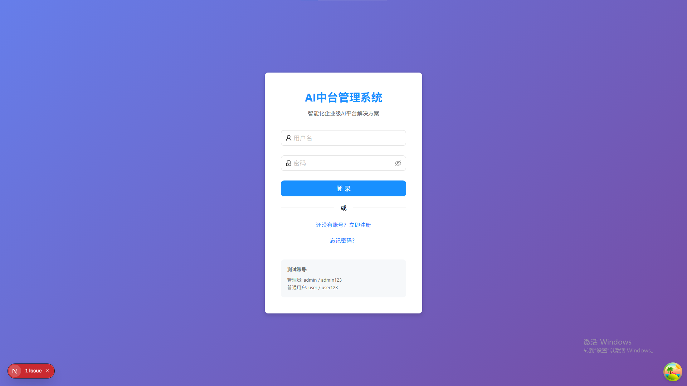
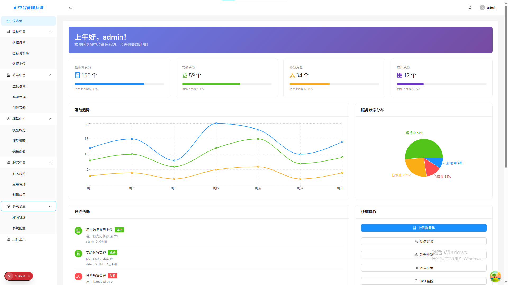
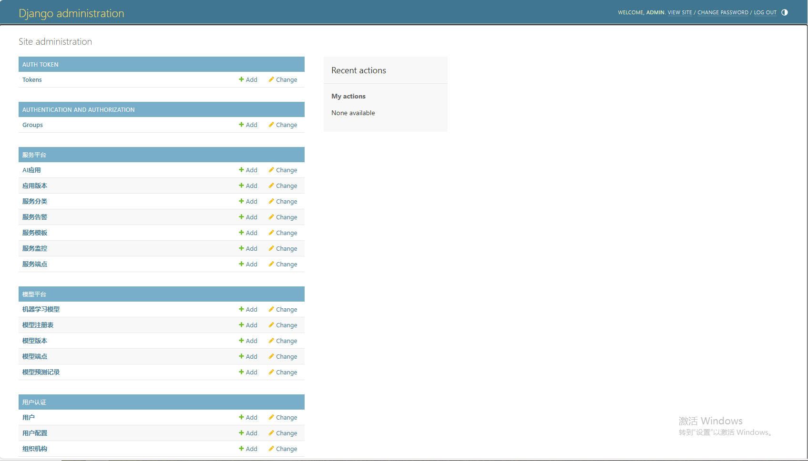
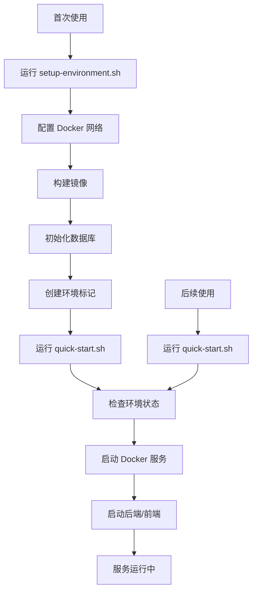

# 🤖 AI 中台最小化示例

> 企业级AI中台的最小化示例项目，基于Django + Next.js构建，包含完整的四大中台功能。

一个完整的 AI 中台解决方案，支持 GPU 加速推理、模型管理、监控和可视化界面。

## ⚡ 快速开始

> **🎯 新用户必读**: 本项目采用两步启动流程，首次使用请按顺序执行：

```bash
# 第一步：环境配置（仅首次使用）
./scripts/setup-environment.sh

# 第二步：启动服务（日常使用）
./quick-start.sh
```

**已配置用户**: 直接运行 `./quick-start.sh` 即可启动所有服务。

## 🔧 功能特性

### 核心功能
- ✅ **完整的 AI 中台界面**：React + TypeScript 前端
- ✅ **REST API 后端**：Django + PostgreSQL
- ✅ **模型管理**：支持多种模型格式
- ✅ **数据管理**：PostgreSQL + Redis + MinIO
- ✅ **监控系统**：Prometheus + Grafana
- ✅ **快速部署**：优化的启动脚本，支持后台运行
- ✅ **实时监控**：自动启动Grafana监控面板

### 🤖 Dify AI 平台集成 (NEW!)
- ✅ **AI 应用构建**：集成 Dify AI 平台，支持对话、文本生成、工作流、智能体
- ✅ **统一管理**：在 AI 中台界面中创建和管理 Dify 应用
- ✅ **API 集成**：完整的 RESTful API 支持 Dify 应用管理
- ✅ **一键部署**：默认启用 Dify 集成，可使用 `--no-dify` 参数禁用

### GPU 功能（可选）
- ✅ **GPU 加速推理**：NVIDIA Triton Inference Server
- ✅ **大语言模型**：Ollama + OpenWebUI
- ✅ **GPU 监控**：DCGM Exporter + GPU 仪表板
- ✅ **多 GPU 支持**：自动检测和管理多张 GPU

### 监控功能
- ✅ **系统监控**：CPU、内存、磁盘使用率
- ✅ **GPU 监控**：GPU 使用率、显存、温度、功耗
- ✅ **服务监控**：各服务健康状态和性能指标
- ✅ **自动化监控**：一键启动 Grafana + Prometheus 监控栈
- ✅ **可视化界面**：预配置的 Grafana 仪表板
- ✅ **智能告警**：基于阈值的自动告警系统

## 🚪 系统界面截图

> 以下为中台主要界面示例截图：

- 登录页：
  
  

- 首页：
  
  

- Django 后台管理：
  
  

## 🚀 快速开始

### 前置要求

- Docker 和 Docker Compose
- Python 3.8+ 和 Node.js 18+（用于本地开发）
- 可选：NVIDIA GPU + NVIDIA Container Toolkit（用于 GPU 加速）

### 🎯 两步启动流程

#### 第一步：环境配置（一次性）
```bash
# 初次使用或需要重新配置环境时运行
./scripts/setup-environment.sh

# 选项:
./scripts/setup-environment.sh --no-dify        # 跳过 Dify 环境配置
./scripts/setup-environment.sh --force-rebuild # 强制重新构建所有镜像
```

> **⚠️ 重要**: 这是一次性配置步骤，完成后无需再次运行，除非需要重新配置环境。

#### 第二步：启动服务
```bash
# 启动所有服务（默认包含 Dify AI 平台）
./quick-start.sh

# 仅启动 AI 中台（不包含 Dify）
./quick-start.sh --no-dify

# 停止所有服务
./stop.sh
```

> **🎉 新架构特性**: 
> - **环境配置分离**: 环境配置和服务启动完全分离，提高启动速度
> - **智能检测**: 自动检测环境配置状态，确保服务正常启动
> - **后台运行**: 服务启动后脚本保持运行以监控服务状态，Ctrl+C 停止所有服务
> - **Dify 默认集成**: Dify AI 平台默认启用，提供完整的 AI 应用创建功能

### 🔄 启动流程说明



### 💡 使用建议

- **首次部署**: 完整运行两步流程
- **日常开发**: 只需运行 `./quick-start.sh`
- **环境重置**: 运行 `./scripts/setup-environment.sh --force-rebuild`
- **快速验证**: 使用 `./quick-start.sh --no-dify` 减少启动时间

## 📁 项目结构

```
minimal-example/
├── quick-start.sh               # 服务启动脚本（主入口）
├── stop.sh                      # 服务停止脚本
├── README.md                    # 项目说明文档
├── backend/                     # Django 后端
│   ├── apps/                    # Django 应用
│   │   ├── service_platform/    # 服务中台（含 Dify 集成）
│   │   ├── data_platform/       # 数据中台
│   │   └── ai_platform/         # AI 中台
│   ├── venv/                    # Python 虚拟环境
│   └── requirements.txt         # Python 依赖
├── frontend/                    # Next.js 前端
│   ├── src/                     # 源码目录
│   ├── node_modules/            # Node.js 依赖
│   └── package.json             # 前端依赖配置
├── docker/                      # Docker 配置
│   ├── docker-compose.yml       # 基础服务配置
│   ├── dify-docker-compose.yml  # Dify 服务配置
│   ├── dify-nginx.conf          # Dify Nginx 配置
│   └── docker-compose.offline.yml # 离线监控配置
├── scripts/                     # 核心脚本目录
│   ├── setup-environment.sh     # 环境配置脚本（一次性）
│   ├── quick-start.sh           # 快速启动脚本（已移至根目录）
│   └── stop.sh                  # 停止服务脚本（已移至根目录）
├── configs/                     # 配置文件
│   ├── dify.env                 # Dify 环境变量
│   └── ...                     # 其他配置
├── logs/                        # 服务日志
├── data/                        # 数据目录
├── docs/                        # 详细文档
└── .env-status/                 # 环境状态标记（自动生成）
    ├── last-setup              # 上次环境配置时间
    └── dify-configured          # Dify 配置状态标记
```

### 🔍 关键文件说明

- **`quick-start.sh`**: 主要的服务启动脚本，检查环境后启动所有服务
- **`scripts/setup-environment.sh`**: 一次性环境配置脚本，构建镜像、初始化数据库
- **`stop.sh`**: 停止所有服务的脚本
- **`.env-status/`**: 环境配置状态目录，用于检测是否已完成环境配置

**注意**: `scripts/` 目录中的 `quick-start.sh` 和 `stop.sh` 已移至项目根目录，请使用根目录下的版本。

## 🌐 服务端口与访问信息

系统启动后，可以通过以下地址访问各个服务：

### 主要服务

| 服务 | 地址 | 账号 | 密码 | 说明 |
|------|------|------|------|------|
| AI中台前端 | http://localhost:3000 | admin@example.com | admin123 | Next.js 前端界面 |
| AI中台后端 API | http://localhost:8000 | - | - | Django REST API |
| Dify AI平台 | http://localhost:8001 | 需初次设置 | 需初次设置 | Dify AI应用构建平台 |

> **🔧 Dify 初始化说明**: 
> - 首次访问 Dify 平台时，需要通过 http://localhost:8001/install 完成初始设置
> - 设置管理员账号和密码后，即可正常使用 Dify 的所有功能
> - 建议设置账号为: admin@example.com，密码请自定义

### 数据存储服务

| 服务 | 地址 | 账号 | 密码 | 说明 |
|------|------|------|------|------|
| PostgreSQL (AI中台) | localhost:5432 | ai_user | ai_password | 主数据库 |
| PostgreSQL (Dify) | localhost:5433 | dify_user | dify_password | Dify数据库 |
| Redis (AI中台) | localhost:6379 | - | - | 缓存服务 |
| Redis (Dify) | localhost:6380 | - | - | Dify缓存 |
| MinIO 存储服务 | http://localhost:9000 | minioadmin | minioadmin | 对象存储服务 |
| MinIO 控制台 | http://localhost:9001 | minioadmin | minioadmin | MinIO管理界面 |
| Weaviate (Dify) | http://localhost:8081 | - | - | 向量数据库 |

### 监控服务

| 服务 | 地址 | 账号 | 密码 | 说明 |
|------|------|------|------|------|
| Grafana | http://localhost:3001 | admin | admin | 监控仪表板 |
| Prometheus | http://localhost:9090 | - | - | 指标收集 |

> **注意**: 首次登录后请务必修改默认密码，特别是在生产环境中。

## 🔐 默认账号安全

出于安全考虑，请在系统部署后尽快修改以下默认账号密码：

1. **Dify 管理员账号**:
   - 首次访问 Dify 平台 (http://localhost:8001/install)
   - 设置管理员账号和密码（建议使用 admin@example.com）
   - 完成初始设置后即可正常使用

2. **MinIO 管理员账号**:
   - 访问 MinIO 控制台 (http://localhost:9001)
   - 使用默认账号: minioadmin / minioadmin
   - 在 Access Keys 设置中修改密码

3. **Grafana 管理员账号**:
   - 访问 Grafana 界面 (http://localhost:3001)
   - 使用默认账号: admin / admin
   - 在首次登录时会提示修改密码

## 📚 使用指南

### 系统启动和停止

```bash
# 环境配置（仅首次使用）
./scripts/setup-environment.sh

# 启动所有服务（默认包含 Dify）
./quick-start.sh

# 启动服务（不包含 Dify）
./quick-start.sh --no-dify

# 停止所有服务
./stop.sh
```

### 测试和验证

```bash
# GPU 环境完整测试
python3 tests/test_gpu_stack_complete.py

# 基础GPU环境测试
python3 tests/test_gpu_environment.py

# 部署验证测试
python3 tests/validate_deployment.py

# API功能测试
python3 tests/test_complete_api.py

# 系统完整性验证
python3 tests/system_validation.py

# Triton客户端测试
python3 tests/test_triton_client.py
```

### 故障排查

```bash
# 系统环境诊断（推荐第一步）
bash scripts/diagnose_system.sh

# 查看服务状态
docker compose ps

# 查看服务日志
docker compose logs <service-name>

# 重启特定服务
docker compose restart <service-name>

# 完全重新启动
./stop.sh && ./start.sh
```

## 🛠️ 开发指南

### 本地开发模式

```bash
# 首次开发环境配置
./scripts/setup-environment.sh

# 日常开发启动
./quick-start.sh

# 仅启动 AI 中台（开发时推荐）
./quick-start.sh --no-dify

# 停止服务
./stop.sh
```

### 🔧 环境配置说明

#### 环境配置阶段 (`setup-environment.sh`)
- ✅ 检查和安装依赖（Python venv、Node.js 依赖）
- ✅ 创建 Docker 网络
- ✅ 构建必要的 Docker 镜像
- ✅ 启动并配置基础服务（PostgreSQL、MinIO）
- ✅ 初始化数据库（AI 中台和 Dify）
- ✅ 创建环境状态标记

#### 服务启动阶段 (`quick-start.sh`)
- ✅ 检查环境配置状态
- ✅ 启动 Docker 服务（PostgreSQL、MinIO、Grafana）
- ✅ 可选启动 Dify 服务
- ✅ 启动后端服务（Django）
- ✅ 启动前端服务（Next.js）
- ✅ 监控服务状态

### 📋 开发工作流

1. **初次设置**:
   ```bash
   git clone <repository>
   cd minimal-example
   ./scripts/setup-environment.sh  # 一次性配置
   ```

2. **日常开发**:
   ```bash
   ./quick-start.sh                # 启动服务
   # 进行开发工作...
   ./stop.sh                       # 停止服务
   ```

3. **环境重置**（如有需要）:
   ```bash
   ./scripts/setup-environment.sh --force-rebuild
   ```

### 🔍 脚本功能对比

| 脚本 | 功能 | 执行频率 | 执行时间 |
|------|------|----------|----------|
| `setup-environment.sh` | 环境配置、镜像构建、数据库初始化 | 一次性 | **30-90分钟**（首次）|
| `quick-start.sh` | 服务启动、状态监控 | 日常使用 | 1-2分钟 |
| `stop.sh` | 服务停止、资源清理 | 需要时 | 30秒 |

> **⏱️ 构建时间说明**: 
> - **AI 中台构建**: 5-15分钟
> - **Dify 镜像构建**: 30-60分钟（需下载1788个npm包）
> - **网络因素**: 国外服务器访问可能较慢，建议使用国内镜像源

### 💻 本地开发注意事项

- **端口占用**: 确保 3000、8000、5432、9000、9001、3001、8001、5001、6380、8081 端口未被占用
- **Docker 资源**: 确保 Docker 有足够的内存分配（推荐 4GB+）
- **网络配置**: 脚本会自动创建 `ai_platform_network` Docker 网络
- **日志查看**: 服务日志保存在 `logs/` 目录中
- **进程管理**: 进程 PID 保存在 `logs/` 目录中，便于手动管理

## 📖 文档

详细文档请查看 `docs/` 目录：

- [启动指南](docs/STARTUP_GUIDE.md) - **推荐首次使用阅读**
- [用户指南](docs/USER_GUIDE.md) - 功能使用和操作指南
- [离线模式指南](docs/OFFLINE_MODE_GUIDE.md) - 网络受限环境使用指南

## 🐛 问题解决

如果遇到问题，请按以下顺序排查：

### 1. 环境配置问题

如果 `quick-start.sh` 报告环境未配置：

```bash
# 运行环境配置脚本
./scripts/setup-environment.sh

# 如果仍有问题，强制重新构建
./scripts/setup-environment.sh --force-rebuild
```

### 2. 服务启动问题

```bash
# 检查 Docker 服务状态
docker ps

# 查看特定服务日志
docker compose -f docker/docker-compose.yml logs postgres
docker compose -f docker/dify-docker-compose.yml logs dify-api

# 检查端口占用
netstat -tlnp | grep -E "(3000|8000|5432|9000)"

# 手动清理端口（如果需要）
./stop.sh
```

### 3. 网络和连接问题

```bash
# 检查 Docker 网络
docker network ls | grep ai_platform_network

# 重新创建网络（如果需要）
docker network rm ai_platform_network
docker network create ai_platform_network
```

### 4. 数据库问题

```bash
# 检查 PostgreSQL 连接
docker exec -it ai_platform_postgres pg_isready -U ai_user

# 查看数据库日志
docker compose -f docker/docker-compose.yml logs postgres

# 重新初始化数据库（如果需要）
cd backend && python manage.py migrate
```

### 5. 前端/后端问题

```bash
# 查看服务日志
tail -f logs/backend.log
tail -f logs/frontend.log

# 检查进程状态
ps aux | grep -E "(python|node)" | grep -E "(8000|3000)"

# 手动重启服务
./stop.sh
./quick-start.sh
```

### 6. 常见错误解决

| 错误类型 | 解决方案 |
|---------|----------|
| 端口被占用 | 运行 `./stop.sh` 或手动终止占用进程 |
| Docker 网络错误 | 重新创建网络 `docker network create ai_platform_network` |
| 环境未配置 | 运行 `./scripts/setup-environment.sh` |
| 镜像不存在 | 运行 `./scripts/setup-environment.sh --force-rebuild` |
| 数据库连接失败 | 检查 PostgreSQL 容器状态和日志 |
| Dify 服务异常 | 确保已运行环境配置脚本且 Dify 镜像存在 |

### 7. 获取帮助

```bash
# 查看脚本帮助
./scripts/setup-environment.sh --help
./quick-start.sh --help

# 查看环境状态
ls -la .env-status/
```

### ⚠️ **网络问题解决方案**

**项目完全离线运行**，所有 Docker 镜像都存储在本地 `ZTZT/packages/docker-images/` 目录中：

#### 本地镜像资源
项目包含以下预打包的 Docker 镜像：
- **基础服务**: PostgreSQL 16, Redis 7.2, MinIO 2024.6.4
- **监控服务**: Grafana, Prometheus, Node Exporter
- **AI 服务**: Weaviate 1.22.4/1.24.4
- **系统镜像**: Node.js 22-alpine, Python 3.12-slim

#### 自动镜像加载
脚本会自动检测并加载本地镜像：
```bash
# 脚本会自动从以下位置加载镜像
/home/lsyzt/ZTZT/packages/docker-images/
├── postgres-16.tar
├── redis-7.tar
├── minio-2024.6.4-debian-12-r0.tar
├── weaviate.tar
├── grafana.tar
├── prometheus.tar
└── ...其他镜像文件
```

#### 解决方案（按优先级）

**方案1：正常运行（推荐）**
```bash
# 项目已完全离线化，直接运行即可
./scripts/setup-environment.sh
```

**方案2：跳过 Dify 构建（快速验证）**
```bash
# 仅构建 AI 中台核心功能
./scripts/setup-environment.sh --no-dify

# 后续可以选择性启动
./quick-start.sh --no-dify
```

**方案3：强制重新加载镜像**
```bash
# 如果镜像加载有问题，强制重新构建
./scripts/setup-environment.sh --force-rebuild
```

#### 故障排查
如果仍遇到网络相关错误：

```bash
# 检查本地镜像包是否完整
ls -la /home/lsyzt/ZTZT/packages/docker-images/

# 手动加载特定镜像（示例）
docker load -i /home/lsyzt/ZTZT/packages/docker-images/weaviate.tar

# 检查已加载的镜像
docker images | grep -E "(postgres|redis|minio|weaviate)"
```

> **💡 设计理念**: 项目采用完全离线设计，避免网络依赖问题。所有必要的 Docker 镜像都预先打包在 `packages/` 目录中，确保在任何网络环境下都能稳定运行。
